# Deployment and Payment setup

- The app was deployed to [Render](https://render.com/).
- The database was deployed to [ElephantSQL](https://www.elephantsql.com/).

- The app can be reached by the [link](https://wowder.onrender.com).

---

## Payment Setup

1. Register a stripe account at https://dashboard.stripe.com/register.
2. Go to the developers' page:


3. Select API keys.

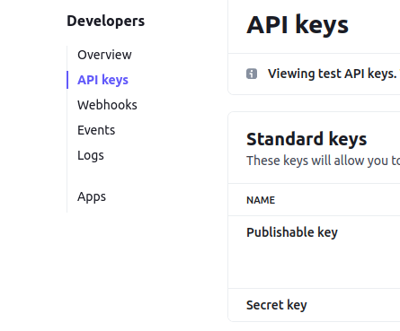

4. Copy the `public key` and `secret key` to the `env.py` file.

5. Add the following setting to `settings.py`:

```python
  STRIPE_PUBLIC_KEY = os.environ.get("STRIPE_PUBLIC_KEY")
  STRIPE_SECRET_KEY = os.environ.get("STRIPE_SECRET_KEY")
```

6. Install stripe package:

```python
  pip3 install stripe
```

7. Create an order model with the required fields in the orders app.
8. Set up a payment app.
9. Add a payment form to the payment app template.
10. Add div to hold stripe element:

```html
  <div id="stripe-element"></div>
```
11. Create a View to handle payment setup:
  - Get public key: `stripe_public_key = settings.STRIPE_PUBLIC_KEY`
  - Get private key: `stripe_secret_key = settings.STRIPE_SECRET_KEY`
  - create intent: `intent = stripe.PaymentIntent.create(**kwargs)`
  - **kwargs for the payment intent should include:
    * `amount`: amount
    * `currency`: currency
    * `metadata`: metadata
  - For the metadata, I have user id `userid: request.user.id`
  - Create context for the view with the following data:
      *  'my_profile': my_profile,
      *  'total_sum': total_sum,
      *  'client_secret': intent.client_secret,
      *  'stripe_public_key': stripe_public_key,

12. Add extra js block to payment template where you have to add csrf_token, stripe_public_key,
  script tag with stripe.js, and script tag with payment.js.

```html
  
    <script>
        let CSRF_TOKEN = '{{ csrf_token }}';
        let stripe_public_key = '{{ stripe_public_key }}';
    </script>
    <script src="https://js.stripe.com/v3/"></script>
    <script src="" data-rel-js></script>
  
```

13. In the payment.js, create variables for stripe public key, stripe, payment element, payment form, and a variable from which you will receive 'client_secret.' To get 'client secret,` I have added data-attribute to confirmation button in the payment form:

```html
  data-secret="{{ client_secret }}"
```
14. Set up stripe element:

```javascript
  let elements = stripe.elements();
  let style = {
    base: {
      color: "#000",
      lineHeight: '2.4',
      fontSize: '16px'
    }
  };
  let card = elements.create("card", {
    style: style
  });
  card.mount("#card-element");
```

*You can use various styling by checking out the following docs [stripe/elements-examples](https://github.com/stripe/elements-examples)*

15. Get all data from the payment form and collect it by using `new FormData()`

16. Create an AJAX request to send collected data and set the url to for adding order. The URL is `window.location.origin + '/orders/add/'`.

17. In the orders app views, you need to create a view to handle order creation.

18. The payment intent is created when the user clicks on the confirmation button. That stripe element prevents the user from multiple clicks and handles all errors. However, you must set alerts for the user to show the error.

19. To test the user's payment, you need to create a test payment intent with the card data provided by the stripe:

No auth: 4242424242424242

Auth: 4000002500003155

Error: 4000000000009995

20. Create a success page to redirect the user after successful payment and add js functionality to handle the redirection:

```javascript
    if (result.paymentIntent.status === 'succeeded') {
      window.location.replace(window.location.origin + "/payment/order_placed/");
    }
```

21. Set app stripe backend:
  - Go to [Stripe Docs. Stripe CLI](https://stripe.com/docs/stripe-cli)
  - Download the stripe-cli file depending on your operating system.

  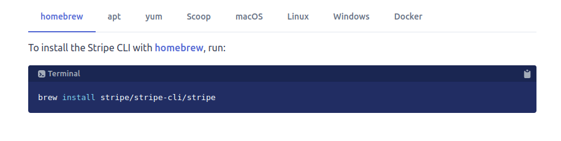

  - In my case, I downloaded the file for Linux:

  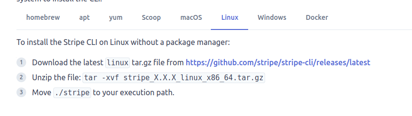

  - Go to the link provided and download the file.

  

  - Open the downloaded file and move the file `stripe` to the project's root directory.

  - Open the terminal and type:

  `./stripe login`

  *Note! For the window OS, the command looks as follows `stripe login`*

  - Hit enter -> You will be redirected to the Stripe dashboard, where you need to allow access to your local workspace.

  - Create a payment, and the intent will be created.

  *Another option:*
  
  - Download the following file:

  

  - Open the downloads folder in the terminal and type:

  `sudo gdebi stripe_1.11.0_linux_amd64.deb`

  - The package will be installed -> Type `stripe` in the terminal and hit enter.

22. Create a function in the orders views to handle the payment confirmation, which will take payment data. This function will also handle email confirmation.

23. To run this function, you will need to add the following process provided by stripe:

```python
from django.views.decorators.csrf import csrf_exempt

@csrf_exempt
  def stripe_webhook(request):
      payload = request.body
      event = None
      try:
          event = stripe.Event.construct_from(
              json.loads(payload), stripe.api_key
          )
      except ValueError as e:
          return HttpResponse(status=400)
      # Handle the event
      if event.type == 'payment_intent.succeeded':
          payment_confirmation(event.data.object.client_secret)
      else:
          print('Unhandled event type {}'.format(event.type))
      return HttpResponse(status=200)
```

24. Add URL to the stripe_webhook function in the payment urls.py

```python
    path('webhook/', stripe_webhook),
```

25. In the terminal type:

`./stripe listen --forward-to localhost:8000/payment/webhook/`

26. Remember to set app stripe data in Heroku configs:

  - Create a webhook in the stripe dashboard and set the hosted endpoint.

  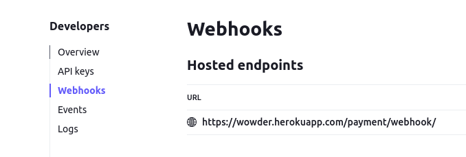

  - `STRIPE_PUBLIC_KEY`
  - `STRIPE_SECRET_KEY`
  - `STRIPE_WEBHOOK_SECRET`

---

## Local deployment

1. Clone the repository.

    - ```git clone https://github.com/IuliiaKonovalova/e-commerce.git```

2. Go to the ```ecommerce_project``` directory.

    - ```cd ecommerce_project```

3. Create a virtual environment.

    - ```python3 -m venv venv```

    - ```source venv/bin/activate```

4. Install all dependencies.

    - ```pip install -r requirements.txt```

5. Create a ```env.py``` file.

    - ```touch env.py```

6. Add the following lines to ```env.py```:

    - ```import os```
    - ```os.environ["SECRET_KEY"]``` = your secret key.
    - ```os.environ["DEBUG"]``` = "True" or "False" depending on whether you are in development or production.
    - ```os.environ["DEVELOPMENT"]``` = "True" or "False" depending on whether you are in development or production.
    - ```os.environ["ALLOWED_HOSTS"]``` = your domain name.
    - ```os.environ["DATABASE_URL"]``` = your database url.
    - ```os.environ["CLOUDINARY_CLOUD_NAME"]``` = your cloudinary cloud name.
    - ```os.environ["CLOUDINARY_API_KEY"]``` = your cloudinary api key.
    - ```os.environ["CLOUDINARY_API_SECRET"]``` = your cloudinary api secret.
    - ```os.environ["STRIPE_PUBLIC_KEY"]``` = your stripe public key.
    - ```os.environ["STRIPE_SECRET_KEY"]``` = your stripe secret key.
    - ```os.environ["STRIPE_WEBHOOK_SECRET"]``` = your stripe webhook secret key.

7. Create and migrate the database.

---

## Important note


**NOTE !**

As the app requires assigning a role for each user, you will need to apply some changes Profile model for the role field.:

```python
    class Profile(models.Model):
        """Model for the profiles."""
        user = models.OneToOneField(
            User,
            on_delete=models.CASCADE,
            related_name='profile',
            verbose_name='User',
            help_text=(
                'format: required, unique=True'
            )
        )
        first_name = models.CharField(
            max_length=50,
            blank=True,
            null=True,
            verbose_name='First name',
            help_text=(
                'format: not required, max_length=50'
            )
        )
        last_name = models.CharField(
            max_length=50,
            blank=True,
            null=True,
            verbose_name='Last name',
            help_text=(
                'format: not required, max_length=50'
            )
        )
        birthday = models.DateField(
            blank=True,
            null=True,
            verbose_name='Birthday',
            help_text=(
                'format: not required'
            )
        )
        avatar = CloudinaryField(
            'avatar',
            folder='avatars',
            blank=True,
            null=True,
        )
        subscription = models.BooleanField(
            default=False,
            verbose_name='Subscription',
            help_text=(
                'format: not required'
            )
        )
        role = models.ForeignKey(
            Role,
            on_delete=models.SET_NULL,
            null=True,
            # default=1, # 1 is the default role that should be commented out before the first migrations
            verbose_name='Role',
            help_text=(
                'format: not required'
            )
        )
        created_at = models.DateTimeField(
            auto_now_add=True,
            verbose_name='Created at',
        )
        updated_at = models.DateTimeField(
            auto_now=True,
            verbose_name='Updated at',
        )
```

- ```python manage.py makemigrations```
- ```python manage.py migrate```

- After migration, you will need to create a superuser.


8. Create the superuser.

    - ```python manage.py createsuperuser```

9. Create roles as following:

For example:

```python
    Role.objects.create(name='Customer')
    Role.objects.create(name='Manager')
    Role.objects.create(name='Admin')
```


10. Set the role for the superuser with the role field with id 3.

```python
    superuser.profile.role_id = 3
    superuser.save()
```

11. Go to Profiles and uncomment the default role. Make new migrations and migrate.

    - ```python manage.py makemigrations```
    - ```python manage.py migrate```

**After the following steps, you will ensure that the app is working correctly, and any other user registered in your app will only have access as a customer. The rest of the roles will be controlled by the admin.**


12. Run the server.

    - ```python manage.py runserver```

13. Access the website by the link provided in terminal. Add ```/admin/``` at the end of the link to access the admin panel.


*If you are using Gitpod, you can skip steps 1-3 by clicking this [link](https://gitpod.io/#https://github.com/IuliiaKonovalova/e-commerce), and start from step 4.*

---


**The app was initially deployed to Heroku then moved to Render since Heroku has removed its free tier services from November 29 2022**

---

## Heroku Deployment


1. Create a Heroku account if you don't already have one.

2. Create a new app on Heroku.

    1. Go to the [Heroku dashboard](https://dashboard.heroku.com/apps).
    2. Click on the "New" button.
    3. Click on the "Create new app" button.
    4. Choose a name for your app.
    5. Choose a region.
    6. Click on the "Create app" button.

3. In your app go to the "Resources" tab.

    1. Add a Heroku Postgres database.

4. In your app, go to the "Settings" tab, press "Reveal Config Vars", and add the following config vars if they are not already set:

    1. ```ALLOWED_HOSTS``` = your heroku domain name.
    2. ```CLOUDINARY_CLOUD_NAME``` = the cloud name you used when creating your cloudinary account.
    3. ```CLOUDINARY_API_KEY``` = the api key you got when created your cloudinary account.
    4. ```CLOUDINARY_API_SECRET``` = the api secret you got when created your cloudinary account.
    5. ```DATABASE_URL``` = the url of your heroku postgres database.
    6. ```REDIS_URL``` = the url of your heroku redis database.
    7. ```SECRET_KEY``` = a secret key for your app.
    8. ```EMAIL_HOST_USER``` = the email address you going to use to send emails.
    9. ```EMAIL_HOST_PASSWORD``` = the password for the email address you are using.
    10. ```DEBUG``` = True during development, False during production.
    11. ```DISABLE_COLLECTSTATIC``` = 1 during development. Remove this when deploying to production.
    12. ```STRIPE_PUBLIC_KEY``` = the public key you got when created your stripe account.
    13. ```STRIPE_SECRET_KEY``` = the secret key you got when created your stripe account.
    14. ```STRIPE_WEBHOOK_SECRET``` = the secret key you got when created your stripe webhook.

5. In your app go to the "Deploy" tab.

    1. If it's already possible, connect your Heroku account to your GitHub account and then click on the "Deploy" button.
    2. If not, you need to copy the Heroku CLI command to connect your heroku app and your local repository.

        - ```heroku git:remote -a <your-heroku-app-name>```

6. Go to your local repository.

7. Login to your Heroku account in your terminal and connect your local repository to your heroku app.

    1. ```heroku login -i``` - Enter all your Heroku credentials it will ask for.
    2. Paste the command you copied from step 5 into your terminal.

8. Create Procfile.

    This project uses Daphne server for its ability to run asynchronous applications in order to implement tech support chats in the future, so in this case if you want to implement chat functionality as well, you have to add the following to Procfile:

    - ```release: python manage.py migrate``` - this command will apply all migrations every time you re-deploy the app.
    - ```web: daphne ecommerce_project.asgi:application --port $PORT --bind 0.0.0.0 -v2``` - this command will run the app.
    - ```worker: python manage.py runworker -v2 channel_layer``` - this command will run the worker for the channel layer to run the async tasks.

9. Create ```requirements.txt```. This can be done by running the following command:

    - ```pip freeze > requirements.txt```
    or
    - ```pipreqs requirements.txt``` - if you have pipreqs installed.

10. Add and commit all changes.

11. Push your changes to Heroku.

    - ```git push heroku master```
    or
    - ```git push heroku main```

12. Check your app's logs in heroku dashboard and ensure everything is working.

13. After the development is done, you can change the ```DEBUG``` config var to ```False``` and remove the ```DISABLE_COLLECTSTATIC``` config var from the config vars on heroku.

To get Cloudinary cloud name, API key, and API secret:

1. Go to the [Cloudinary website](https://cloudinary.com/).

2. Log in to your account or sign up if you don't have an account.

3. Go to the [Cloudinary dashboard](https://cloudinary.com/console/).

4. At the top of the page, you will see your cloud name, API key, and API secret.

5. To reveal API secret, hover over the API key container and click on the button that looks like an eye.

6. Copy these values and paste them into the config vars on Heroku and into your `env.py` file.

To get stripe public key, secret key, and webhook secret:

**Please go to the Payment Setup section in the readme file for more information.**

[Payment Setup](#payment-setup)

*If you find any difficulties with the installation, please, visit the following project's [GitHub repository](https://github.com/IuliiaKonovalova/school_app), where you can find the images of the installation process.*

---

## Render Deployment

### Create Database on ElephantSQL

1. Go to [ElephantSQL](https://www.elephantsql.com/) and create a new account.

2. Create a new instance of the database.

    - 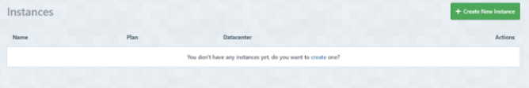

3. Select a name for your database and select the free plan.

    - 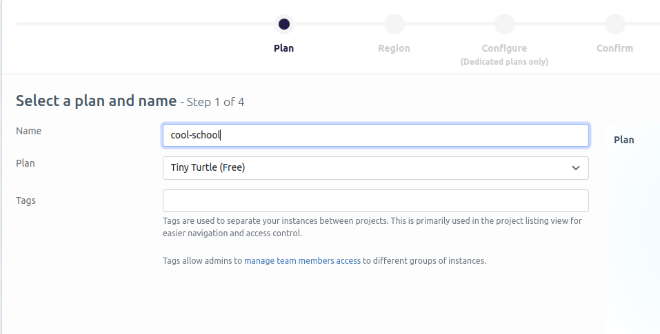

4. Click "Select Region"

    - 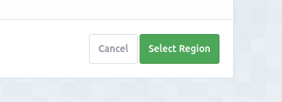

5. Select a region close to you.

    - 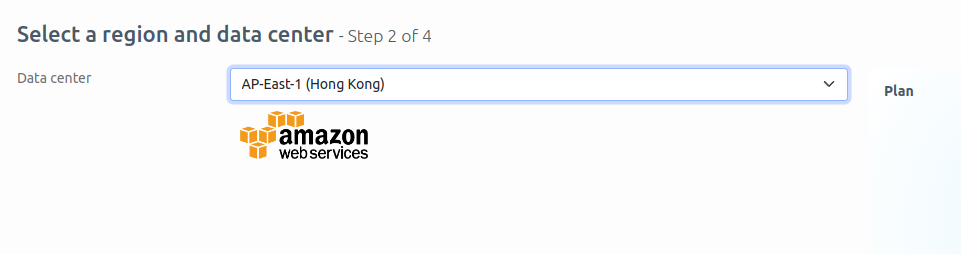

6. Click "Review"

    - 

7. Click "Create Instance"

    - 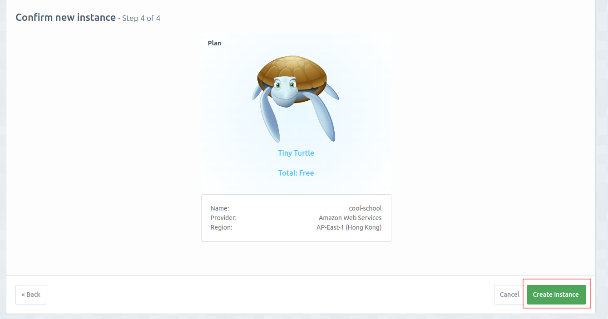

8. Click on the name of your database to open the dashboard.

    - 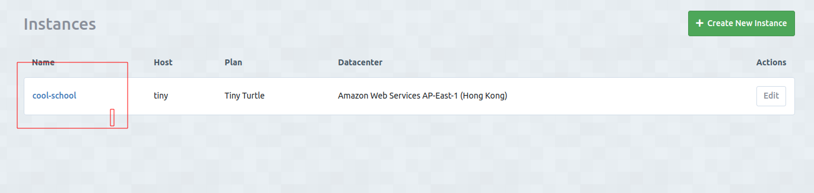

9. You will see the dashboard of your database. You will need the URL of your database to connect it to your Django project.

    - 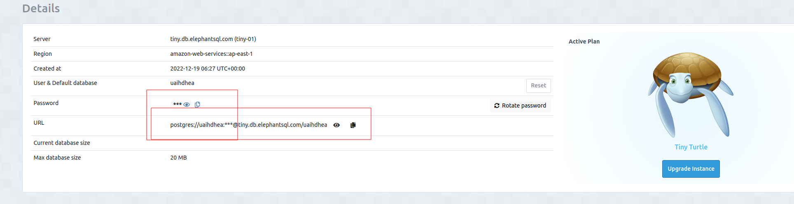

### Create a new app on Render

Link to the deployed application on Render: [Cool School](https://cool-school.onrender.com/)

1. Create a new Render account if you don't already have one here [Render](https://render.com/).

2. Create a new application on the following page here [New Render App](https://dashboard.render.com/), choose **Webserver**:

    - 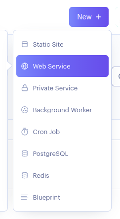

3. Select the GitHub option and connect the application to the repository you created.

    - 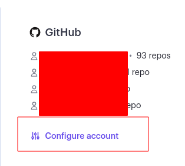

4. Search for the repository you created and click "Connect."

    - 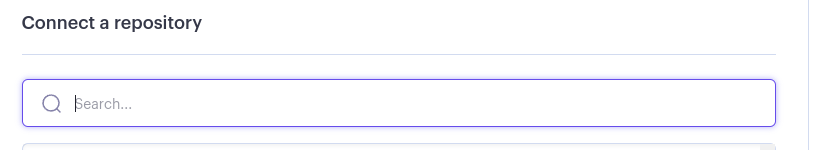

    - 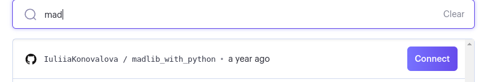

5. Create name for the application

    - 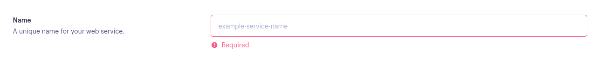

6. Select the region where you want to deploy the application.

    - 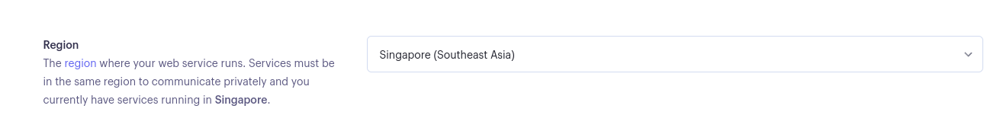

7. Select branch to deploy.

    - 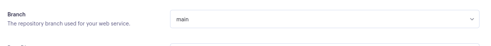

8. Select environment.

    - 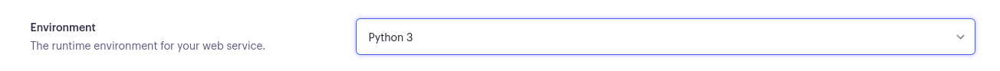

9. Render build command: `./build.sh`

    - 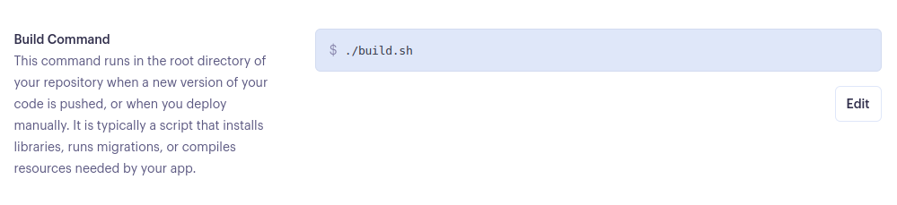

10. Render start command: `daphne <NAME OF YOUR APP>.asgi:application --port $PORT --bind 0.0.0.0 -v2` + You can delete `Procfile` from your repository.

    - 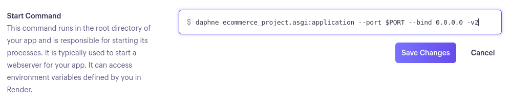

11. Select Free plan.

    - 

12. Click on "Advanced" settings.

    - 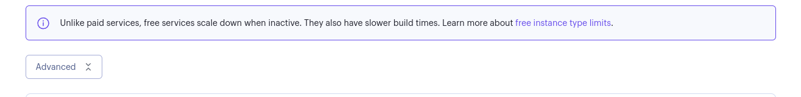

13. Add the following environment variables:

    | Key      | Value          |
    |-------------|-------------|
    | WEB_CONCURRENCY | 4 |
    | DATABASE_URL | ************* |
    | SECRET_KEY | ************* |
    | DEBUG | False |
    | EMAIL_HOST_USER | ************* |
    | EMAIL_HOST_PASSWORD | ************* |
    | DISABLE_COLLECTSTATIC | 1 |
    | CLOUDINARY_URL | ************* |
    | CLOUDINARY_CLOUD_NAME | ************* |
    | CLOUDINARY_API_KEY | ************* |
    | CLOUDINARY_API_SECRET | ************* |
    | STRIPE_CURRENCY | ************* |
    | STRIPE_PUBLIC_KEY | ************* |
    | STRIPE_SECRET_KEY | ************* |
    | STRIPE_ENDPOINT_SECRET | ************* |

    *DATABASE_URL value is takes from ElephantSQL dashboard, SECRET_KEY value is takes from your local env.py file, DEBUG value is set to False, EMAIL_HOST_USER and EMAIL_HOST_PASSWORD values are takes from your Gmail account. STRIPE_CURRENCY, STRIPE_PUBLIC_KEY, STRIPE_SECRET_KEY, STRIPE_ENDPOINT_SECRET values are takes from your Stripe account. CLOUDINARY_URL, CLOUDINARY_CLOUD_NAME, CLOUDINARY_API_KEY, CLOUDINARY_API_SECRET values are takes from your Cloudinary account.*


14. Open VS Code and create a new file called `build.sh` in the root directory of your project.

    - 

15. Copy the following code into the `build.sh` file:

    ```bash
      set -o errexit
      pip install -r requirements.txt
      python manage.py collectstatic --noinput
      python manage.py makemigrations && python manage.py migrate
    ```

    -*pip install -r requirements.txt installs the packages detailed in your requirements.txt file.*
    - *python manage.py collectstatic collects all static files to allow them to be served in the production environment.*
    - *The –noinput flag allows the command to run with no additional input from the deploying developer.*
    - *python manage.py makemigrations && python manage.py migrate are run to ensure all migrations are made to your production database.*

16. Save the file `build.sh`.

17. Go to `settings.py` file and add the following code to add Render.com to allowed hosts:

    ```python
        RENDER_EXTERNAL_HOSTNAME = os.environ.get('RENDER_EXTERNAL_HOSTNAME')
        if RENDER_EXTERNAL_HOSTNAME:
            ALLOWED_HOSTS.append(RENDER_EXTERNAL_HOSTNAME)
    ```

   *If you have heroku in your allowed hosts, delete it*

18. Save the file `settings.py`.

19. Go to `env.py` and change to DATEBASE_URL value to the one you got from ElephantSQL.

    ```python
        os.environ["DATABASE_URL"] = '*************'
    ```

20. Create a superuser for your database.

    ```bash
        python manage.py createsuperuser
    ```

21. Commit and push the changes to GitHub.

22. Go back to Render and click "Create Web Service."

    - 

23. Wait for the completion of the deployment.

24. Go to admin panel and change the settings for the admin by assigning a role of `Boss` to allow the full control of the website including role assignment.

---