# Features

## Access to pages according to the user role:

| Page Name | Logged out  | Customers  | Manager | Admin |
| --------- | ----------- | ---------- | ------- | ----- |
| Home       | Yes         | Yes        | Yes     | Yes   |
| Login      | Yes         | Yes        | Yes     | Yes   |
| Register   | Yes         | Yes        | Yes     | Yes   |
| Logout     | Yes         | Yes        | Yes     | Yes   |
| Store Products   | Yes         | Yes        | Yes     | Yes   |
| Store Product's Details | Yes         | Yes        | Yes     | Yes   |
| All reviews   | Yes         | Yes        | Yes     | Yes   |
| Bag       | No         | Yes        | Yes     | Yes   |
| Profile   | No         | Yes        | Yes     | Yes   |
| Edit profile   | No         | Yes        | Yes     | Yes   |
| Add address   | No         | Yes        | Yes     | Yes   |
| All addresses   | No         | Yes        | Yes     | Yes   |
| Edit address   | No         | Yes        | Yes     | Yes   |
| My Orders   | No         | Yes        | Yes     | Yes   |
| My Order's Details   | No         | Yes        | Yes     | Yes   |
| My Wishlist   | No         | Yes        | Yes     | Yes   |
| My reviews   | No         | Yes        | Yes     | Yes   |
| My reviews' Details   | No         | Yes        | Yes     | Yes   |
| Checkout   | No         | Yes        | Yes     | Yes   |
| Promotions | No         | No         | Yes     | Yes   |
| Add promotion | No         | No         | No     | Yes   |
| Edit promotion | No         | No         | No     | Yes   |
| Delete promotion | No         | No         | No     | Yes   |
| Create newsletter-promo Email | No         | No         | Yes     | Yes   |
| Categories | No         | No         | Yes     | Yes   |
| Add category | No         | No         | Yes     | Yes   |
| Edit category | No         | No         | Yes     | Yes   |
| Delete category | No         | No         | No     | Yes   |
| Brands | No         | No         | Yes     | Yes   |
| Brand's details | No         | No         | Yes     | Yes   |
| Edit brand | No         | No         | Yes     | Yes   |
| Delete brand | No         | No         | No     | Yes   |
| Tags | No         | No         | Yes     | Yes   |
| Add tag | No         | No         | Yes     | Yes   |
| Edit tag | No         | No         | Yes     | Yes   |
| Delete tag | No         | No         | Yes     | Yes   |
| Products' Types | No         | No         | Yes     | Yes   |
| Add product's type | No         | No         | Yes     | Yes   |
| Edit product's type | No         | No         | Yes     | Yes   |
| Delete product's type | No         | No         | No     | Yes   |
| Products' attributes | No         | No         | Yes     | Yes   |
| Add product's attribute | No         | No         | Yes     | Yes   |
| Edit product's attribute | No         | No         | Yes     | Yes   |
| Delete product's attribute | No         | No         | No     | Yes   |
| Product's values | No         | No         | Yes     | Yes   |
| Add product's value | No         | No         | Yes     | Yes   |
| Edit product's value | No         | No         | Yes     | Yes   |
| Delete product's value | No         | No         | No     | Yes   |
| Personnel Products Table | No         | No         | Yes     | Yes   |
| Add product | No         | No         | Yes     | Yes   |
| Edit product | No         | No         | Yes     | Yes   |
| Delete product | No         | No         | Yes     | Yes   |
| Personnel Product's full details | No         | No         | Yes     | Yes   |
| Add new image modal | No         | No         | Yes     | Yes   |
| Edit image modal | No         | No         | Yes     | Yes   |
| Delete image modal | No         | No         | Yes     | Yes   |
| Add product's unit | No         | No         | Yes     | Yes   |
| Edit product's unit | No         | No         | Yes     | Yes   |
| Delete product's unit | No         | No         | Yes     | Yes   |
| Product's units | No         | No         | Yes     | Yes   |
| Product's unit's details | No         | No         | Yes     | Yes   |
| Add stock | No         | No         | No     | Yes   |
| Edit stock | No         | No         | No     | Yes   |
| Delete stock | No         | No         | No     | Yes   |
| Stock table | No         | No         | No     | Yes   |
| Orders | No         | No         | Yes     | Yes   |
| Order's details | No         | No         | Yes     | Yes   |
| Edit order status feature | No         | No         | No     | Yes + Logistics manager   |
| Edit Order | No         | No         | No     | Yes   |
| Delete order | No         | No         | No     | Yes   |
| Edit order's item | No         | No         | No     | Yes   |
| Delete order's item | No         | No         | No     | Yes   |

## Main Features:

- Each page has a navbar and a footer

### Navbar:

The Navbar has two subsections:

1. Customer's section, which is visible for all users:

    - if the user is logged in, the Navbar has the following features:

      
      
        - logo, which redirects to the home page;
        
        
        
        - Store button, which redirects the user to the store page

        - Wishlist button, which redirects the user to the wishlist page

        - Bag button, which redirects the user to the bag page

        - Profile button, which redirects the user to the profile page

        - Logout button, which redirects the user to the login page

    - if the user is logged out, the Navbar has the following features:
    
      
      
        - logo:
        
        
        
        - It has only Store, Wishlist, and Bag buttons, which redirect the user to the store page, wishlist page, and bag page, respectively.

        - Login button, which redirects the user to the login page

        - SignUp button, which redirects the user to the register page

2. Personnel's section, which is visible only for store personnel:
      
      

    It has Personnel's button, which is visible only for store personnel. When this button is clicked, the user will see a dropdown menu with the following navbar features:

    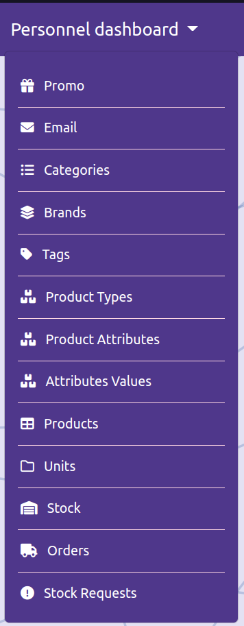

    - Promo button, which redirects the user to the promotions page

    - Email button, which redirects the user to the create newsletter or promotional email page;

    - Categories button, which redirects the user to the categories page;

    - Brands button, which redirects the user to the brands' page;

    - Tags button, which redirects the user to the tags page;

    - Products' Types button, which redirects the user to the products' types page;

    - Products' Attributes button, which redirects the user to the products' attributes page;

    - Products' Values button, which redirects the user to the products' values page;

    - Personnel Products Table button, which redirects the user to the personnel products table page;

    - Units button, which redirects the user to the units table page;

    - Stock button, which redirects the user to the stock table page;

    - Orders button, which redirects the user to the orders page;

    - Stock requests button, which redirects the user to the stock requests page;

The simplistic design of the Navbar is based on the decision to make the use of the web app easy for all users.

*Navbar is slightly different on the tablet devices*

*Navbar looks as follows on the mobile devices*

### Footer:

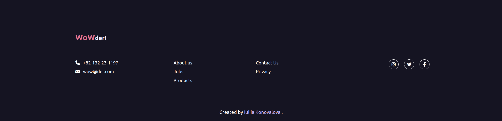

Footer has the following features:

- logo;

- contact information;

- About us button, which redirects the home page;

- Jobs button, which redirects the Linkedin page (the implementation is necessary for the future);

- Products button, which redirects the store page;

- Contact us button, which allows the user to send an email to the store personnel;

- Privacy Policy button, which redirects the privacy policy page;

- Social media buttons: Instagram, Facebook, Twitter (the implementation is necessary for the future);

- And the information about the web app creator with the link to GitHub.

*Footer is slightly different on the mobile devices*

### Home page:

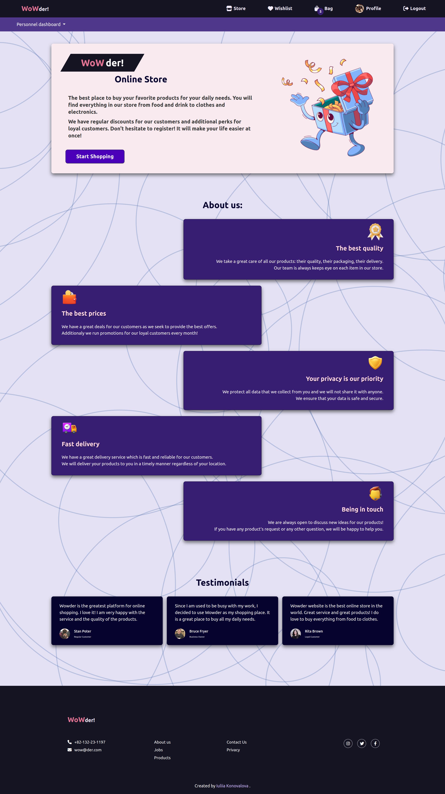

The home page has:

- Hero section:

This section has a logo in the left top corner. There is also an eye-catching image on the right side of the hero section.
Underneath the logo is a description of the store and a button. If the user is logged in, the button has the following text "Start Shopping," which redirects the user to the store page.
If the user is logged out, the button has the following text "Get Started," which redirects the user to the SignUp page.

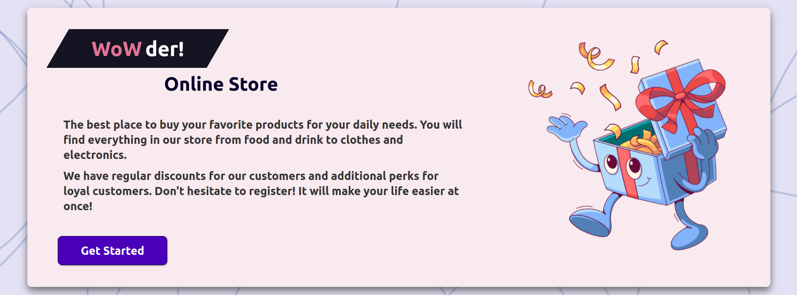

- About Us section:

This section describes the benefits of being a customer of the store, such as "The best quality," "The best prices," "Your privacy is our priority," "Fast delivery," and "Being in touch."

- Testimonials section:

This section presents the testimonials of the store customers and aims to give the user an idea of the store's quality.

*Home page is slightly different on the mobile devices*

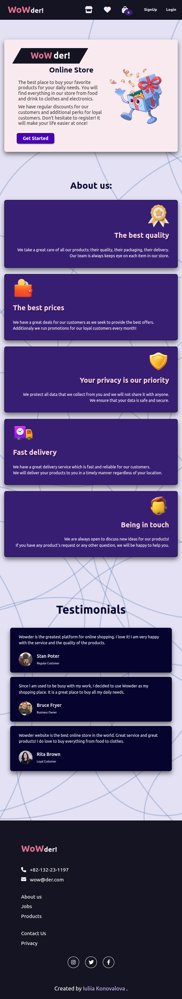

### My profile page:

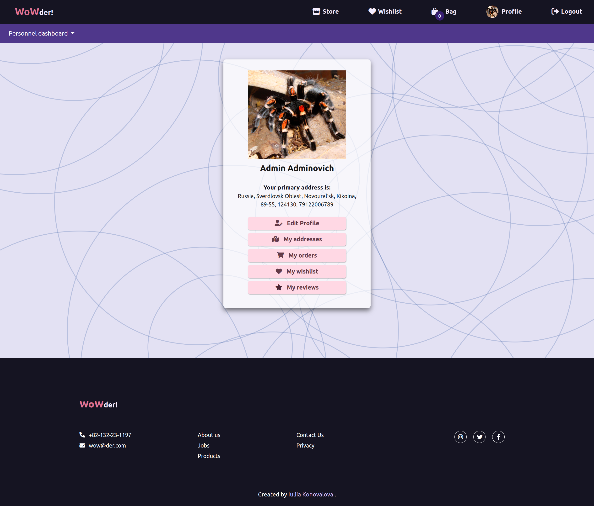

This page has the primary data on the customer for the logged-in user.

- It has an avatar, full name, primary address (if it is set), and profile navigation:

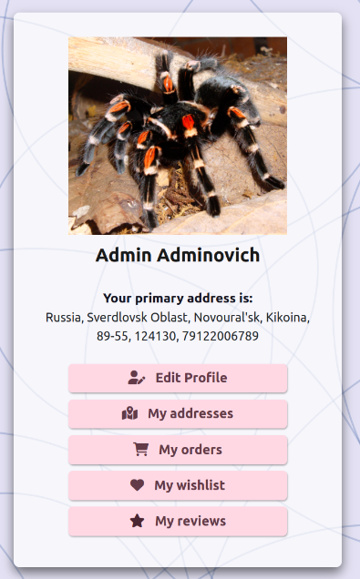

- Profile navigation has the following buttons:

  - Edit Profile button, which redirects the user to the edit profile page;

  - My addresses button, which redirects the user to my addresses page; (*If the user hasn't added any addresses, the button will say: add the address, and the user will be redirected to add address page*)

  - My orders button, which redirects the user to my orders page;

  - My wishlist button, which redirects the user to my wishlist page;

  - My reviews button, which redirects the user to my reviews page;

### Edit Profile page:

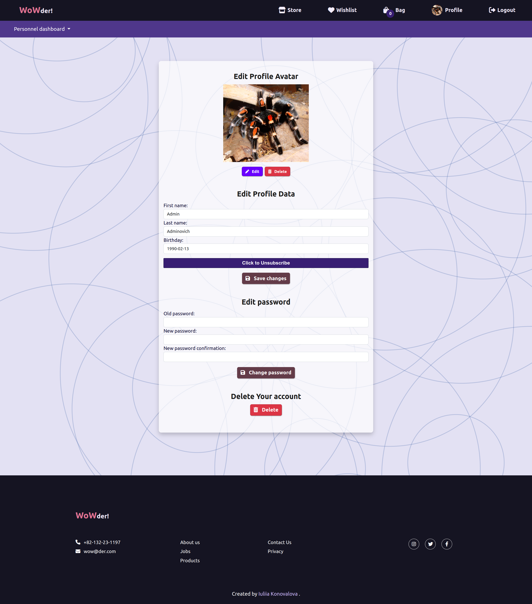

This page has the primary data on the customer for the logged-in user and allows user to edit this data.

It has four forms:

  - Edit avatar form;

    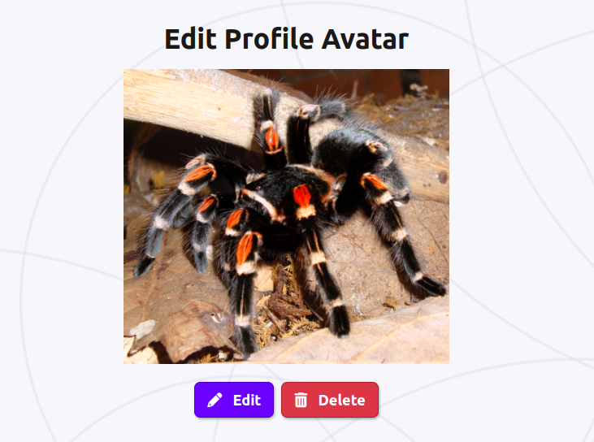

    - if the user wants to upload an avatar, he can do it by clicking the "Edit" button, and the user will be able to select an image from his computer. When the user selects an image, the form will be filled with the image's data:

    

  - Edit Profile Data Form;
  
    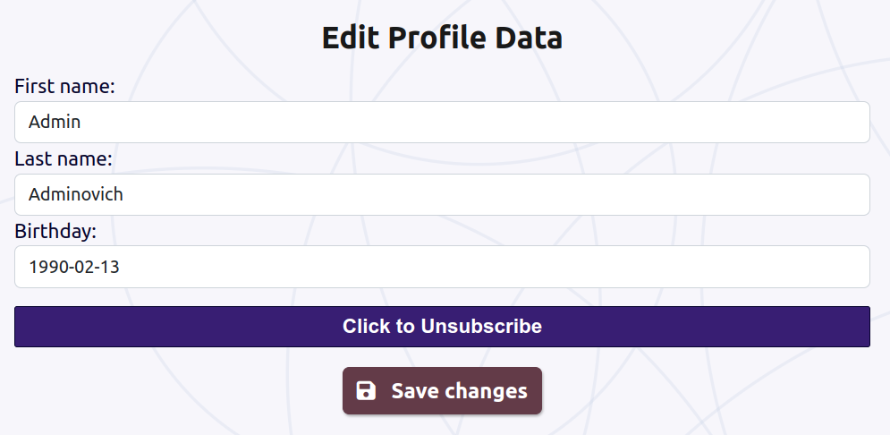
    
  - Change Password Form;
  
    

  - Delete Account Form;

    

    - If the user clicks the "Delete" button, the user will be asked to confirm the deletion.

    

    - If the user confirms the deletion, the user will be redirected to the home page.

    - If the user doesn't confirm the deletion, the delete account form will be closed.

### My addresses page:

This page empowers customers to store their addresses. And easily allows them to edit and delete them as well as set the primary address.

It has a button: "Add a new address," which redirects the user to the add address page.

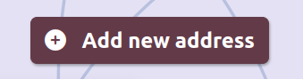

It has a table of address cards:

Only one address can be primary.

Each card has address data and two buttons.

  - Edit button, which redirects the user to the edit address page;
  
  - Primary address card also has a "Disable as Primary" button, which allows the user to disable the primary address.

The primary address card is distinguished by the "Primary" label and purple background.

  - Not primary address card also has an "Enable as Primary" button, which allows the user to make the address primary, and disable the previous primary address.

### Add address page:

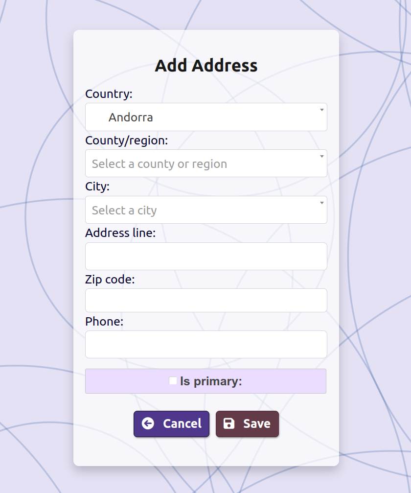

This page allows the user to add a new address by selecting the country, state, and city and typing the address, zip code, and phone number. The user can also set the address as primary.

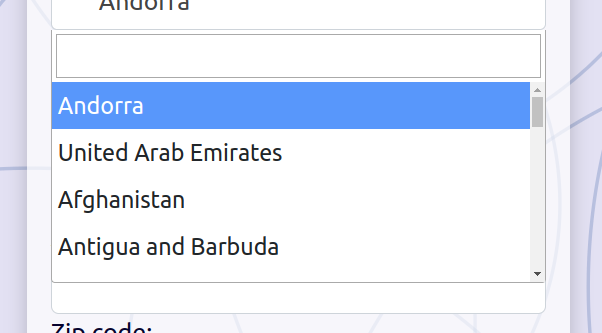

It also has two buttons:

  - Save Address button, which redirects the user to my addresses page and saves the address;
  
  - Cancel button, which redirects the user to my addresses page.

### Edit address page:

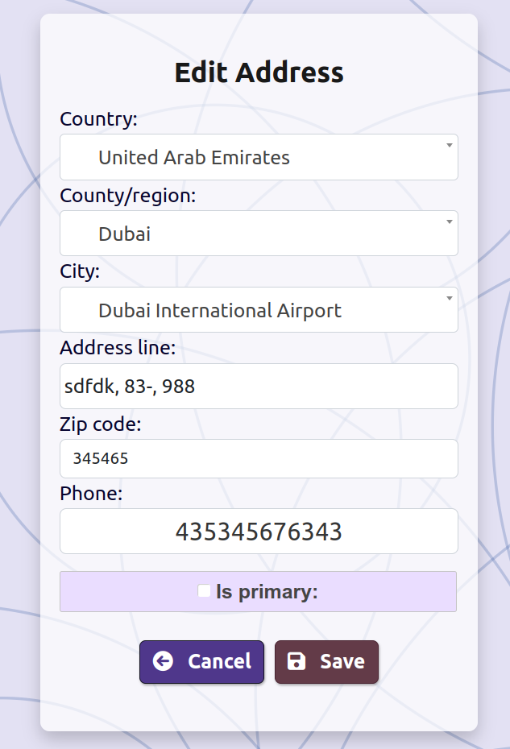

This form has the same fields as the add address form. However, it has prefilled data on the address.

It has 2 buttons:

  - Save Address button, which redirects the user to my addresses page and saves changes to the address;
  
  - Cancel button, which redirects the user to my addresses page.

**Under the edit address page, the user can find the delete address button**

If the user clicks the delete address button, the user will be asked to confirm the deletion.

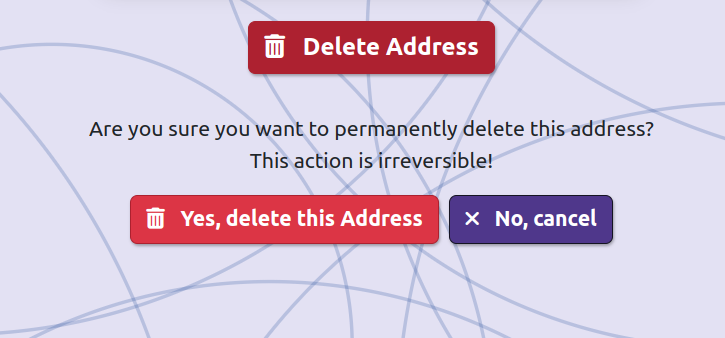

- If the user confirms the deletion, the user will be redirected to my addresses page.

- The delete address form will be closed if the user doesn't confirm the deletion.

### My orders page:

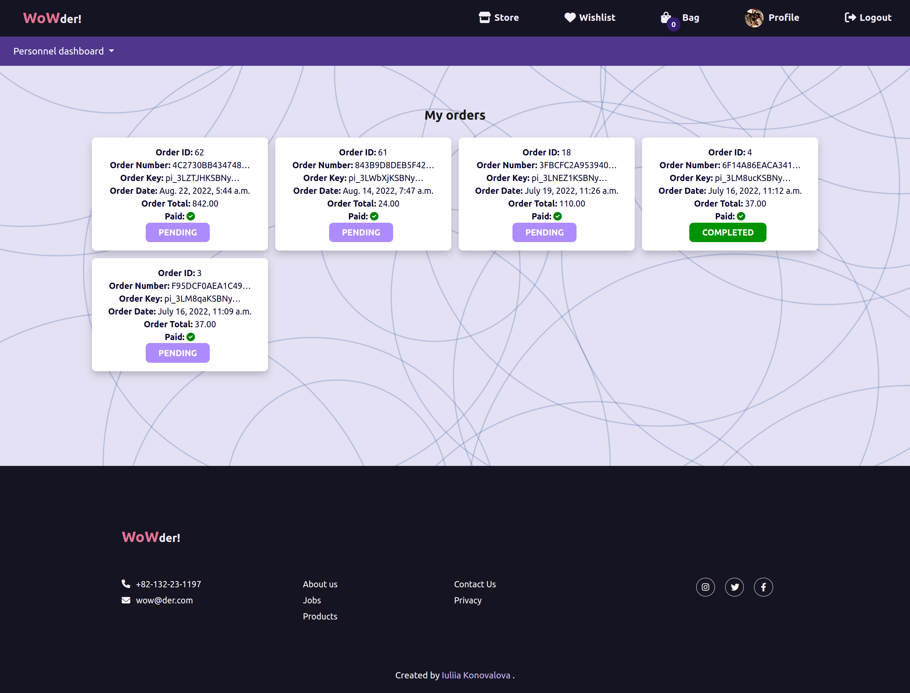

This page has complete data on the Customer's orders and is presented by order cards.

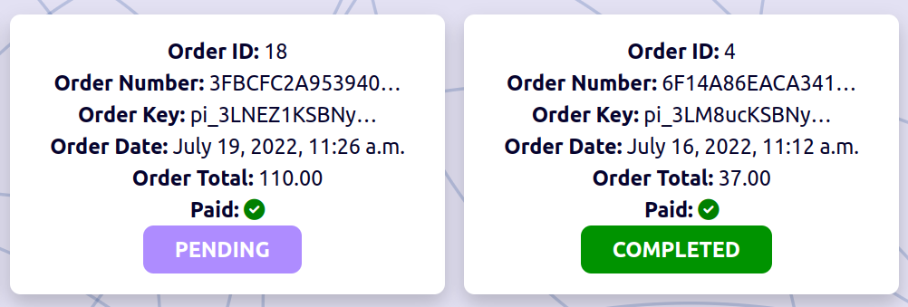

Each card has a short description of the order, the date of the order, the total price of the order, and the status of the order.

If the user clicks on the order card, the user will be redirected to the order detail page.

### My Order detail page:

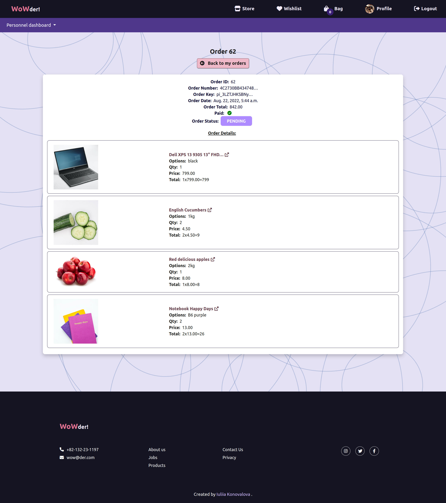

This page has a store order number as a title and a "Back to my orders" button, which redirects the user to my orders page. 

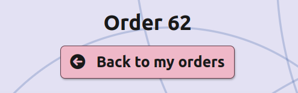

Under the title, the user can find the order's data shown as a table:

1. Order summary:

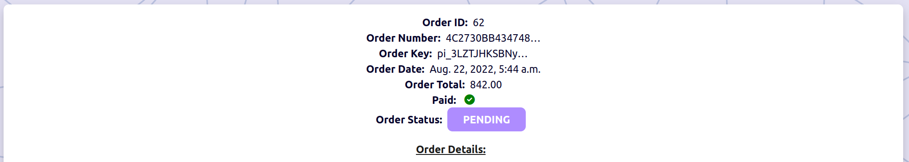

2. Order items:

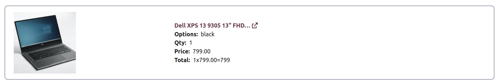

For each item, the user can find the product's name with the link to the product in-store, quantity, price, and total price. If the user clicks on the product's name or image, the user will be redirected to the product detail page.

**If an order is completed, the Customer is allowed to add reviews on the products**

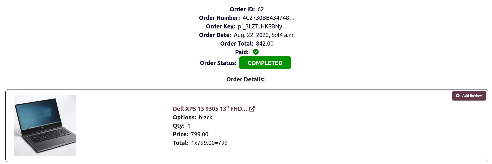

Each item got the same button: "Add a review."

If the user clicks on the button, the user will be redirected to the add review page.

If the user has already added a review, the button is "View review."

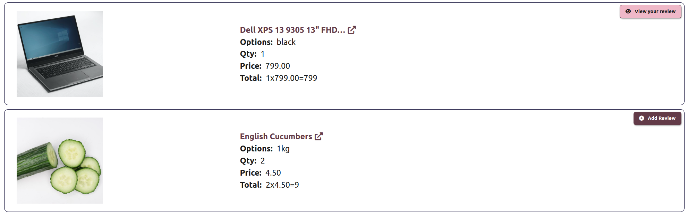

If the user forgot to close the window with the add review page, and a review has already been added, the user will be redirected to the "Review already added" page.

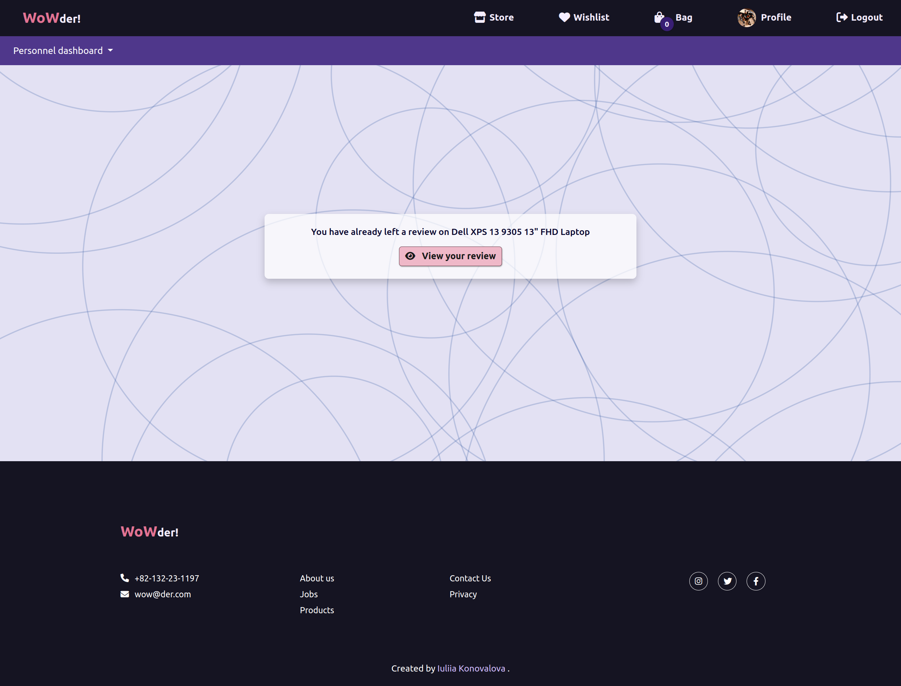

### Add review page:

This page has a form to add a review.

1. Rating:

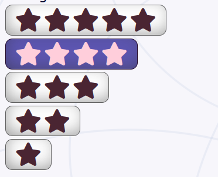

The rating field allows the user can select the rating.

2. Comment:

The comment field allows users can type the comment.

3. Images:

  - If the user has uploaded images, they will be shown in the form;
  
  - If the user has not uploaded images, they will be shown in the form.

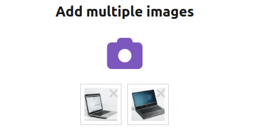

4. Form control buttons:

  - Save button, which redirects the user to my order detail page and saves the review;
  
  - Cancel button, which redirects the user to my order detail page.

### All reviews page:

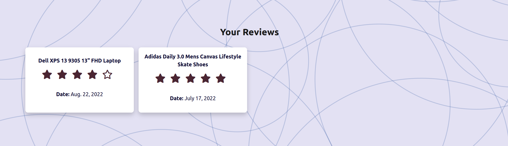

This page has all reviews that the user has left. Review cards present it. If the user clicks on the review card, the user will be redirected to the review detail page.

### My review page:

This page has all data on the review left by the user.

**However, the edition of the review is not allowed**

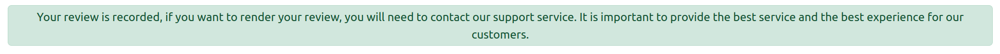

This decision was made because the shop owner has to evaluate all aspects of the customer's experience: product quality, delivery speed, and customer service.

It has been made to prevent the user from editing the review for no reason.

The Chinese online shopping community highly appreciates this trend.

### Store page:

This page has the following features:

  - Search-select bar:

    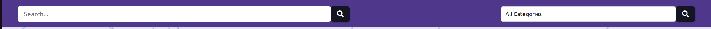

    - Search bar:

    Users can type the product's name in the search bar, and the system will show the products that match the search.

    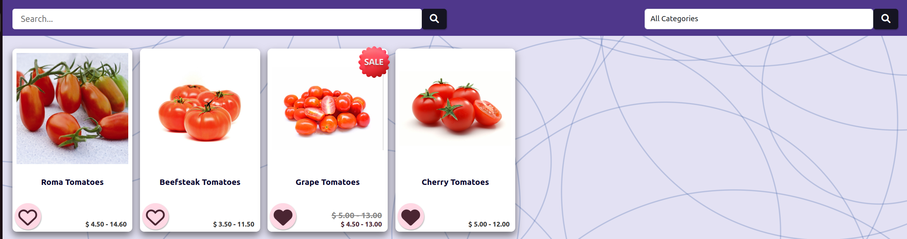

    - Select bar:

    Users can select the product category in the select bar, and the system will show the products that match the type.

    

  - Products:

    Users can see the products that are in the store. The products are displayed in a grid with the following features:
    
    **Product card:**

    

    It has the product's main image, the product's name, the product, the price of the product, the button "Add to wishlist," and unique labels. Suppose the product is new, and the label "New" is displayed. The label "Sale" is displayed if the product is on sale.

    The button outline heart is displayed if the user doesn't like the product. If the user likes the product, the button-filled heart is displayed. And etc.

    

    The spin icon is displayed when the user call processing the request.

    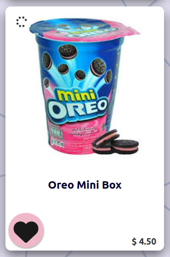

    Special features of the product card:

    The price of products can be different depending on the product's values. For example, if the product has a value of "Size," the cost of the product can be different depending on the size of the product. If the product is out of stock, the price is displayed as "Out of stock."

    

  - Pages:

    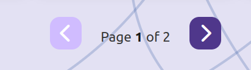

### Product's details page:

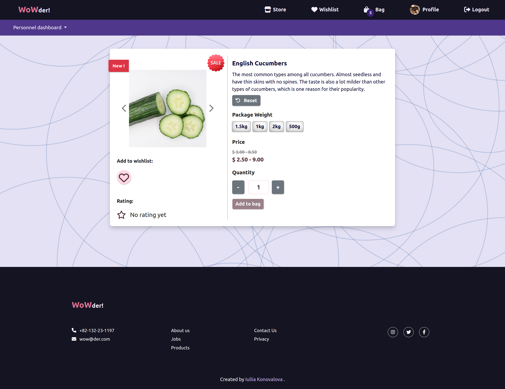

This page has the Product's card with complete data.

The left side of the products card has the following features:

It has the main image of the Product with a carousel. The carousel will change the image when the user clicks on the left or right arrow.

  
  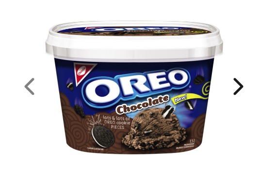
  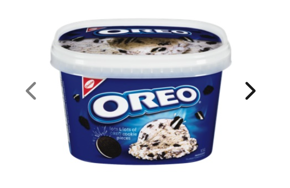

It also has labels:

  - if a Product is on sale, the label "Sale" is displayed;

  - if the Product is new, the label "New" is displayed;

Underneath the Product's main image is the "Add to wishlist" section. When the user clicks on the outline heart button, the Product is added to the wishlist.

And the message will appear in the top right corner of the page:

And the heart icon button will turn to be filled heart button.

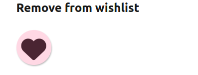

*While the request is processing, the spin icon is displayed*

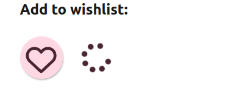

Under this section, the user may find the reviews of the Product and the overall rating of the Product.

When the user clicks "View reviews," the user will be redirected to the Product's reviews page.

The right side of the product card has the following features:

  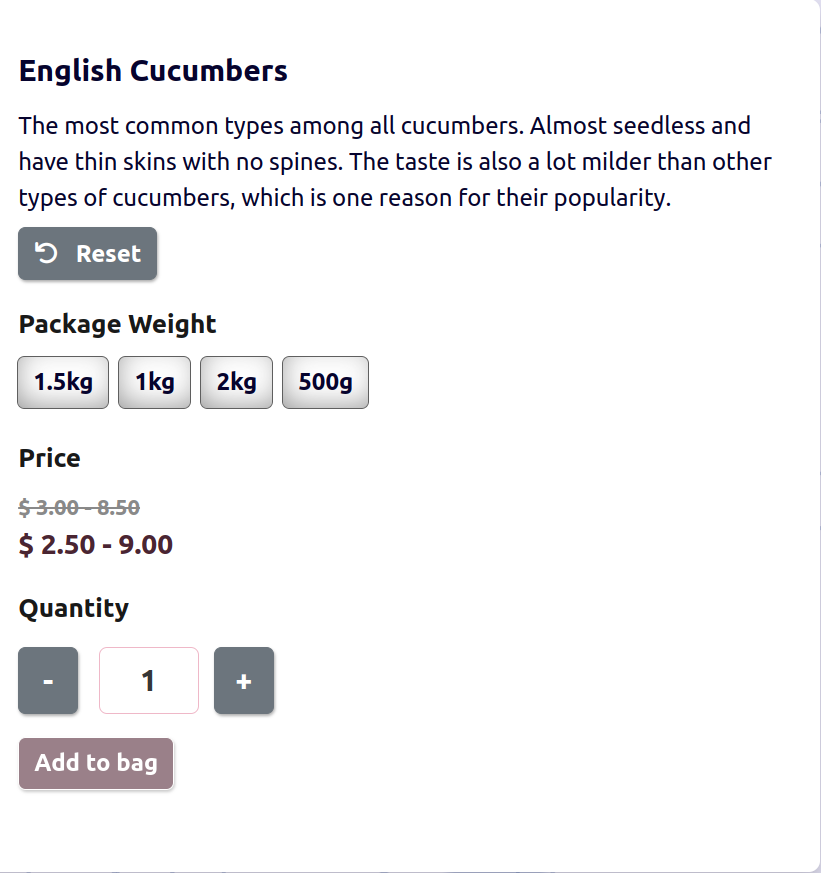

  *"Add to bag button will be disabled if there are any options that the customer specifies.**

  

  - Product's full name;
  
  - Product's description;

  - Reset button, which allows the user to reset the values of the Product;

    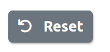

  - Product's options section:
  
    

    - User can select the value of the Product's option.

    *The "Add to bag" button will be enabled if the options are chosen.*

    

    If options have colors, the user can see the example of the stain right away.

    - if the Product has no options, the section is not displayed;

    

    *This button will be enabled if there are no options for a particular product.*

    - If the Product is out of stock, the button "Add to bag" is disabled;

    

  - Product's price:
  
    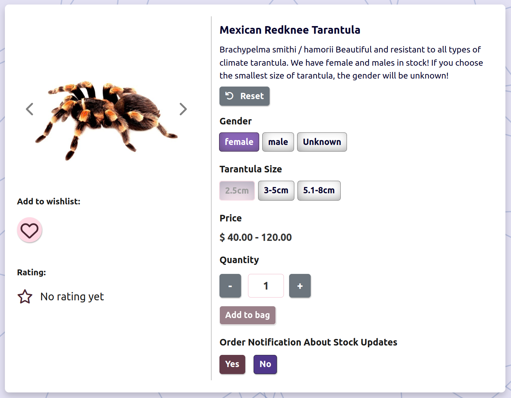

    The Product's price can be different depending on the Product's value. In the above example, the price for the tarantula starts from $40 to $120.
    
      - If the user chooses the particular value of the Product, the price of the Product will be specified:

      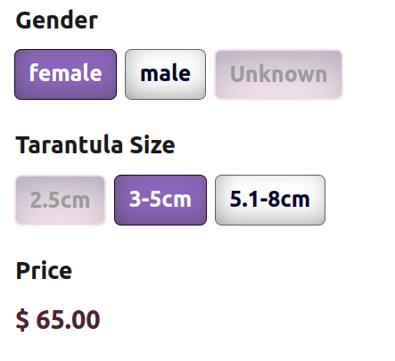

      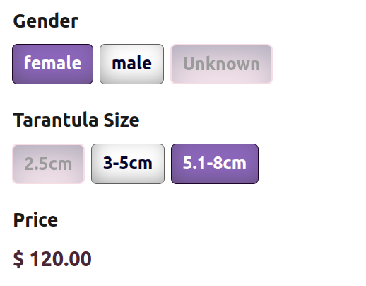

    - If there is a discount, the Product's price will be displayed with the discount.
    
      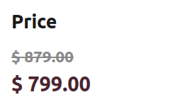
      
  - Product's quantity:

    

      - If the quantity is limited, the user will see a warning message.

      

      - If the user adds the exact quantity of the Product that is available right now (7 items in this example), the plus button will be disabled.

      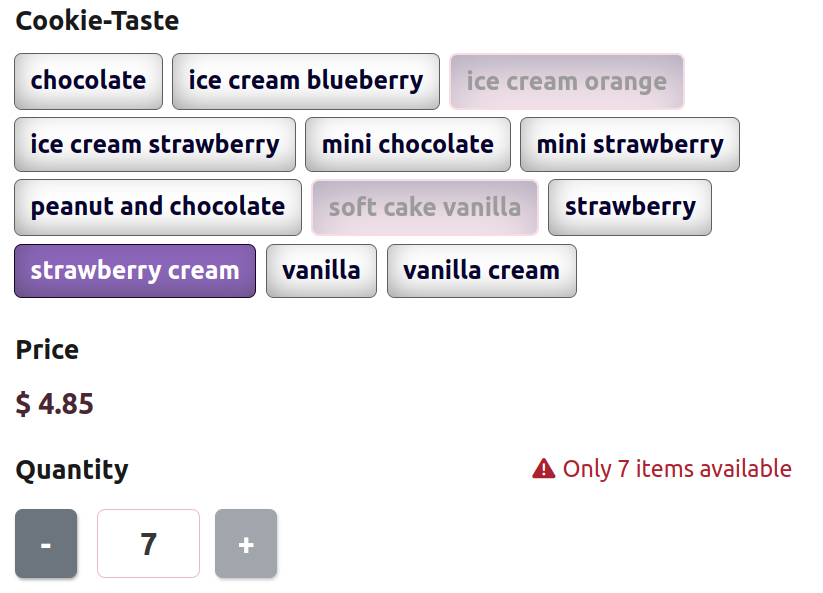

      - If the user reduces the quantity of the Product, the plus button will be enabled.

      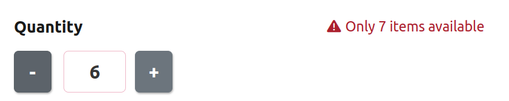

  - Add to bag button:

    The functionality of this button has been described above in the values options. It has two stages:

    - disabled: the button is disabled when the user has not chosen the values of the Product, or the Product is out of stock;

    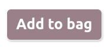

    - enabled: the button is enabled when the user has chosen the values of the Product, the Product is not out of stock, and there are no options for a particular product;

    

    - If the button is enabled, the user can add the Product to the bag, and the message will appear in the top right corner of the page confirming the success of the operation:
    
      

  - Request product section:

    - When the user opens the Product's details page, the request product section is not displayed till the user starts choosing combinations of the Product's options
    
      

    - When the user chooses some product options, and some units of the products are not present in the store, they will see our message. This message will allow the user to request the particular Product's options from the store and get a notification email when the Product is available.
    
      

    - If the Product is out of stock, the request product section is displayed immediately.
    
      

  - Modal for requesting a product:

    

    - There are two buttons: "Cancel" and "Send" requests. The "Cancel" button will cancel the request and closes the modal. The "Send" button allows users to request a stock notification email when the Product is available.

    - If there are options for a particular product and the user hasn't specified with options combinations they want, and the user clicks the "Send" button, there will be a visible highlighted title to remind the user to select options, and the request will not be sent
    
      

    - If the user has specified options combinations they want and clicks the "Send" button, the request will be sent, the modal window will be closed, and the user will see a message confirming the operation's success.
    
      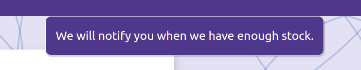

    - If the user has specified options combinations they want and clicks the "Cancel" button, the request will not be sent, and the modal window will be closed.

    - If the user has specified the options combinations they want and clicks the "Send" button. These options combinations are available in the store at this moment; the request will not be sent, the modal window will be closed, and the user will see a message:

      

  - Email notifications on stock requests:

    When the user requests a product, the user will receive an email notification when the Product is available.

    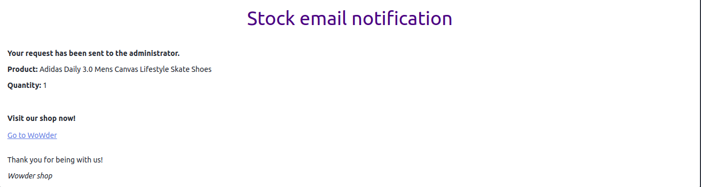

    When the requested Product is available, the user will receive an email notification.

    

  *The Product's details page is displayed differently for the mobile version of the site.*

  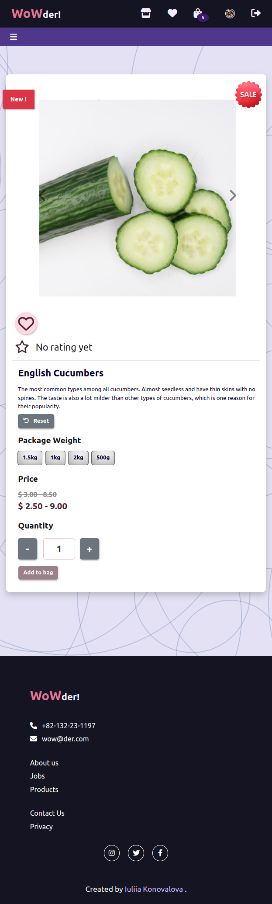

### Wishlist page:

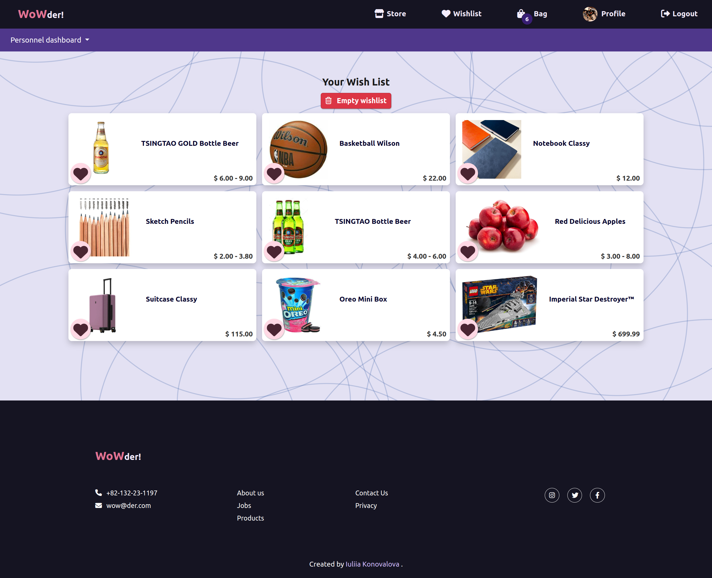

This page has the following features:

  - Empty the wishlist button:
  
    
    
    - if the user unlikes the Product, the Product will be removed from the wishlist, and the user will see a message confirming the success of the operation.

    

    - If the user clicks the button, a container with the confirmation will appear:

    

    - if the user clicks "No," the container will be closed, and the wishlist will not be emptied.

    - If the user clicks the "Yes" button, the wishlist will be emptied, and the user will see a message confirming the operation's success.

    

    - If there are no items on the wishlist, the user will see a message:

    

    - If there are too many items on the wishlist, the user will see functional page navigation:

    

### Product's Review page:


This page has all reviews for the Product left by the users who purchased the Product.

*Due to the lack of time, the database wasn't filled; However, all reviews may be seen on this page with page navigation. The user will see functional page navigation if there are more than 20 reviews.*

### Bag page:

This page has the following features:

  - Title with the arrow down button. If the user clicks this button, they will immediately be redirected to the checkout button.
  
    
    
    - If the user clicks the button, the bag page will be redirected to the checkout page.
    
  - Alert message. It can have two options:

    - If the user has subscribed to the newsletter, the message will be displayed:
    
      

    - If the user hasn't subscribed to the newsletter, the message will be displayed:

      

  - Bag table with all items in the bag:
  
    

    - If there are no items in the bag, the user will see a message, and there will be no bag table:
    
      

    - Items of the bag:

    

      - It has an image of the product, the product's name, the quantity, the price for the single item, quantity control, the total cost for the bag item, and the remove button.

      - Quantity control provides the user a possibility to change the quantity of the item in the bag.

      

      - If the user clicks the "+" button, the quantity of the item will be increased by one and the user will see the message:

      

      - If the user clicks the "-" button, the quantity of the item will be decreased by 1 (If the user has more than one items), and the user will see the message:

      

      - If the user clicks the "-" button and the quantity of the item is 1, the item will be removed from the bag, and the user will see the message:

      

      **Note!** When a user updates the item quantity in the bag, the total price for the item and the total spending will also be updated.

      - There is a remove from the bag button, which helps the user to remove the item from the bag regardless of the quantity.

      

      - When the user clicks the button, all items will be removed from the bag, and the user will see the message:

      

  - Bag Summary section:

    

    It has the Total sum of the bag and quantity of the items in the bag.

  - Under this section, the user may see a coupon section for loyal customers:

    

    - If the user inputs the correct coupon code, the price will be reduced by the coupon value

      

    - If the user inputs the incorrect coupon code, the user will see the message:
    
      

  - Checkout button. When the user clicks the button, the bag page will be redirected to the checkout page.
  
    

### Payment page:

This page has the following features:

  - Title and prefilled form:
  
    

    - This form is editable, and the user can change the data.

    - If the user hasn't set the full name in the profile, the "Customer Name" will be empty:

    
    
    - If the user has subscribed to the newsletter, the form will be prefilled with the email address.

    - Alert message if the user hasn't set a primary address with an empty form:

    

  - Under the form, the user will see a payment card field with a "Pay button" This button will show the exact price for the order.
  
    
    
    - If the user clicks the button, the payment page will be redirected to the confirmation page.

    *If there are any errors in the form, the user will see the messages*
    *Uses is unable to double-click on the button to pay the order.*

### Order Placed page:


This page has a success message and a button to review a customer's orders.

### Promotions Page:


This page is accessible only to the personnel. And only the admin can add a promotion, render the promotion page, and delete the promotion.

The following image shows the promotion page for managers:


When the personnel member clicks on the promotion in the promotions table, the dropdown menu will display all items in the promotion and link to these items.


However, only the admin can see the edit and delete buttons.

The following image shows the promotion dropdown menu for managers:

- If the admin clicks add promotion button, he will be redirected to add promotion page;

- If the admin clicks on the edit button, he will be redirected to the edit promotion page;

- If the admin clicks on the delete button, the modal will be displayed with a confirmation message;


### Add Promotion Page:


This page is accessible only to the admin. It has a form with fields for the promotion name, description, coupon code, discount, start date, end date, and the items included in the promotion.

When the admin clicks the "Cancel" button, the admin will be redirected to the promotions page.

When the admin clicks the "Save" button, the admin will be redirected to the promotions page.

### Edit Promotion Page:


This page is accessible only to the admin. It has a form with fields for the promotion name, description, coupon code, discount, start date, end date, and the items included in the promotion.

When the admin clicks the "Cancel" button, the admin will be redirected to the promotions page.

When the admin clicks the "Save" button, the admin will be redirected to the promotions page.

### Create Email Page:


This page is accessible only by personnel. It has a form with fields for the email name, Content, and coupon code.

The coupon code field is optional.

When the personnel clicks the "Cancel" button, the personnel will be redirected to the emails page.

When the personnel clicks the "Save" button, the personnel will be redirected to the emails page.

### Categories Page:


This page is accessible only to the personnel. It has a categories table with all categories.

However, only the admin can delete categories.

The following image shows the categories table for managers:


Under the title of the Categories title, the personnel member can see a button to add a category.

If the personnel member clicks on the button, the personnel member will be redirected to the add category page.

- Category card for the admin:

  

  - If the admin or other personnel members click on the edit button, the admin will be redirected to the edit category page;

  - If the admin clicks on the delete button, the admin will be redirected to the delete category page;!

### Add Category Page:


This page is accessible only to the personnel. It has a form with fields for the category name and status.

When the personnel clicks the "Cancel" button, the personnel will be redirected to the categories page.

When the personnel clicks the "Save" button, the personnel will be redirected to the categories page.

### Edit Category Page:


This page is accessible only to the personnel. It has a form with fields for the category name and status.

When the personnel clicks the "Cancel" button, the personnel will be redirected to the categories page.

When the personnel clicks the "Save" button, the personnel will be redirected to the categories page.

### Delete Category Page:


This page is accessible only to the admin. It has a form and a list of the products in the category.

When the admin clicks the "Cancel" button, the admin will be redirected to the categories page.

When the admin clicks the "Delete" button, the admin will be redirected to the categories page.

### Brands Page:


This page is accessible only to the personnel. It has a brands table with all brands.

The "Add brand" button has a title, which will redirect the personnel member to the add brand page. It also has a search field, which allows the admin to search for brands.

The central part of the page is dedicated to the brands' table.

If the admin or other personnel members click on the brand in the brands' table, the admin will be redirected to the brand's details page.

### Add Brand Page:


This page is accessible only to the personnel. It has a form with the brand name, description, and status fields.

When the personnel clicks the "Cancel" button, the personnel will be redirected to the brands' page.

When the personnel clicks the "Add brand" button, the personnel will be redirected to the brands' page.

### Brand Details Page:


This page is accessible only to the personnel.

It has complete data on the brand:

*Admin view*


*Manager view*


- Name;
- Status;
- How many products are in the brand;
- All products in the brand;
- Description;
- Edit button;
    - if the personnel member clicks on the edit button, the personnel member will be redirected to the edit brand page;
- Delete button; (Only for admin)
    - if the admin clicks on the delete button, the admin will be redirected to the delete brand page;

### Edit Brand Page:


This page is accessible only to the personnel. It has a pre-filled form with fields for the brand name, description, and status.

When the personnel clicks the "Cancel" button, the personnel will be redirected to the brands' page.

When the personnel clicks the "Save changes" button, the personnel will be redirected to the brands' page.

### Delete Brand Page:


This page is accessible only to the admin. It has a form and a list of the products in the brand.

When the admin clicks the "Cancel" button, the admin will be redirected to the brands' page.

When the admin clicks the "Delete" button, the admin will be redirected to the brands' page.

### Tags Page:


This page is accessible only to the personnel. It has a tags table with all tags.

The "Add tag" button has a title, which will redirect the personnel member to the add tag page. It also has a search field, which allows the admin to search for tags.

The central part of the page is dedicated to the tags table.
If the admin or other personnel members click on the tag in the tags table, the admin will be redirected to the tag's details page.

### Tag details Page:


This page is accessible only to the personnel.

It has complete data on the tag:

  - Name;
  - Status;
  - How many products are in the tag;
  - All products in the tag;
  - Edit button;
      - if the personnel member clicks on the edit button, the personnel member will be redirected to the edit tag page;
  - Delete button;
      - if the personnel member clicks on the delete button, the personnel member will be redirected to the delete tag page;

### Add Tag Page:


This page is accessible only to the personnel. It has a form with fields for the tag name and status.

When the personnel clicks the "Cancel" button, the personnel will be redirected to the tags page.

When the personnel clicks the "Add tag" button, the personnel will be redirected to the tags page.

### Edit Tag Page:


This page is accessible only to the personnel. It has a pre-filled form with fields for the tag name and status.

When the personnel clicks the "Cancel" button, the personnel will be redirected to the tags page.

When the personnel clicks the "Save changes" button, the personnel will be redirected to the tags page.

### Delete Tag Page:


This page is accessible only to the personnel. It has a form with a warning message.

When the personnel clicks the "Cancel" button, the personnel will be redirected to the tags page.

When the personnel clicks the "Delete" button, the personnel will be redirected to the tags page.

### Product Types Page:


This page is accessible only to the personnel. It has a product types table with all product types.

The "Add product type" button has a title, which will redirect the personnel member to the add product type page. It also has a search field, which allows the admin to search for product types.

The central part of the page is dedicated to the product types table. The product types table has cards with data on each product type:

  - Name;
  - Description;
  - Attributes;
      - If this click on the attribute, the personnel member will see all list of attributes associated with the product type;

      

  - Edit button;
      - if the personnel member clicks on the edit button, the personnel member will be redirected to the edit product type page;

  **The product type card will be viewed as the following for managers**

  

  - Delete button; (Only for admin)
      - if the admin clicks on the delete button, the admin will be redirected to the delete product type page;

### Add Product Type Page:


This page is accessible only to the personnel. It has a form with fields for the product type name, attributes, and description.

When the personnel clicks the "Cancel" button, the personnel will be redirected to the product types page.

When the personnel clicks the "Add product type" button, the personnel will be redirected to the product types page.

### Edit Product Type Page:


This page is accessible only to the personnel. It has a pre-filled form with fields for the product type name, attributes, and description.

When the personnel clicks the "Cancel" button, the personnel will be redirected to the product types page.

When the personnel clicks the "Save changes" button, the personnel will be redirected to the product types page.

### Delete Product Type Page:


This page is accessible only to the personnel. It has no form, as the deletion may be dangerous.

It provides a warning message.

And has only a "Go back" button.

When the personnel clicks the "Go back" button, the personnel will be redirected to the product types page.

### Attributes Page:


This page is accessible only to the personnel. It has an attributes table with all attributes.

The "Add attribute" button has a title, which will redirect the personnel member to the add attribute page. It also has a search field, which allows the admin to search for attributes.

The main part of the page is dedicated to the attributes table. The attributes table has cards with data on each attribute:
  - Name;
  - Description;
  - Values associated with the attribute;
      - If this click on the value, the personnel member will see all list of values associated with the attribute;
      
  - Edit button;
      - if the personnel member clicks on the edit button, the personnel member will be redirected to the edit attribute page;

  **The attribute card will be viewed as the following for managers**

  

  - Delete button; (Only for admin)
      - if the admin clicks on the delete button, the admin will be redirected to the delete attribute page;

### Add Attribute Page:


This page is accessible only to the personnel. It has a form with fields for the attribute name, description, and values.

When the personnel clicks the "Cancel" button, the personnel will be redirected to the attributes page.

When the personnel clicks the "Add attribute" button, the personnel will be redirected to the attributes page.

### Edit Attribute Page:


This page is accessible only to the personnel. It has a pre-filled form with fields for the attribute name, description, and values.

When the personnel clicks the "Cancel" button, the personnel will be redirected to the attributes page.

When the personnel clicks the "Save changes" button, the personnel will be redirected to the attributes page.

### Delete Attribute Page:


This page is accessible only to the personnel. It has no form, as the deletion may be dangerous.

It provides a warning message.

And has only a "Go back" button.

When the personnel clicks the "Go back" button, the personnel will be redirected to the attributes page.

### Values Page:


This page is accessible only to the personnel. It has a values table with all values.

It has a title, the "Add value" button, which will redirect the personnel member to the add value page. It also has a search field, which allows the admin to search for values.

The central part of the page is dedicated to the values table. The values table has cards with data on each value:
  - Name;
  - Description;
  - number of units assigned to the value;
  - Edit button;
      - if the personnel member clicks on the edit button, the personnel member will be redirected to the edit value page;
    
    **The value card will be viewed as the following for managers**

    

  - Delete button; (Only for admin)
      - if the admin clicks on the delete button, the admin will be redirected to the delete value page;

### Add Value Page:


This page is accessible only to the personnel. It has a form with fields for the value name, description, and number of units.

When the personnel clicks the "Cancel" button, the personnel will be redirected to the values page.

When the personnel clicks the "Add value" button, the personnel will be redirected to the values page.

### Edit Value Page:


This page is accessible only to the personnel. It has a pre-filled form with fields for the value name, description, and number of units.

When the personnel clicks the "Cancel" button, the personnel will be redirected to the values page.

When the personnel clicks the "Save changes" button, the personnel will be redirected to the values page.

### Delete Value Page:


This page is accessible only to the personnel. It has no form, as the deletion may be dangerous.

It provides a warning message.

And has only a "Go back" button.

When the personnel clicks the "Go back" button, the personnel will be redirected to the values page.

### Products table:


This page is accessible only to the personnel. It has a product table with all products.

The "Add product" button has a title, which will redirect the personnel member to the add product page. 


It includes a summary of the products in store as well.

It also has a search field, which allows the admin/personnel to search for products.


The central part of the page is dedicated to the products table. The products table has cards with data on each product:


  - ID;
  - Name;
  - Category;
  - Number of tags;
  - Brand;
  - Number of images;
  - If the product is on sale;
  - Number of units;
  
  
  If the personnel member clicks on the product, the personnel member will be redirected to the product page.

### Product full data Page:


This page is accessible only to the personnel. It has a table with all products.

It has a heading section, complete data on the product, images, and units for the product.

- Heading section has a title, label "New" (if the product is added recently to the store), Id, status, and three buttons:

  

  - Edit button;
      - if the personnel member clicks on the edit button, the personnel member will be redirected to the edit product page;

  - Delete button;
      - if the personnel member clicks on the delete button, the personnel member will be redirected to the delete product page;

  - View in store button;
      - if the personnel member clicks on the view in store button, the personnel member will be redirected to the product's store page;

- Additional data on the product:
  

    It has the following  features:
    
    - description;

    - Category;
        - if the personnel member clicks on the category, the personnel member will be redirected to the category page;

    - Brand;
        - if the personnel member clicks on the brand, the personnel member will be redirected to the brand page;

    - Tags associated with the product and their total number;
        - if the personnel member clicks on the tag, the personnel member will be redirected to the tag page;

- Images section:


It has the following  features:

  - Title with the number of images;

  - Add image button;
      - if the personnel member clicks on the add image button, the personnel member will see a modal window with a form for uploading an image;

      

      - Modal has the following features:

          - Image id (automatically generated).

          - Choose the file button;

          - Alt text field;

          - Checkbox for default image;

          - Checkbox for the active image;

          - 2 buttons: "Close" and "Save changes"

      - If the personnel member didn't fill out the form correctly, the personnel member will see a message with the error.

      
    
  - Image cards with the setting displayed for default and active images, edit, delete buttons, and the image itself:

      - if the personnel member clicks on the edit button, the personnel member will see a modal window with a form for editing the image;

      

      - If the personnel member clicks the delete button, the personnel member will see a confirmation window with a warning message.

      

- Units section:

  

  It has the following  features:

    - Title with the number of units;

    - Add unit button, which will redirect the personnel member to the add unit page;
    
    - Unit cards with the data on the unit:
      - status;

      - SKU;

      - UPC;

      - Values;

      - Weight;

      - Promo;

      - Price options;

      - Stock numbers with the colorful background to make sure the stock is noticed:

      

    If the user clicks on the unit card, the personnel member will be redirected to the unit page;

### Add Product Page:

This page is accessible only to the personnel. It has a form for adding a product.

It has the following fields:

- Name;
- Description;
- Category;
- Tags;
- Brand;
- Status;
- 2 buttons: "Cancel" and "Save changes";

  - If the personnel member clicks on the "Cancel" button, the personnel member will be redirected to the products page;
  - If the personnel member clicks on the "Save changes" button, the personnel member will be redirected to the products page;

### Edit Product Page:


This page is accessible only to the personnel. It has a form for editing a product.

It has the same fields as the add product page. The only difference is that the personnel member will see the product's data in the fields.

  - If the personnel member clicks on the "Cancel" button, the personnel member will be redirected to the product full data page, and changes will be lost;
  - If the personnel member clicks on the "Save changes" button, the personnel member will be redirected to the product full data page, and changes will be saved;

### Delete Product Page:


This page is accessible only to the personnel. It has a form for deleting a product.

It also has the name of the product, the number of units related to this product, and a warning message.

Under the warning message, there is a "Cancel" button and a "Delete" button.

- If the personnel member clicks on the "Cancel" button, the personnel member will be redirected to the product full data page;

- If the personnel member clicks on the "Delete" button, the personnel member will be redirected to the products page;

### Stock Units table:


This page is accessible only to the personnel. It has a table with all stock units.

It has a field where the personnel member can search for a unit by SKU, UPC, or values.

The stock units table has unit cards with the data on the team:

  - status;

  - SKU;

  - UPC;

  - Values;

  - Weight;

  - Promo;

  - Price options;

  - Stock numbers with a colorful background to make sure the stock is noticed:

Page navigation if there is more than one page.

### Unit Page:


This page has the following features:

- "Back to products" button, which will redirect the personnel member to the products page;
- Name of the product  of the unit and the label if the product is new;
- "Edit" button, which will redirect the personnel member to the edit unit page;
- "Delete" button, which will redirect the personnel member to the delete unit page;
- Data on the unit:
  - status;
  - SKU;
  - UPC;
  - Values;
  - Weight;
  - Promo;
  - Price table;
  - Stock table:
    - Stock numbers with a colorful background to make sure the stock is noticed;
    - Purchased units' amount;
    - Left units' amount;
    - Sold units' amount;
    - Last checked date;
    - Inconsistency; (if there is some inconsistency, the personnel member will see a red background);

    

  *If the personnel member is admin, the admin will see additional buttons:*
    - "Update stock" button, which will redirect the personnel member to the update stock page;
    - "Delete" button, which will redirect the personnel member to the delete unit page;

    If there is no stock for the unit, the personnel member will not see a stock table, and there will be a message: "Stock not found" and "Add stock" button, which leads to the additional stock page;

    

  *For the managers, this unit detail card will look as follows:*


### Add Unit Page:


This page is accessible only to the personnel. It has a form for adding a unit.

It also has different fields for different types of products:


The fields with values appear on the selected product type and allow personnel members to add all required values.

It has two buttons: "Back to product" and "Add Product Unit."

- If the personnel member clicks on the "Back to product" button, the personnel member will be redirected to the units page;

- If the personnel member clicks on the "Add Product Unit" button, the unit will be saved, and the form will be cleared to let the personnel member add another unit;

### Edit Unit Page:


This page is accessible only to the personnel. It has a form for editing a unit with pre-filled data.

It has two buttons: "Back to product" and "Confirm changes";

  - If the personnel member clicks on the "Back to product" button, the personnel member will be redirected to the units page;
  - If the personnel member clicks on the "Confirm changes" button, the changes will be saved, and the personnel member will be able to return to the unit page by clicking on the "Back to product" button;

### Delete Unit Page:


This page is accessible only to the personnel. It has a form for deleting a unit. It has the name of the unit, a warning message, and two buttons: "Cancel" and "Delete";

- If the personnel member clicks on the "Cancel" button, the personnel member will be redirected to the unit page;

- If the personnel member clicks on the "Delete" button, the personnel member will be redirected to the product page;

### Add Stock Page:


This page is accessible only to the admin. It has a form for adding stock.

The form includes the following fields:

- Checking date;
- Units purchased;
- Units left;
- Units sold;
- 2 buttons: "Cancel" and "Add Stock";

  - If the admin clicks on the "Cancel" button, the admin will be redirected to the unit page;
  - If the admin clicks on the "Add Stock" button, the stock will be saved, and the form will be cleared to let the admin add another stock;

The checking date and units purchased fields are necessary for the admin to control any possible inconsistency in the store.

### Update Stock Page:


This page is accessible only to the admin. It has a pre-filled form for updating a stock.

The form includes the same fields as the add stock form.

It also has two buttons: "Cancel" and "Update Stock";

  - If the admin clicks on the "Cancel" button, the admin will be redirected to the unit page;
  - If the admin clicks on the "Update Stock" button, the stock will be updated, and the admin will be redirected to the unit page;

### Delete Stock Page:


This page is accessible only to the admin. It has a form for deleting a stock. It has the name of the units for which this stock was created, a warning message, and two buttons: "Cancel" and "Delete";

  - If the admin clicks on the "Cancel" button, the admin will be redirected to the unit page;
  - If the admin clicks on the "Delete" button, the stock will be deleted, and the admin will be redirected to the unit page;

### Stock Table Page:


This page is accessible only to personnel. It has the following features:

- Heading with the title, data on how many product's units do not have stock and the "Show" button to see these units;

- If the "Show" button is clicked, the personnel member may see a table with the unit, where each unit has an SKU, the name of the product, and a link to the unit's product:


When a personnel member clicks the unit, they will be redirected to the unit's page to see complete data on the unit.

Under this table, the user can find a select bar.

When the personnel member/admin clicks a particular option, units will be filtered in the table.

]

As it is shown in the above example, personnel may find out the number of units which have < 20 stock units and the entire data. In addition, there is also a link to go to the unit details page to find more data on this unit.

The main accent of this page is devoted to the stock table itself:


It has all the necessary data on the stock for each unit.

Under the table, the user can find page navigation.

### Orders Page:


This page is accessible only to personnel. It has all order data and a search-sort bar.

1. Sort-search bar:


It allows you to search orders by numbers, key, and ID. It also empowers personnel to sort orders according to their status.

2. Order cards.

They include short data on the order and its status. If the personnel member clicks on the order card, they will be redirected to the order full details page.

### Order full detail Page:


This page is accessible only to personnel. It has all data on order.

However, only the admin can see the rendering order buttons:

*View for the manager*:


This page has the following features:

1. "Go to orders" button:


This button redirects the personnel member to the orders page.

2. "Edit order" and "Delete order" buttons:


Accessible only to the admin.

  - If the admin clicks on the "Edit order" button, the admin will be redirected to the order edit page;

  - If the admin clicks on the "Delete order" button, the order will be deleted, and the admin will be redirected to the orders page;

3. Order full details:


*However, only admin or logistics manager is able to see the rendering order status buttons*:

- If the admin or logistics manager clicks on the "Edit" button, the dropdown menu will be opened; the admin can change the order status to "Pending," "Processing," "Completed," "Refunded," "Cancelled" or "In delivery";

Examples:


4. Order items table:


Each item has the following data:

- Product name with a link to the product in-store;
- Image of the product;
- Product's values;
- Quantity;
- Price;
- Total price;
- 2 buttons are accessible only to the admin: "Edit" and "Delete";
    - If the admin clicks on the "Edit" button, the admin will be redirected to the ordered item edit page;
    - If the admin clicks on the "Delete" button, the ordered item will be deleted, and the admin will be redirected to the order full detail page;

5. Customer's order data, including customer's name, phone number, email, address, and phone number:


### Edit Order Item Page:

Accessible only to the admin. This page has the following features:

  - Heading with the title;
  - Form with all necessary data on the ordered item;
  - "Save" button;
  - "Cancel" button;

### Delete Order Item Page:


Accessible only to the admin. This page has the following features:

  - Heading with the title;
  - Warning message;
  - "Delete" button;
  - "Cancel" button;

### Edit Order Page:


Accessible only to the admin. This page has the following features:

  - Heading with the title;
  - Form with all necessary data on order;
  - "Save" button;
  - "Cancel" button;

### Delete Order Page:


  - Heading with the title;
  - Warning message;
  - "Delete" button;
  - "Cancel" button;

### Stock Requests Page:


This page is accessible only to personnel. It has all stock request data and a sort bar.

1. Heading with the title and the number of requests;


2. Sort bar with a dropdown menu showing all requested products. It allows sorting requests by product.


3. Stock requests Table:


The Table has the following data:

- Product name with a link to the product in-store;

- Values of the product requested;

- Quantity;

## Allauth and Access pages:

### Access Page:


### 404 and 500 pages:

It handles two types of errors:

- 404 error;
- 500 error;

Example of 404 error:


### Logout Page:


### Signup Page:


### Login Page:


### Forgot Password Page:


### Reset password Page:


### Change Password Page Success:

