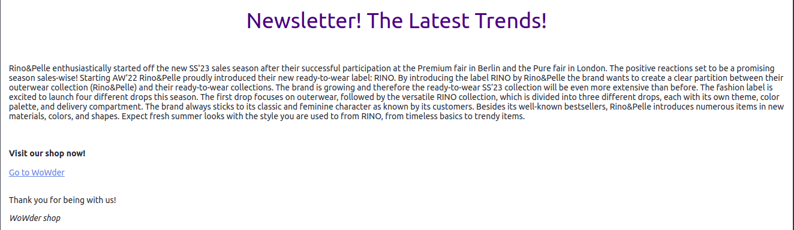
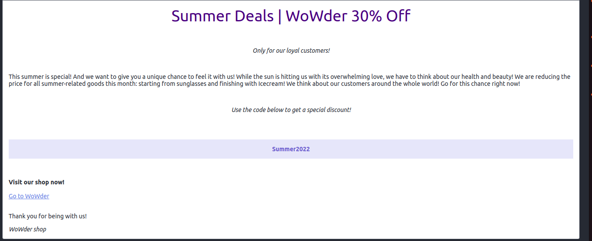

# E-commerce website

**Deployed website: [Link to website](https://wowder.onrender.com)**


**Card number for payment testing: 4242424242424242**
## About

"WoWder" is an e-commerce website that allows customers to buy various products. It has a login system, a shopping cart, a checkout system, and a payment system. Loyal customers can get discounts on their purchases by using the coupon system. This website has a notification system that allows users to be notified when a product is available if they submit a request.
In addition, the website has a personnel functionality that allows admin, manager, logistics, and other personnel to manage the website. The decision to implement multiple personnel roles was made due to the desire to create the project as scalable as possible and reusable in the real world.

---

## UX

The website was created to be eye-catching and user-friendly. The user is given plenty of choices to choose from when they are shopping. The emphasis is on the user experience; the user can navigate the website easily to fulfill users' goals. The website is designed to be easy to use and easy to understand. Additionally, the website attracts customers to become a part of loyalty programs by giving them additional discounts on their purchases.
It also handles all personnel functionality moving from admin to manager to logistics to other personnel.
Business goals were to make the website as scalable as possible and reusable in the real world so that the store personnel could use it according to their position in the company.

### Target Audience

This website is intended for people interested in purchasing products online, starting from bread and finishing electronics, such as TV, smartphones, or other products. It was also aimed to lure people into using this website in their daily lives. This was achieved by implementing a discount system for all customers, additional discounts for loyal customers, and a notification system that allows users to be notified when a product is available. This website may hold many products, and it is essential to make sure that the website is easy to use and navigate. 

### User Stories

#### First Time Visitor

| Issue ID    | User Story |
|-------------|-------------|
| [#1](https://github.com/IuliiaKonovalova/e-commerce/issues/1) | As a First Time Visitor, I want to be able to register my account, so that I can learn the benefits of the app as a user. |
| [#2](https://github.com/IuliiaKonovalova/e-commerce/issues/2) | As a First Time Visitor, I want to be able to easily understand the main purpose of the app, so that I can learn more about this app. |
| [#3](https://github.com/IuliiaKonovalova/e-commerce/issues/3) | As a First Time Visitor, I want to be able to easily navigate through the app, so that I can find the content. |
| [#4](https://github.com/IuliiaKonovalova/e-commerce/issues/4) | As a First Time Visitor, I want to be able to find the app useful, so that I can use it according to my needs. |
| [#5](https://github.com/IuliiaKonovalova/e-commerce/issues/5) | As a First Time Visitor, I want to be informed clearly if I am making any errors when registering my account, so that I can be able to fix any errors quickly if I make some. |
| [#16](https://github.com/IuliiaKonovalova/e-commerce/issues/16) | As a First Time Visitor, I want to be able to see the list of products, so that I can learn the benefits of the app as a user. |
| [#78](https://github.com/IuliiaKonovalova/e-commerce/issues/78) | As a First Time Visitor, I want to be able to register with social media, so that I can easily register my account or login. *(Future feature)* |


#### Regular User (Customer)

| Issue ID    | User Story |
|-------------|-------------|
| [#6](https://github.com/IuliiaKonovalova/e-commerce/issues/6) | As a Regular User, I want to be able to access my account without having to log in every time, so that I can quickly buy a product that I need. |
| [#7](https://github.com/IuliiaKonovalova/e-commerce/issues/7) | As a Regular User, I want to be sure that my account details are protected, so that I can safely make purchases. |
| [#8](https://github.com/IuliiaKonovalova/e-commerce/issues/8) | As a Regular User, I want to be able to view my data, so that I can easily check my account details and past orders. |
| [#9](https://github.com/IuliiaKonovalova/e-commerce/issues/9) | As a Regular User, I want to be able to search for a product, so that I can get the most appropriate choices, so that I am likely to find what I am looking for.   *(Future development)*|
| [#10](https://github.com/IuliiaKonovalova/e-commerce/issues/10) | As a Regular User, I want to be able to add, edit, and save my address data, so that I can make an order faster. |
| [#11](https://github.com/IuliiaKonovalova/e-commerce/issues/11) | As a Regular User, I want to be able to search products by category, tag, or text search, so that I can find a product faster.  |
| [#12](https://github.com/IuliiaKonovalova/e-commerce/issues/12) | As a Regular User, I want to be able to sort products by category, so that I can find the best option to buy.  |
| [#13](https://github.com/IuliiaKonovalova/e-commerce/issues/13) | As a Regular User, I want to be able to leave a product review, so that I can share my feedback. |
| [#14](https://github.com/IuliiaKonovalova/e-commerce/issues/14) | As a Regular Visitor, I want to be able to see ratings and reviews on a product, so that I can make a prudent decision before buying it.  |
| [#15](https://github.com/IuliiaKonovalova/e-commerce/issues/15) | As a Regular User, I want to be able to see recommendations underneath the product that I am reviewing, so that I can have a choice to pick from. *(future development)* |
| [#17](https://github.com/IuliiaKonovalova/e-commerce/issues/17) | As a Regular User, I want to be able to see the list of products, so that I can learn the benefits of the app as a user. |
| [#18](https://github.com/IuliiaKonovalova/e-commerce/issues/18) | As a Regular Customer, I want to be able to see discount offers, so that I can buy products with a discount and save some money. |
| [#19](https://github.com/IuliiaKonovalova/e-commerce/issues/19) | As a Customer, I want to be able to see if the product is about to go out of stock, so that I can plan my purchases. |
| [#20](https://github.com/IuliiaKonovalova/e-commerce/issues/20) | As a Customer, I want to be able to see if the product is out of stock, so that I can be informed in advance that the item is not available and save my time. |
| [#21](https://github.com/IuliiaKonovalova/e-commerce/issues/21) | As a Customer, I want to be able to See a full product description (image, name, description, options, price, discount), so that I can understand whether I want to buy this product. |
| [#22](https://github.com/IuliiaKonovalova/e-commerce/issues/22) | As a Customer, I want to be able to see the product’s options (size, color, height), so that I can understand whether the option of the product suits me.  |
| [#23](https://github.com/IuliiaKonovalova/e-commerce/issues/23) | As a Customer, I want to be able to choose, edit product’s options (size, color, height), so that I can choose an appropriate option of the product. |
| [#24](https://github.com/IuliiaKonovalova/e-commerce/issues/24) | As a Customer, I want to be able to ask for the notification from the shop if I want to purchase a product that is out of stock or about to finish, so that I can buy a product that I really want. |
| [#25](https://github.com/IuliiaKonovalova/e-commerce/issues/25) | As a Customer, I want to be able to get an email notification from the shop about special offers, promotions, discounts, so that I can make purchases cheaper. |
| [#26](https://github.com/IuliiaKonovalova/e-commerce/issues/26) | As a Customer, I want to be able to get an email notification from the shop if the product that I wanted and was out of stock came back to the shop, so that I can buy a product that I really want when it is available.   |
| [#27](https://github.com/IuliiaKonovalova/e-commerce/issues/27) | As a Customer, I want to be able to add product to my wish list, so that I can buy it later. |
| [#28](https://github.com/IuliiaKonovalova/e-commerce/issues/28) | As a Customer, I want to be able to remove products to my wish list, so that I can keep my wish list up to date. |
| [#29](https://github.com/IuliiaKonovalova/e-commerce/issues/29) | As a Customer, I want to be able to view products on my wish list, so that I can plan my purchases. |
| [#30](https://github.com/IuliiaKonovalova/e-commerce/issues/30) | As a Customer, I want to be able to increase/reduce the number of product items in my bag that I want, so that I can buy a number of items that I want. |
| [#31](https://github.com/IuliiaKonovalova/e-commerce/issues/31) | As a Customer, I want to be able to add products to my bag, so that I can easily save products in the bag. |
| [#32](https://github.com/IuliiaKonovalova/e-commerce/issues/32) | As a Customer, I want to be able to see the counted total cost of the product, so that I can see how much I will spend. |
| [#33](https://github.com/IuliiaKonovalova/e-commerce/issues/33) | As a Customer, I want to be able to see the total cost of the products in the bag, so that I can see how much I will spend. |
| [#35](https://github.com/IuliiaKonovalova/e-commerce/issues/35) | As a Customer, I want to be able to remove the product from my bag, so that I can change my mind not to buy a particular product at the last moment. |
| [#36](https://github.com/IuliiaKonovalova/e-commerce/issues/36) | As a Customer, I want to be able to see messages from the shop, so that I can understand whether an item is actually added to the bag or removed.   |
| [#37](https://github.com/IuliiaKonovalova/e-commerce/issues/37) | As a Customer, I want to be able to contact shop staff immediately, so that I can get an answer to my questions quickly.    *(Future development)*|
| [#38](https://github.com/IuliiaKonovalova/e-commerce/issues/38) | As a Visitor, I want to be able to send photos of a product, so that I can provide proof if there are any probable issues with the delivered product (wrong color, size, or damage). |
| [#39](https://github.com/IuliiaKonovalova/e-commerce/issues/39) | As a Customer, I want to be able to living images report for review, so that I can share my real experience.  *(future development)* |
| [#40](https://github.com/IuliiaKonovalova/e-commerce/issues/40) | As a Customer who made a purchase, I want to be able to review the order status, so that I can understand where my purchase is. |
| [#41](https://github.com/IuliiaKonovalova/e-commerce/issues/41) | As a Customer who made a purchase, I want to be able to see order confirmation after checkout, so that I can see what I bought. |
| [#42](https://github.com/IuliiaKonovalova/e-commerce/issues/42) | As a Customer who made a purchase, I want to be able to receive an email confirmation of my purchase, so that I can have email proof of purchase. |
| [#51](https://github.com/IuliiaKonovalova/e-commerce/issues/51) | As a Customer, I want to be able to receive live messages including images from customers, so that I can provide answers to customers’ questions and assist them in resolving any probable problems with purchases.  *(Future development)*|
| [#75](https://github.com/IuliiaKonovalova/e-commerce/issues/75) | As a Regular user, I want to be able to change my profile data, so that I can keep my profile up to date. |
| [#76](https://github.com/IuliiaKonovalova/e-commerce/issues/76) | As a Regular User, I want to be able to add, edit, and delete addresses, so that I can be sure that I will receive my order at the correct address. |
| [#77](https://github.com/IuliiaKonovalova/e-commerce/issues/77) | As a Regular User, I want to be able to change primary address, so that I can set the primary address without editing it. |


#### Manager + Admin

| Issue ID    | User Story |
|-------------|-------------|
| [#43](https://github.com/IuliiaKonovalova/e-commerce/issues/43) | As a Manager, I want to be able to add, edit, and delete category, so that I can keep products’ categories up to date. |
| [#44](https://github.com/IuliiaKonovalova/e-commerce/issues/44) | As a Manager, I want to be able to add, edit, and delete products, so that I can keep shop products up to date.  |
| [#45](https://github.com/IuliiaKonovalova/e-commerce/issues/45) | As a Manager, I want to be able to add, edit, delete tags, so that I can keep products’ sorting up to date and, as a result, increase sales.  |
| [#46](https://github.com/IuliiaKonovalova/e-commerce/issues/46) | As a Manager, I want to be able to change tags for a product, so that I can increase sales for a particular product.  |
| [#47](https://github.com/IuliiaKonovalova/e-commerce/issues/47) | As a Manager, I want to be able to Add, edit, and delete products’ options (attributes and values), so that I can keep products’ options up to date. |
| [#49](https://github.com/IuliiaKonovalova/e-commerce/issues/49) | As a Manager, I want to be able to send emails to customers about future promotions, so that I can increase sales by notifying customers about promotions. |
| [#50](https://github.com/IuliiaKonovalova/e-commerce/issues/50) | As a Manager, I want to be able to view customers' data, so that I can contact customers if needed and solve possible problems with purchases.  |
| [#52](https://github.com/IuliiaKonovalova/e-commerce/issues/52) | As a Manager, I want to be able to answer to customers immediately, so that I can satisfy customers' needs.   *(Future development)* |
| [#53](https://github.com/IuliiaKonovalova/e-commerce/issues/53) | As a Manager, I want to be able to sort and review live support chats, so that I can get access to the previous conversation between a customer and other tech support managers.    *(Future development)*|
| [#184](https://github.com/IuliiaKonovalova/e-commerce/issues/184) | As a Manager, I want to be able to control product status (active/not active), so that I can keep shop stock up to date.  |
| [#186](https://github.com/IuliiaKonovalova/e-commerce/issues/186) | As a Manager, I want to be able to Review user’s requests on a product that is out of stock, so that I can understand customers' urgent needs. |
| [#187](https://github.com/IuliiaKonovalova/e-commerce/issues/187) | As a Manager, I want to be able to review user’s requests on a product that is about to go out of stock, so that I can understand customers' urgent needs and products’ popularity.  |
| [#188](https://github.com/IuliiaKonovalova/e-commerce/issues/188) | As a Manager, I want to be able to send emails to customers who left notification letters about products coming back to the shop, so that I can enhance customer loyalty and increase sales.  |
| [#189](https://github.com/IuliiaKonovalova/e-commerce/issues/189) | As a Manager, I want to be able to send emails to customers who left notification letters about products that are no longer in the shop, so that I can enhance customer loyalty and increase sales.  *(Future development)*|
| [#190](https://github.com/IuliiaKonovalova/e-commerce/issues/190) | As a Manager, I want to be able to review and edit orders’ status, so that I can control customers’ orders and sales.  (Only admin can render) |
| [#191](https://github.com/IuliiaKonovalova/e-commerce/issues/191) | As a Manager, I want to be able to sort products by rating, sales, and reviews, so that I can understand customers' preferences and increase sales.  *(Future development)*|
| [#192](https://github.com/IuliiaKonovalova/e-commerce/issues/192) | As a Manager, I want to be able to sort products by stock number, so that I can control stock numbers.  |
| [#193](https://github.com/IuliiaKonovalova/e-commerce/issues/193) | As a Manager, I want to be able to create sales statistics, so that I can implement new sales strategies if needed.    *(Future development)*|
| [#194](https://github.com/IuliiaKonovalova/e-commerce/issues/194) | As a Manager, I want to be able to review customers’ orders, so that I can control orders.  |
| [#195](https://github.com/IuliiaKonovalova/e-commerce/issues/195) | As a Manager, I want to be able to sort orders by date and status, so that I can prioritize orders.  |
| [#196](https://github.com/IuliiaKonovalova/e-commerce/issues/196) | As a Manager, I want to be able to learn and sort customers’ reviews left by date, rating, and username, so that I can understand customers' feedback and needs. *(Future development)*|
| [#197](https://github.com/IuliiaKonovalova/e-commerce/issues/197) | As a Manager, I want to be able to display new products label, so that I can be sure that customers will be aware of new products in the shop.  |
| [#198](https://github.com/IuliiaKonovalova/e-commerce/issues/198) | As a Manager, I want to be able to add/render store purchases, so that I can keep the stock app to date.    *(Future development)*|
| [#199](https://github.com/IuliiaKonovalova/e-commerce/issues/199) | As a Manager, I want to be able to control my suppliers' data, so that I can easily connect with them.    *(Future development)*|
| [#200](https://github.com/IuliiaKonovalova/e-commerce/issues/200) | As a Manager, I want to be able to Allow customers to leave reviews only after they receive a product, so that I can control that reviews are relevant.  |


#### Logistics Manager + Admin
| Issue ID    | User Story |
|-------------|-------------|
| [#289](https://github.com/IuliiaKonovalova/e-commerce/issues/289) | As a Logistics Manager or Admin, I want to be able to render order status, so that I can track at which stage the order is in.  |


#### Admin

| Issue ID    | User Story |
|-------------|-------------|
| [#48](https://github.com/IuliiaKonovalova/e-commerce/issues/48) | As an Admin, I want to be able to add promotions, so that I can increase sales and enhance customers’ loyalty.  |
| [#92](https://github.com/IuliiaKonovalova/e-commerce/issues/92) | As an Admin, I want to be able to get a visible notice about products that are running in stock, so that I can keep stock up to date. |
| [#93](https://github.com/IuliiaKonovalova/e-commerce/issues/93) |  As an Admin, I want to be able to be aware of units sold, so that I can be aware of sales on a particular product. |
| [#94](https://github.com/IuliiaKonovalova/e-commerce/issues/94) | As an Admin, I want to be able to get a visible notice if there is some inconsistency in sales, so that I can be aware of possible stealing.  |
| [#95](https://github.com/IuliiaKonovalova/e-commerce/issues/95) | As an Admin, I want to be able to get a visible notice if there a product is not salable, so that I can make a decision about stopping purchasing this product for my store.  |
| [#185](https://github.com/IuliiaKonovalova/e-commerce/issues/185) |  As an Admin, I want to be able to send special discounts email notifications, so that I can inform loyal customers about special offers. |


*All User stories were initially created in LibreOffice Calc*
**PDF version**
[PDF version](documentation/user_stories/user_stories.pdf)

## Business Model

The Business Model is B2C, meaning that the company sells products to customers only.
It focuses on individual transactions only.


### A Persona Summary of the customer

The "WoWder" store is aimed at a diverse group of people considering their needs and wants. As everyone has different needs and wants, the store provides everyone the best possible service.
The age criteria on this website are customers who are 18 and older. The emphasis was made on providing a good user experience for the customers by allowing them to find the products they are looking for, giving them all available options of these products, and offering the best possible service.

### A persona summary of the store personnel

The "Wowder" store is aimed at companies interested in selling products online. It may be a small company or a large one. Moreover, the company's potential growth is considered by implementing full personnel functionality with the ability to render all data in the store, starting from cotegories and tags and finishing product inventory and orders.

### Strategy Trade-Off

"WoWder" is an online store app that is challenging to compete with due to its wide variety of product offerings and low-cost products.

- a wide variety of product offerings;
- product availability;
- product quality;
- product choice;
- good user experience;
- good service;
- good sales;
- good customer loyalty;
- unique customer service (customer products' requests);

---

## Web Marketing

Newsletters were implemented in the email_notification app. The manager can create a newsletter and send it to all customers. It also handles sending newsletters about new loyalty programs with promo codes.

1. News Letter

To send a newsletter to all customers, the manager can create a newsletter and send it to all customers.
I have used Django EmailMultiAlternatives to send the newsletter.



2. Promo Codes

To send a newsletter about new loyalty programs with promo codes to all customers, the manager can create a newsletter using the same form with a promo code field filled with a legend. Django EmailMultiAlternatives is also responsible for it.



3. Facebook

Facebook is essential for the store to be able to reach customers. According to the statistics, the store has a good reach among people who prefer to use Facebook. Facebook has excellent coverage worldwide among people who can purchase products online.

"WoWder" Facebook page is for marketing purposes to post adverts and exciting content and engage users.

[WoWder Facebook Page](documentation/web_marketing/wowder_facebook_mockup.pdf)

4. Instagram

Instagram attracts people of younger ages and is essential for the store to be able to reach this age group. According to the statistics, 90% of Instagram users are under 35 years old. [See report](https://info.lse.ac.uk/staff/divisions/communications-division/digital-communications-team/assets/documents/guides/A-Guide-To-Social-Media-Platforms-and-Demographics.pdf)

"WoWder" Instagram page is for marketing purposes to post adverts, interesting content, and engage users.

[WoWder Instagram Page](documentation/web_marketing/wowder_instagram_mockup.pdf)

5. Twitter

Twitter has become a place for people from different backgrounds to meet and discuss various topics! That is why "WoWder" presence is also essential on this platform.

"WoWder" Twitter page is for marketing purposes to post adverts, and exciting content, and start the discussion about the shop itself.

[WoWder Twitter Page](documentation/web_marketing/wowder_twitter_mockup.pdf)

---

## Future Development

#### Techsupport chat

Chat support is planned to be implemented to provide the customers with the best possible service.

My application is already using ASGI instead of WSGI. Thus, it would be easier to implement chat support using Django Channels and Redis channel layers in the future.

#### Sorting products by rating and reviews

This feature is fully dependent on the business requirements. And not all business requirements include this feature due to the customers' personal preferences.
#### Third-party registration

Facebook and Twitter were not considered for future development at this stage as they require additional information from the business. 
Google is the most popular third-party registration service that is easy to implement; however, it is not available in all countries and regions (like China).

#### Payment system

I want to implement PayPal payment system in the future as many customers prefer it. I am also considering adding Alipay and WeChat payment functionality to the existing stripe payment system as they are widely used in Asian countries like China and Thailand.

#### Suppliers app

I want to add the suppliers' app in the future as it is a significant part of the business. The suppliers' app is a platform for businesses to manage suppliers and products they offer customers. It will highly increase the business' productivity and sales.
The models for this app have already been planned and described in the DB architecture tables.

#### Order cancellation

This feature requires more research time to implement, which is why it is not implemented at this stage.

#### Elastic search

Elastic search is necessary for the future development of the application as it may increase the search speed and the quality of search results.


This decision to postpone the this feature's implementation was necessary to make as a developer, I have to evaluate the necessity of all features and estimate the time for the development process and the time for the implementation of the features. Moreover, it is crucial to know the exact operating procedure of a real business. For example, understanding the business's product prioritization to set up the recommendation functionality will play a crucial role in the implementation process. Thus, I would like to leave those features as the opportunity to future learning and development.

#### Delivery cost calculation

This interesting feature has kept me curious during the development process as there are many different ways to calculate the delivery cost. At this stage, I decided to go with the idea of free delivery based in all Chinese e-commerce stores, where the cost is already included in the product's price. However, to make the application more flexible, I would like to consider the possibility of different delivery cost calculation methods and plan to consult with logistics specialists to get all the necessary information. We have to take into consideration various factors such as:

1. The shipping company fees;
2. the actual distance between a shop warehouse and the customer's address;
3. The total weight of the products in the order;
4. The parameters of the package (size, weight, etc.);
5. The value of the products in the order (whether the order includes golden jewelry, TV, etc.);
6. Payment method (whether the customer is paying with a credit card, PayPal, etc.);
7. Tax rate;
8. If the customer is located abroad, the border tax rate;
9. Option to deliver by courier or by self-service;
10. etc.

---


## Technologies used
- ### Languages:
    
    + [Python 3.8.5](https://www.python.org/downloads/release/python-385/): the primary language used to develop the server-side of the website.
    + [JS](https://www.javascript.com/): the primary language used to develop interactive components of the website.
    + [HTML](https://developer.mozilla.org/en-US/docs/Web/HTML): the markup language used to create the website.
    + [CSS](https://developer.mozilla.org/en-US/docs/Web/css): the styling language used to style the website.

- ### Frameworks and libraries:

    + [Django](https://www.djangoproject.com/): python framework used to create all the logic.
    + [jQuery](https://jquery.com/): was used to control click events and sending AJAX requests.
    + [jQuery User Interface](https://jqueryui.com/) was used to create interactive elements.

- ### Databases:

    + [SQLite](https://www.sqlite.org/): was used as a development database.
    + [PostgreSQL](https://www.postgresql.org/): the database used to store all the data.


- ### Other tools:

    + [Git](https://git-scm.com/): the version control system used to manage the code.
    + [Pip3](https://pypi.org/project/pip/): the package manager used to install the dependencies.
    + [Gunicorn](https://gunicorn.org/): the web server used to run the website.
    + [Psycopg2](https://www.psycopg.org/): the database driver used to connect to the database.
    + [Django-allauth](https://django-allauth.readthedocs.io/en/latest/): the authentication library used to create the user accounts.
    + [Django-crispy-forms](https://django-cryptography.readthedocs.io/en/latest/): was used to control the rendering behavior of Django forms.
    + [Render](https://pypi.org/project/render/): was used to render the README file.
    + [GitHub](https://github.com/): used to host the website's source code.
    + [VSCode](https://code.visualstudio.com/): the IDE used to develop the website.
    + [Chrome DevTools](https://developer.chrome.com/docs/devtools/open/): was used to debug the website.
    + [Font Awesome](https://fontawesome.com/): was used to create the icons used in the website.
    + [Draw.io](https://www.lucidchart.com/) was used to make a flowchart for the README file.
    + [Coolors](https://coolors.co/202a3c-1c2431-181f2a-0b1523-65e2d9-925cef-6b28e0-ffffff-eeeeee) was used to make a color palette for the website.
    + [BGJar](https://www.bgjar.com/): was used to make a background images for the website.
    + [W3C Validator](https://validator.w3.org/): was used to validate HTML5 code for the website.
    + [W3C CSS validator](https://jigsaw.w3.org/css-validator/): was used to validate CSS code for the website.
    + [JShint](https://jshint.com/): was used to validate JS code for the website.
    + [PEP8](https://pep8.org/): was used to validate Python code for the website.
    + [geonames](https://www.geonames.org/) was used to get the country and city names.
    + [Multiple Video & Image Upload Plugin - jQuery Miv.js](https://www.jqueryscript.net/form/multi-video-image-upload.html) was used to upload multiple videos and images. **Note:** the plugin  is using special characters in css and js files that I am aware about!
    + [stripe](https://stripe.com/): was used to create the payment system.
    + [birme.net](https://www.birme.net/): was used to crop and center unsplash images.
    + [Sitemap Generator](https://www.xml-sitemaps.com/) was used to create the sitemap.xml file.
    + [Privacy Policy Generator](https://www.privacypolicygenerator.info/) was used to create the privacy policy.
    + [Django-extensions](https://django-extensions.readthedocs.io/en/latest/) was used to create a Entity-Relationship Diagram.

---

## Features


Please refer to the [FEATURES.md](FEATURES.md) file for all test-related documentation.


---
## Design

The design of the application is based on Material Design principles. The colors are chosen to be consistent with the [Material Design principles](https://www.creative-tim.com/blog/web-design/12-absolute-principles-material-design/)
The minimalistic approach was used to create something meaningful without moving out of the customer's focus. As this application is a multifunctional (provides full customer experience and business management) application and consists of many components, the decision to implement white spaces was made as it helps to create a more pleasant user experience. It also helps users, whether customers or personnel, to focus on the main content of the application.

### Color Scheme

The application's color scheme is based on the combination of bold and neutral colors. The bold colors are used to create a more vibrant and attractive user experience. The neutral colors are used to create a more calm and relaxed user experience.

  

The navbar and footer are colored with a dark purple color (`#151422`) to emphasize the application's main content. The navbar for admin was colored with the purplish color (`#4f378b`) to separate is from the main navbar and put an accent on the admin functionality. It also helps personnel to distinguish that they enter as personnel.

The color scheme for the text is quite simple to create a more readable user experience.

  

As the application is highly complex and has lots of functionality, I have decided to implement accent colors to help users navigate the application. The accent colors are used to create a more vibrant and attractive user experience.

  

### Typography
The main font used in the application is Lato. During my learning experience, I found that the Lato font is straightforward and has perfect readability, increasing user experience. This font is also consistent with the color scheme.

  

  

  

To emphasize the importance of the text, the font-weight was set to 900. To make the accent on the buttons, the font-weight was set to 700. For the rest of the text, the font-weight was set to 400.

### Imagery

- The main background image was generated with the user of the [BGJar](https://www.bgjar.com/) tool.

  

- Images were downloaded from the websites listed in the **Credits section**. [Content and Images](#content-and-images)

- The main part is allocated to using icons from the [font awesome](https://fontawesome.com/) website. Icons are essential for the user experience when it comes to multifunctional websites.

### Wireframes

  [WoWder Wireframes](documentation/design/wowder_wireframes.pdf)

---

## Agile Methodology

### GitHub Project Management

  

GitHub Project Management was used to manage the project. If it hadn't been for the GitHub project management, I wouldn't have been able to manage the development of the application. It helped me to prioritize the tasks and to keep track of my progress.


---

## Flowcharts

To understand some concepts, I created several flowchart diagrams.

1. Sending stock email notifications to users who have left a request for a particular product inventory.

[Flowchart](documentation/flowcharts/stock_email_notifications_flowchart.pdf)

2. Get discount after applying the coupon code for loyalty program.

[Flowchart](documentation/flowcharts/get_promo_price_flowchart.pdf)

3. Payment system.

[Flowchart](documentation/flowcharts/payment_flowchart.pdf)

---

## Information Architecture

### Database

* During the earliest stages of the project, the database was created using SQLite.
* The database was then migrated to PostgreSQL.

### Entity-Relationship Diagram


### Data Modeling

#### Role Model
| Name          | Database Key  | Field Type    | Validation |
| ------------- | ------------- | ------------- | ---------- |
| name          | name          | CharField    | max_length=50, unique=True, blank=True, null=False, verbose_name='Role name' |
| description   | description   | TextField    | max_length=500, blank=True, null=True, verbose_name='Role description' |


#### Profile Model

When user signs up, a new profile is created. 

| Name          | Database Key  | Field Type    | Validation |
| ------------- | ------------- | ------------- | ---------- |
| user          | user          | OneToOneField | User, on_delete=models.CASCADE, related_name='profile', verbose_name='User' |
| first_name    | first_name    | CharField    | max_length=50, blank=True, null=True, verbose_name='First name' |
| last_name     | last_name     | CharField    | max_length=50, blank=True, null=True, verbose_name='Last name' |
| birthday      | birthday      | DateField    | blank=True, null=True, verbose_name='Birthday' |
| avatar        | avatar        | CloudinaryField | blank=True, null=True, verbose_name='Avatar' |
| subscription | subscription | BooleanField | default=False, verbose_name='Subscription' |
| role          | role          | ForeignKey   | Role, default=1, on_delete=models.SET_NULL, null=True, verbose_name='Role' |
| created_at    | created_at    | DateTimeField | auto_now_add=True, verbose_name='Created at' |
| updated_at    | updated_at    | DateTimeField | auto_now=True, verbose_name='Updated at' |

**Note:** The role field is set to 1 by default. This is because the user is a customer by default. The role can be changed only from the admin panel. The decision to make it mandatory was made due to the store security reasons. **Only the site admin can change the role of the user in order to prevent unauthorized access.**

#### Address Model

Users are encouraged to create their own addresses and set the default address for the fastest purchase. 

| Name          | Database Key  | Field Type    | Validation |
| ------------- | ------------- | ------------- | ---------- |
| user          | user          | ForeignKey   | User, on_delete=models.CASCADE, related_name='addresses', verbose_name='User' |
| country       | country       | CharField    | max_length=50, blank=False, null=False, verbose_name='Country' |
| county_region | county_region | CharField    | max_length=50, blank=False, null=False, verbose_name='County/region' |
| city          | city          | CharField    | max_length=50, blank=False, null=False, verbose_name='City' |
| address_line  | address_line  | CharField    | max_length=150, blank=False, null=False, verbose_name='Address line' |
| zip_code      | zip_code      | CharField    | max_length=10, blank=False, null=False, verbose_name='Zip code' |
| phone_number  | phone_number  | CharField    | max_length=15, blank=False, null=False, verbose_name='Phone' |
| is_primary    | is_primary    | BooleanField | default=False, verbose_name='Is primary' |
| created_at    | created_at    | DateTimeField | auto_now_add=True, verbose_name='Created at' |
| updated_at    | updated_at    | DateTimeField | auto_now=True, verbose_name='Updated at' |

#### Wishlist Model

When the user signs up, a new wishlist is created.

| Name          | Database Key  | Field Type    | Validation |
| ------------- | ------------- | ------------- | ---------- |
| user          | user          | ForeignKey   | User, on_delete=models.CASCADE, related_name='wishlist', verbose_name='User' |
| products      | products      | ManyToManyField | Product, blank=True, related_name='wishlist', verbose_name='Products' |
| created_at    | created_at    | DateTimeField | auto_now_add=True, verbose_name='Created at' |

#### Category Model

| Name          | Database Key  | Field Type    | Validation |
| ------------- | ------------- | ------------- | ---------- |
| name          | name          | CharField    | max_length=100, unique=True, blank=False, null=False, verbose_name='Category name' |
| slug          | slug          | SlugField    | max_length=150, unique=True, blank=False, null=False, verbose_name='Category Slug' |
| is_active     | is_active     | BooleanField | default=False, verbose_name='Is active' |
| created_at    | created_at    | DateTimeField | auto_now_add=True, verbose_name='Created at' |
| updated_at    | updated_at    | DateTimeField | auto_now=True, verbose_name='Updated at' |

#### Tag Model

| Name          | Database Key  | Field Type    | Validation |
| ------------- | ------------- | ------------- | ---------- |
| name          | name          | CharField    | max_length=100, unique=True, blank=False, null=False, verbose_name='Tag name' |
| slug          | slug          | SlugField    | max_length=150, unique=True, blank=False, null=False, verbose_name='Tag Slug' |
| is_active     | is_active     | BooleanField | default=False, verbose_name='Is active' |
| created_at    | created_at    | DateTimeField | auto_now_add=True, verbose_name='Created at' |
| updated_at    | updated_at    | DateTimeField | auto_now=True, verbose_name='Updated at' |

#### Brand Model

| Name          | Database Key  | Field Type    | Validation |
| ------------- | ------------- | ------------- | ---------- |
| name          | name          | CharField    | max_length=100, unique=True, blank=False, null=False, verbose_name='Brand name' |
| slug          | slug          | SlugField    | max_length=150, unique=True, blank=False, null=False, verbose_name='Brand Slug' |
| description   | description   | TextField    | max_length=500, blank=False, null=False, verbose_name='Brand description' |
| is_active     | is_active     | BooleanField | default=False, verbose_name='Is active' |
| created_at    | created_at    | DateTimeField | auto_now_add=True, verbose_name='Created at' |
| updated_at    | updated_at    | DateTimeField | auto_now=True, verbose_name='Updated at' |


#### Product Model

| Name          | Database Key  | Field Type    | Validation |
| ------------- | ------------- | ------------- | ---------- |
| name          | name          | CharField    | max_length=100, unique=True, blank=False, null=False, verbose_name='Product name' |
| slug          | slug          | SlugField    | max_length=150, unique=True, blank=False, null=False, verbose_name='Product Slug' |
| description   | description   | TextField    | max_length=500, blank=False, null=False, verbose_name='Product description' |
| category      | category      | ForeignKey   | Category, on_delete=models.CASCADE, related_name='products', verbose_name='Category' |
| tags          | tags          | ManyToManyField | Tag, related_name='products', verbose_name='Tags' |
| brand         | brand         | ForeignKey   | Brand, on_delete=models.CASCADE, related_name='products', verbose_name='Brand' |
| is_active     | is_active     | BooleanField | default=False, verbose_name='Is active' |
| created_at    | created_at    | DateTimeField | auto_now_add=True, verbose_name='Created at' |
| updated_at    | updated_at    | DateTimeField | auto_now=True, verbose_name='Updated at' |

#### ProductImage Model

| Name          | Database Key  | Field Type    | Validation |
| ------------- | ------------- | ------------- | ---------- |
| product       | product       | ForeignKey   | Product, on_delete=models.CASCADE, related_name='images', verbose_name='Product' |
| image         | image         | CloudinaryField | null=True, blank=True, verbose_name='Image' |
| alt_text      | alt_text      | CharField    | max_length=300, null=True, blank=True, verbose_name='Alt text' |
| default_image | default_image | BooleanField | default=False, verbose_name='Default image' |
| is_active     | is_active     | BooleanField | default=False, verbose_name='Is active' |
| created_at    | created_at    | DateTimeField | auto_now_add=True, verbose_name='Created at' |
| updated_at    | updated_at    | DateTimeField | auto_now=True, verbose_name='Updated at' |

#### ProductAttribute Model

| Name          | Database Key  | Field Type    | Validation |
| ------------- | ------------- | ------------- | ---------- |
| name          | name          | CharField    | max_length=255, unique=True, blank=False, null=False, verbose_name='Attribute name' |
| description   | description   | TextField    | max_length=500, blank=True, null=True, verbose_name='Attribute description' |

#### ProductType Model

| Name          | Database Key  | Field Type    | Validation |
| ------------- | ------------- | ------------- | ---------- |
| name          | name          | CharField    | max_length=100, unique=True, blank=False, null=False, verbose_name='Product type name' |
| slug          | slug          | SlugField    | max_length=150, unique=True, blank=False, null=False, verbose_name='Product type Slug' |
| product_type_attributes | product_type_attributes | ManyToManyField | ProductAttribute, related_name="product_type_attributes", through="ProductTypeAttribute", verbose_name='Product type attributes' |
| description   | description   | TextField    | max_length=500, blank=False, null=False, verbose_name='Product type description' |

#### ProductAttributeValue Model

| Name          | Database Key  | Field Type    | Validation |
| ------------- | ------------- | ------------- | ---------- |
| product_attribute | product_attribute | ForeignKey   | ProductAttribute, on_delete=models.CASCADE, related_name='product_attribute_values', verbose_name='Product attribute' |
| attribute_value | attribute_value | CharField    | max_length=255, blank=False, null=False, verbose_name='Attribute value' |

#### ProductInventory Model

| Name          | Database Key  | Field Type    | Validation |
| ------------- | ------------- | ------------- | ---------- |
| sku           | sku           | CharField    | max_length=50, null=False, unique=True, blank=False, verbose_name='Stock Keeping Unit' |
| upc           | upc           | CharField    | max_length=12, null=False, unique=True, blank=False, verbose_name='Universal Product Code' |
| product       | product       | ForeignKey   | Product, on_delete=models.CASCADE, related_name='inventory', verbose_name='Product' |
| product_type  | product_type  | ForeignKey   | ProductType, on_delete=models.CASCADE, related_name='inventory', verbose_name='Product type' |
| attribute_values | attribute_values | ManyToManyField | ProductAttributeValue, related_name="product_attribute_values", through="ProductAttributeValues", verbose_name='Attribute values' |
| retail_price  | retail_price  | DecimalField | max_digits=9, decimal_places=2, null=False, blank=False, verbose_name='Retail price' |
| store_price   | store_price   | DecimalField | max_digits=9, decimal_places=2, null=False, blank=False, verbose_name='Store price' |
| sale_price    | sale_price    | DecimalField | max_digits=9, decimal_places=2, null=False, blank=False, verbose_name='Sale price' |
| weight        | weight        | FloatField   | null=False, blank=False, verbose_name='Product weight' |
| is_active     | is_active     | BooleanField | default=False, verbose_name='Is active' |
| created_at    | created_at    | DateTimeField | auto_now_add=True, verbose_name='Created at' |
| updated_at    | updated_at    | DateTimeField | auto_now=True, verbose_name='Updated at' |

#### Stock Model

| Name          | Database Key  | Field Type    | Validation |
| ------------- | ------------- | ------------- | ---------- |
| product_inventory | product_inventory | ForeignKey   | ProductInventory, on_delete=models.CASCADE, related_name='stock', verbose_name='Product inventory' |
| last_checked     | last_checked     | DateTimeField | null=True, blank=True, verbose_name='Last checked' |
| units_variable   | units_variable   | IntegerField | default=0, null=False, blank=False, verbose_name='Units variable' |
| units            | units            | IntegerField | default=0, null=False, blank=False, verbose_name='Units current' |
| units_sold       | units_sold       | IntegerField | default=0, null=False, blank=False, verbose_name='Units sold' |

#### ProductAttributeValues Model

| Name          | Database Key  | Field Type    | Validation |
| ------------- | ------------- | ------------- | ---------- |
| attributevalues | attributevalues | ForeignKey   | ProductAttributeValue, on_delete=models.CASCADE, related_name='productattributevalues', verbose_name='Attribute values' |
| productinventory | productinventory | ForeignKey   | ProductInventory, on_delete=models.CASCADE, related_name='productattributevalues', verbose_name='Product inventory' |


#### ProductTypeAttribute Model

| Name          | Database Key  | Field Type    | Validation |
| ------------- | ------------- | ------------- | ---------- |
| product_attribute | product_attribute | ForeignKey   | ProductAttribute, on_delete=models.CASCADE, related_name='producttypeattribute', verbose_name='Product attribute' |
| product_type | product_type | ForeignKey   | ProductType, on_delete=models.CASCADE, related_name='producttypeattribute', verbose_name='Product type' |

*The decision to implement unique_together model method was made due to the wider coverage of it rather than UniqueConstraint which has been added in Django 4.0.0.
[Link to Django Documentation](https://docs.djangoproject.com/en/4.0/ref/models/options/#django.db.models.Options.unique_together)*

#### EmailNewsNotification Model

| Name          | Database Key  | Field Type    | Validation |
| ------------- | ------------- | ------------- | ---------- |
| email_name    | email_name    | CharField    | max_length=100, null=False, unique=True, blank=False, verbose_name='Email name' |
| content       | content       | TextField    | null=False, blank=False, verbose_name='Content' |
| code          | code          | CharField    | max_length=100, null=True, blank=True, verbose_name='Code' |
| created_at    | created_at    | DateTimeField | auto_now_add=True, verbose_name='Created at' |

#### StockEmailNotification Model

| Name          | Database Key  | Field Type    | Validation |
| ------------- | ------------- | ------------- | ---------- |
| user           | user           | ForeignKey   | User, on_delete=models.CASCADE, verbose_name='Requested user' |
| requested_product | requested_product | ForeignKey   | Product, on_delete=models.CASCADE, verbose_name='Requested product' |
| requested_attributes_values | requested_attributes_values | ManyToManyField | ProductAttributeValue, related_name="requested_attributes_values", through="RequestedAttributesValues", verbose_name='Requested attributes values' |
| requested_quantity | requested_quantity | PositiveIntegerField | verbose_name='Requested quantity' |
| created_at    | created_at    | DateTimeField | auto_now_add=True, verbose_name='Created at' |
| answer_sent    | answer_sent    | BooleanField | default=False, verbose_name='Answer send' |

#### Order Model


```python
    """Model for Order."""
    PENDING = 'Pending'
    PROCESSING = 'Processing'
    SHIPPED = 'shipped'
    COMPLETED = 'Completed'
    REFUNDED = 'Refunded'

    STATUS_CHOICES = (
        (PENDING, 'Pending'),
        (PROCESSING, 'Processing'),
        (SHIPPED, 'Shipped'),
        (COMPLETED, 'Completed'),
        (REFUNDED, 'Refunded'),
    )
```

| Name          | Database Key  | Field Type    | Validation |
| ------------- | ------------- | ------------- | ---------- |
| user           | user           | ForeignKey   | User, on_delete=models.CASCADE, verbose_name='Requested user' |
| full_name      | full_name      | CharField    | max_length=50, null=False, blank=False, verbose_name='Full name' |
| email          | email          | CharField    | max_length=50, null=False, blank=False, verbose_name='Email' |
| phone          | phone          | CharField    | max_length=100, null=False, blank=False, verbose_name='Phone' |
| address1       | address1       | CharField    | max_length=250, null=False, blank=False, verbose_name='Address1' |
| address2       | address2       | CharField    | max_length=250, null=False, blank=False, verbose_name='Address2' |
| city           | city           | CharField    | max_length=100, null=False, blank=False, verbose_name='City' |
| county_region_state | county_region_state | CharField    | max_length=100, null=False, blank=False, verbose_name='County/Region/State' |
| country        | country        | CharField    | max_length=100, null=False, blank=False, verbose_name='Country' |
| zip_code       | zip_code       | CharField    | max_length=20, null=False, blank=False, verbose_name='Zip code' |
| created        | created        | DateTimeField | auto_now_add=True, verbose_name='Created' |
| updated        | updated        | DateTimeField | auto_now=True, verbose_name='Updated' |
| total_paid     | total_paid     | DecimalField | max_digits=5, decimal_places=2, null=False, blank=False, verbose_name='Total paid' |
| order_number   | order_number   | CharField    | max_length=32, null=False, editable=False, verbose_name='Order number' |
| order_key      | order_key      | CharField    | max_length=200, blank=True, null=True, verbose_name='Order key' |
| billing_status | billing_status | BooleanField | default=False, verbose_name='Billing status' |
| status         | status         | CharField    | max_length=20, choices=STATUS_CHOICES, default=PENDING, verbose_name='Status' |

*The decision to implement several options for the order identification numbers was due to the variety of the possibilities of the identification numbers in different countries.*

#### OrderItem Model

| Name          | Database Key  | Field Type    | Validation |
| ------------- | ------------- | ------------- | ---------- |
| order          | order          | ForeignKey   | Order, on_delete=models.CASCADE, related_name='order_item', verbose_name='Order' |
| product_inventory | product_inventory | ForeignKey   | ProductInventory, on_delete=models.CASCADE, related_name='order_item_inventory', verbose_name='Product inventory' |
| quantity       | quantity       | PositiveIntegerField | verbose_name='Quantity' |

#### Promotion Model

| Name          | Database Key  | Field Type    | Validation |
| ------------- | ------------- | ------------- | ---------- |
| name           | name           | CharField    | max_length=100, unique=True, blank=False, null=False, verbose_name='Name' |
| slug           | slug           | SlugField    | max_length=100, unique=True, blank=False, null=False, verbose_name='Slug' |
| description    | description    | TextField    | null=False, blank=False, verbose_name='Description' |
| promotion_code | promotion_code | CharField    | max_length=100, unique=True, blank=False, null=False, verbose_name='Promotion code' |
| promotion_reduction | promotion_reduction | DecimalField | max_digits=3, decimal_places=0, default=Decimal(0), validators=PERCENTAGE_VALIDATOR, verbose_name='Promotion reduction' |
| active         | active         | BooleanField | default=True, verbose_name='Active' |
| start_date     | start_date     | DateTimeField | null=False, blank=False, verbose_name='Start date' |
| end_date       | end_date       | DateTimeField | null=False, blank=False, verbose_name='End date' |
| products_inventory_in_promotion | products_inventory_in_promotion | ManyToManyField | blank=True, related_name='products_promotions', verbose_name='Products inventory in promotion' |
| created_at     | created_at     | DateTimeField | auto_now_add=True, verbose_name='Created at', help_text='Date and time of creation.' |
| updated_at     | updated_at     | DateTimeField | auto_now=True, verbose_name='Updated at', help_text='Date and time of last update.' |

#### Review Model


```python
    STAR_CHOICES = (
        ('1', '1'),
        ('2', '2'),
        ('3', '3'),
        ('4', '4'),
        ('5', '5'),
    )
```
| Name          | Database Key  | Field Type    | Validation |
| ------------- | ------------- | ------------- | ---------- |
| user           | user           | ForeignKey   | User, on_delete=models.CASCADE, related_name='reviews', verbose_name='User' |
| product        | product        | ForeignKey   | Product, on_delete=models.CASCADE, related_name='reviews', verbose_name='Product' |
| order          | order          | ForeignKey   | Order, on_delete=models.CASCADE, related_name='reviews', verbose_name='Order' |
| rating         | rating         | CharField    | max_length=20, choices=STAR_CHOICES, default=1, verbose_name='Rating' |
| comment        | comment        | TextField    | max_length=1000, blank=True, null=True, verbose_name='Comment' |
| created_at     | created_at     | DateTimeField | auto_now_add=True, verbose_name='Created at', help_text='Date and time of creation.' |

#### ReviewImage Model


| Name          | Database Key  | Field Type    | Validation |
| ------------- | ------------- | ------------- | ---------- |
| review         | review         | ForeignKey   | Review, on_delete=models.CASCADE, related_name='images', verbose_name='Review' |
| image          | image          | CloudinaryField | null=True, blank=True, verbose_name='Image' |

#### Future Models:

##### Supplier Model

| Name          | Database Key  | Field Type    | Validation |
| ------------- | ------------- | ------------- | ---------- |
| company_name  | company_name  | CharField    | max_length=100, unique=True, blank=False, null=False, verbose_name='Company name' |
| company_email | company_email | EmailField   | max_length=100, unique=True, blank=False, null=False, verbose_name='Company email' |
| company_phone | company_phone | CharField    | max_length=20, unique=True, blank=False, null=False, verbose_name='Company phone' |
| company_contact_name | company_contact_name | CharField    | max_length=100, unique=True, blank=False, null=False, verbose_name='Company contact name' |
| country       | country       | CharField    | max_length=100, unique=True, blank=False, null=False, verbose_name='Country' |
| city          | city          | CharField    | max_length=100, unique=True, blank=False, null=False, verbose_name='City' |
| state_region_county | state_region_county | CharField    | max_length=100, unique=True, blank=False, null=False, verbose_name='State/region/county' |
| zip_code      | zip_code      | CharField    | max_length=20, unique=True, blank=False, null=False, verbose_name='Zip code' |
| address       | address       | CharField    | max_length=100, unique=True, blank=False, null=False, verbose_name='Address' |
| notes         | notes         | TextField    | max_length=1000, blank=True, null=True, verbose_name='Notes' |
| created_at     | created_at     | DateTimeField | auto_now_add=True, verbose_name='Created at', help_text='Date and time of creation.' |
| updated_at     | updated_at     | DateTimeField | auto_now=True, verbose_name='Updated at', help_text='Date and time of last update.' |

##### StorePurchase Model

| Name          | Database Key  | Field Type    | Validation |
| ------------- | ------------- | ------------- | ---------- |
| product_inventory | product_inventory | ForeignKey   | ProductInventory, on_delete=models.CASCADE, related_name='store_purchases', verbose_name='Product inventory' |
| units | units | PositiveIntegerField | verbose_name='Units' |
| total_spending | total_spending | DecimalField | max_digits=5, decimal_places=2, null=False, blank=False, verbose_name='Total spending' |
| supplier | supplier | ForeignKey   | Supplier, on_delete=models.CASCADE, related_name='store_purchases', verbose_name='Supplier' |
| delivered | delivered | BooleanField | default=False, verbose_name='Delivered' |
| created_at     | created_at     | DateTimeField | auto_now_add=True, verbose_name='Created at', help_text='Date and time of creation.' |
| updated_at     | updated_at     | DateTimeField | auto_now=True, verbose_name='Updated at', help_text='Date and time of last update.' |

##### LiveSupportChat Model

| Name          | Database Key  | Field Type    | Validation |
| ------------- | ------------- | ------------- | ---------- |
| members       | members       | ManyToManyField | blank=True, related_name='live_support_chats', verbose_name='Members' |
| created_at     | created_at     | DateTimeField | auto_now_add=True, verbose_name='Created at', help_text='Date and time of creation.' |
| updated_at     | updated_at     | DateTimeField | auto_now=True, verbose_name='Updated at', help_text='Date and time of last update.' |

##### LiveSupportMessage Model

| Name          | Database Key  | Field Type    | Validation |
| ------------- | ------------- | ------------- | ---------- |
| chat          | chat          | ForeignKey   | LiveSupportChat, on_delete=models.CASCADE, related_name='messages', verbose_name='Chat' |
| author       | author        | ForeignKey   | User, on_delete=models.CASCADE, related_name='live_support_messages', verbose_name='Author' |
| content       | content       | TextField    | max_length=1000, blank=True, null=True, verbose_name='Content' |
| image         | image         | CloudinaryField | null=True, blank=True, verbose_name='Image' |
| created_at     | created_at     | DateTimeField | auto_now_add=True, verbose_name='Created at', help_text='Date and time of creation.' |
| updated_at     | updated_at     | DateTimeField | auto_now=True, verbose_name='Updated at', help_text='Date and time of last update.' |


---
## Testing

Please refer to the [TESTING.md](TESTING.md) file for all test-related documentation.

---


## Deployment and Payment setup

- The app was deployed to [Render](https://render.com/).
- The database was deployed to [ElephantSQL](https://www.elephantsql.com/).

- The app can be reached by the [link](https://wowder.onrender.com).


Please refer to the [DEPLOYMENT.md](DEPLOYMENT.md) file for all deployment and payment-related documentation.

---

## Credits

- [GitHub](https://github.com/) for giving the idea of the project's design.
- [Django](https://www.djangoproject.com/) for the framework.
- [Font awesome](https://fontawesome.com/): for the free access to icons.
- [Render](https://render.com/): for providing a free hosting.
- [jQuery](https://jquery.com/): for providing varieties of tools to make standard HTML code look appealing.
- [jQuery UI](https://jqueryui.com/): for providing varieties of tools to make standard HTML code look appealing.
- [Postgresql](https://www.postgresql.org/): for providing a free database.
- [geonames](https://www.geonames.org/): for providing a free database on countries, regions, cities.
- [Multiple Video & Image Upload Plugin - jQuery Miv.js](https://www.jqueryscript.net/form/multi-video-image-upload.html): for providing a free plugin to upload multiple videos and images.
- [Stripe](https://stripe.com/): for providing a free payment gateway.
- [htmlcolorcodes.com](https://htmlcolorcodes.com/): for providing a free database on colors.
- [Very Academy Youtube Channel](https://www.youtube.com/c/veryacademy): for brilliant tutorials, which shed the light on the implementation of database with multi-values products, precise explanations of the stripe API, and many other things!
- [birme](https://www.birme.net/): for providing free service to center and crop images.
- [fontawesome](https://fontawesome.com/): for providing free icons.
- [googlefonts](https://fonts.google.com/): for providing free fonts.
- [BGJar](https://www.bgjar.com/): for the free access to the background images build tool.
- [Responsive Viewer](https://chrome.google.com/webstore/detail/responsive-viewer/inmopeiepgfljkpkidclfgbgbmfcennb/related?hl=en): for providing a free platform to test website responsiveness
- [GoFullPage](https://gofullpage.com/): for allowing to create free full web page screenshots;
- [Favicon Generator. For real.](https://realfavicongenerator.net/): for providing a free platform to generate favicons.
- [Sitemap Generator](https://www.xml-sitemaps.com/): for providing a free platform to generate sitemaps.
- [Coolors](https://coolors.co/): for providing a free platform to generate your own palette.
- [Elon Musk](https://twitter.com/elonmusk?ref_src=twsrc%5Egoogle%7Ctwcamp%5Eserp%7Ctwgr%5Eauthor): for providing a template for the twitter mock-up page;

### Content and Images

- [unsplash](https://unsplash.com/): for providing a free products' images.
- [Icons8](https://icons8.com/): for providing free access to amazing icons and illustrations to fill out the store.
- [unsplash](https://unsplash.com/): for providing free products' images to fill out the store.
- [chrome developer tools](https://developer.chrome.com/extensions/devtools_inspector): for providing a free platform to test website.
- [adidas](https://www.adidas.com/): for providing free products' data and images to fill out the store on clothes and shoes.
- [fashionunited](https://www.fashionunited.com/): for providing content for the newsletter;
- [dell](https://www.dell.com/): for providing free products' data and images to fill out the store on computers and laptops.
- [nike](https://www.nike.com/): for providing free products' data and images to fill out the store on clothes and shoes.
- [artsaber](https://www.artsabers.com/): for providing free products' images to fill out the store on lightsabers data and images.
- [backwaterreptiles](https://www.backwaterreptiles.com/): for providing free products' images to fill out the store on tarantulas' data and images.
- [Yum Of China](https://www.yumofchina.com/chinese-beer/): for providing free data on Chinese beer.
- [lego](https://www.lego.com/): for providing free products' data and images to fill out the store with toys.
- [maggie](https://www.maggie.com/): for providing free products' data and images to fill out the store with maggie products.
- [barilla](https://www.barilla.com/): for providing free products' data and images to fill out the store with pasta.
- [LG electronics](https://www.lg.com/): for providing free products' data and images to fill out the store with electronics.
---

## Acknowledgments

- [Tim Nelson](https://github.com/TravelTimN) was a great supporter of another bold idea of mine for this project. Tim guided me through the development of the project and helped me to learn a lot of new things by challenging me to do something new.
- [Aleksei Konovalov](https://github.com/lexach91), my husband and coding partner, assisted me greatly in product values js selection control implementation and helped me to stay sane.
- [Very Academy Youtube Channel](https://www.youtube.com/c/veryacademy) provided great insight on the implementation of the database with multi-values products, precise explanations of the stripe API, and many other things! This Youtube channel has plenty of brilliant tutorials that shed light on Django's most curious and useful aspects.
