# E-commerce website

## About

**Deployed website: [Link to website](https://wowder.herokuapp.com/)**

This is a e-commerce website that allows to sell various types of products. It has a login system, a shopping cart, a checkout system, and a payment system. Loyal customers can get discounts on their purchases by using the coupon system. This website has an notification system that allows users to be notified when a product is available if they left a request for it.
In addition, the website has a personnel functionality which allows admin, manager, logistics, and other personnel to manage the website. The decision to implement multiple personnel roles was made due to the desire to make the project as scalable as possible as well as reusable in a real world.

---

## UX

The website created to be eye-catching and user-friendly. The user is given plenty of choices to choose from when they are shoppings. The emphasis is on the user experience and the user is able to easily navigate the website in order to fulfill users goals. The website is designed to be easy to use and easy to understand. Additionally, the website attracts customers to become a part of loyalty programs by giving them additional discounts on their purchases.
It also handles all personnel functionality moving from admin to manager to logistics to other personnel.
Business goals were to make the website as scalable as possible as well as reusable in a real world that the store personnel can use it according to the position they have in the company.

### Target Audience

This website is intended for people who are interested in purchasing products online, starting from bread and finishing electronics, such as TV, or smartphones, or other products. It was also aimed to lure people to use this website in their daily lives, which was achieved by implementing a discount system for all customers, additional discounts for loyal customers, and a notification system that allows users to be notified when a product is available. This website may hold a lot of products, and it is important to make sure that the website is easy to use and navigate. 

### User Stories

#### First Time Visitor

| Issue ID    | User Story |
|-------------|-------------|
| [#1](https://github.com/IuliiaKonovalova/e-commerce/issues/1) | As a First Time Visitor, I want to be able to register my account, so that I can learn the benefits of the app as a user. |
| [#2](https://github.com/IuliiaKonovalova/e-commerce/issues/2) | As a First Time Visitor, I want to be able to easily understand the main purpose of the app, so that I can learn more about this app. |
| [#3](https://github.com/IuliiaKonovalova/e-commerce/issues/3) | As a First Time Visitor, I want to be able to easily navigate through the app, so that I can find the content. |
| [#4](https://github.com/IuliiaKonovalova/e-commerce/issues/4) | As a First Time Visitor,, I want to be able to find the app useful, so that I can use it according to my needs. |
| [#5](https://github.com/IuliiaKonovalova/e-commerce/issues/5) | As a First Time Visitor, I want to be informed clearly if I am making any errors when registering my account, so that I can be able to fix any errors quickly if I make some. |
| [#16](https://github.com/IuliiaKonovalova/e-commerce/issues/16) | As a First Time Visitor, I want to be able to see the list of products, so that I can learn the benefits of the app as a user. |
| [#78](https://github.com/IuliiaKonovalova/e-commerce/issues/78) | As a First Time Visitor, I want to be able to register with social media, so that I can easily register my account or login. |


#### Regular User (Customer)

| Issue ID    | User Story |
|-------------|-------------|
| [#6](https://github.com/IuliiaKonovalova/e-commerce/issues/6) | As a Regular User, I want to be able to access my account without having to log in every time, so that I can quickly buy a product that I need. |
| [#7](https://github.com/IuliiaKonovalova/e-commerce/issues/7) | As a Regular User, I want to be sure that my account details are protected, so that I can safely make purchases. |
| [#8](https://github.com/IuliiaKonovalova/e-commerce/issues/8) | As a Regular User, I want to be able to view my data, so that I can easily check my account details and past orders. |
| [#9](https://github.com/IuliiaKonovalova/e-commerce/issues/9) | As a Regular User, I want to be able to search for a product, so that I can get the most appropriate choices, so that I am likely to find what I am looking for.   *(Future development)*|
| [#10](https://github.com/IuliiaKonovalova/e-commerce/issues/10) | As a Regular User, I want to be able to add, edit, and save my address data, so that I can make an order faster. |
| [#11](https://github.com/IuliiaKonovalova/e-commerce/issues/11) | As a Regular User, I want to be able to search products by category, tag, or text search, so that I can find a product faster.  |
| [#12](https://github.com/IuliiaKonovalova/e-commerce/issues/12) | As a Regular User, I want to be able to sort products by category, so that I can find the best option to buy.  |
| [#13](https://github.com/IuliiaKonovalova/e-commerce/issues/13) | As a Regular User, I want to be able to leave a product review, so that I can share my feedback. |
| [#14](https://github.com/IuliiaKonovalova/e-commerce/issues/14) | As a Regular Visitor, I want to be able to see ratings and reviews on a product, so that I can make a prudent decision before buying it.  |
| [#15](https://github.com/IuliiaKonovalova/e-commerce/issues/15) | As a Regular User, I want to be able to see recommendations underneath the product that I am reviewing, so that I can have a choice to pick from. |
| [#17](https://github.com/IuliiaKonovalova/e-commerce/issues/17) | As a Regular User, I want to be able to see the list of products, so that I can learn the benefits of the app as a user. |
| [#18](https://github.com/IuliiaKonovalova/e-commerce/issues/18) | As a Regular Customer, I want to be able to see discount offers, so that I can buy products with a discount and save some money. |
| [#19](https://github.com/IuliiaKonovalova/e-commerce/issues/19) | As a Customer, I want to be able to see if the product is about to go out of stock, so that I can plan my purchases. |
| [#20](https://github.com/IuliiaKonovalova/e-commerce/issues/20) | As a Customer, I want to be able to see if the product is out of stock, so that I can be informed in advance that the item is not available and save my time. |
| [#21](https://github.com/IuliiaKonovalova/e-commerce/issues/21) | As a Customer, I want to be able to See a full product description (image, name, description, options, price, discount), so that I can understand whether I want to buy this product. |
| [#22](https://github.com/IuliiaKonovalova/e-commerce/issues/22) | As a Customer, I want to be able to see the product’s options (size, color, height), so that I can understand whether the option of the product suits me.  |
| [#23](https://github.com/IuliiaKonovalova/e-commerce/issues/23) | As a Customer, I want to be able to choose, edit product’s options (size, color, height), so that I can choose an appropriate option of the product. |
| [#24](https://github.com/IuliiaKonovalova/e-commerce/issues/24) | As a Customer, I want to be able to ask for the notification from the shop if I want to purchase a product that is out of stock or about to finish, so that I can buy a product that I really want. |
| [#25](https://github.com/IuliiaKonovalova/e-commerce/issues/25) | As a Customer, I want to be able to get an email notification from the shop about special offers, promotions, discounts, so that I can make purchases cheaper. |
| [#26](https://github.com/IuliiaKonovalova/e-commerce/issues/26) | As a Customer, I want to be able to get an email notification from the shop if the product that I wanted and was out of stock came back to the shop, so that I can buy a product that I really want when it is available.   |
| [#27](https://github.com/IuliiaKonovalova/e-commerce/issues/27) | As a Customer, I want to be able to add product to my wish list, so that I can buy it later. |
| [#28](https://github.com/IuliiaKonovalova/e-commerce/issues/28) | As a Customer, I want to be able to remove products to my wish list, so that I can keep my wish list up to date. |
| [#29](https://github.com/IuliiaKonovalova/e-commerce/issues/29) | As a Customer, I want to be able to view products on my wish list, so that I can plan my purchases. |
| [#30](https://github.com/IuliiaKonovalova/e-commerce/issues/30) | As a Customer, I want to be able to increase/reduce the number of product items that I want to be on the product description page, so that I can buy a number of items that I want. |
| [#31](https://github.com/IuliiaKonovalova/e-commerce/issues/31) | As a Customer, I want to be able to add products to my bag, so that I can easily save products in the bag. |
| [#32](https://github.com/IuliiaKonovalova/e-commerce/issues/32) | As a Customer, I want to be able to see the counted total cost, so that I can see how much I will spend. |
| [#33](https://github.com/IuliiaKonovalova/e-commerce/issues/33) | As a Customer, I want to be able to see the total cost of the products in the bag, so that I can see how much I will spend. |
| [#35](https://github.com/IuliiaKonovalova/e-commerce/issues/35) | As a Customer, I want to be able to remove the product from my bag, so that I can change my mind not to buy a particular product at the last moment. |
| [#36](https://github.com/IuliiaKonovalova/e-commerce/issues/36) | As a Customer, I want to be able to see messages from the shop, so that I can understand whether an item is actually added to the bag or removed.   |
| [#37](https://github.com/IuliiaKonovalova/e-commerce/issues/37) | As a Customer, I want to be able to contact shop staff immediately, so that I can get an answer to my questions quickly.    *(Future development)*|
| [#38](https://github.com/IuliiaKonovalova/e-commerce/issues/38) | As a Visitor, I want to be able to send photos of a product, so that I can provide proof if there are any probable issues with the delivered product (wrong color, size, or damage). |
| [#39](https://github.com/IuliiaKonovalova/e-commerce/issues/39) | As a Customer, I want to be able to living images report for review, so that I can share my real experience.  |
| [#40](https://github.com/IuliiaKonovalova/e-commerce/issues/40) | As a Customer who made a purchase, I want to be able to review the order status, so that I can understand where my purchase is. |
| [#41](https://github.com/IuliiaKonovalova/e-commerce/issues/41) | As a Customer who made a purchase, I want to be able to see order confirmation after checkout, so that I can see what I bought. |
| [#42](https://github.com/IuliiaKonovalova/e-commerce/issues/42) | As a Customer who made a purchase, I want to be able to receive an email confirmation of my purchase, so that I can have email proof of purchase. |
| [#51](https://github.com/IuliiaKonovalova/e-commerce/issues/51) | As a Customer, I want to be able to receive live messages including images from customers, so that I can provide answers to customers’ questions and assist them in resolving any probable problems with purchases.  *(Future development)*|
| [#75](https://github.com/IuliiaKonovalova/e-commerce/issues/75) | As a Regular user, I want to be able to change my profile data, so that I can keep my profile up to date. |
| [#76](https://github.com/IuliiaKonovalova/e-commerce/issues/76) | As a Regular User, I want to be able to add, edit, and delete addresses, so that I can be sure that I will receive my order at the correct address. |
| [#77](https://github.com/IuliiaKonovalova/e-commerce/issues/77) | As a Regular User, I want to be able to change primary address, so that I can set the primary address without editing it. |


#### Manager + Admin

| Issue ID    | User Story |
|-------------|-------------|
| [#43](https://github.com/IuliiaKonovalova/e-commerce/issues/43) | As a Manager, I want to be able to add, edit, and delete category, so that I can keep products’ categories up to date. |
| [#44](https://github.com/IuliiaKonovalova/e-commerce/issues/44) | As a Manager, I want to be able to add, edit, and delete products, so that I can keep shop products up to date.  |
| [#45](https://github.com/IuliiaKonovalova/e-commerce/issues/45) | As a Manager, I want to be able to add, edit, delete tags, so that I can keep products’ sorting up to date and, as a result, increase sales.  |
| [#46](https://github.com/IuliiaKonovalova/e-commerce/issues/46) | As a Manager, I want to be able to change tags for a product, so that I can increase sales for a particular product.  |
| [#47](https://github.com/IuliiaKonovalova/e-commerce/issues/47) | As a Manager, I want to be able to Add, edit, and delete products’ options (attributes and values), so that I can keep products’ options up to date. |
| [#49](https://github.com/IuliiaKonovalova/e-commerce/issues/49) | As a Manager, I want to be able to send emails to customers about future promotions, so that I can increase sales by notifying customers about promotions. |
| [#50](https://github.com/IuliiaKonovalova/e-commerce/issues/50) | As a Manager, I want to be able to view customers' data, so that I can contact customers if needed and solve possible problems with purchases.  |
| [#52](https://github.com/IuliiaKonovalova/e-commerce/issues/52) | As a Manager, I want to be able to answer to customers immediately, so that I can satisfy customers' needs.   *(Future development)* |
| [#53](https://github.com/IuliiaKonovalova/e-commerce/issues/53) | As a Manager, I want to be able to sort and review live support chats, so that I can get access to the previous conversation between a customer and other tech support managers.    *(Future development)*|
| [#184](https://github.com/IuliiaKonovalova/e-commerce/issues/184) | As a Manager, I want to be able to control product status (active/not active), so that I can keep shop stock up to date.  |
| [#186](https://github.com/IuliiaKonovalova/e-commerce/issues/186) | As a Manager, I want to be able to Review user’s requests on a product that is out of stock, so that I can understand customers' urgent needs. |
| [#187](https://github.com/IuliiaKonovalova/e-commerce/issues/187) | As a Manager, I want to be able to review user’s requests on a product that is about to go out of stock, so that I can understand customers' urgent needs and products’ popularity.  |
| [#188](https://github.com/IuliiaKonovalova/e-commerce/issues/188) | As a Manager, I want to be able to send emails to customers who left notification letters about products coming back to the shop, so that I can enhance customer loyalty and increase sales.  |
| [#189](https://github.com/IuliiaKonovalova/e-commerce/issues/189) | As a Manager, I want to be able to send emails to customers who left notification letters about products that are no longer in the shop, so that I can enhance customer loyalty and increase sales.  |
| [#190](https://github.com/IuliiaKonovalova/e-commerce/issues/190) | As a Manager, I want to be able to review and edit orders’ status, so that I can control customers’ orders and sales.  |
| [#191](https://github.com/IuliiaKonovalova/e-commerce/issues/191) | As a Manager, I want to be able to sort products by rating, sales, and reviews, so that I can understand customers' preferences and increase sales.  |
| [#192](https://github.com/IuliiaKonovalova/e-commerce/issues/192) | As a Manager, I want to be able to sort products by stock number, so that I can control stock numbers.  |
| [#193](https://github.com/IuliiaKonovalova/e-commerce/issues/193) | As a Manager, I want to be able to create sales statistics, so that I can implement new sales strategies if needed.    *(Future development)*|
| [#194](https://github.com/IuliiaKonovalova/e-commerce/issues/194) | As a Manager, I want to be able to review customers’ orders, so that I can control orders.  |
| [#195](https://github.com/IuliiaKonovalova/e-commerce/issues/195) | As a Manager, I want to be able to sort orders by date and status, so that I can prioritize orders.  |
| [#196](https://github.com/IuliiaKonovalova/e-commerce/issues/196) | As a Manager, I want to be able to learn and sort customers’ reviews left by date, rating, and username, so that I can understand customers' feedback and needs.  |
| [#197](https://github.com/IuliiaKonovalova/e-commerce/issues/197) | As a Manager, I want to be able to display new products label, so that I can be sure that customers will be aware of new products in the shop.  |
| [#198](https://github.com/IuliiaKonovalova/e-commerce/issues/198) | As a Manager, I want to be able to add/render store purchases, so that I can keep the stock app to date.    *(Future development)*|
| [#199](https://github.com/IuliiaKonovalova/e-commerce/issues/199) | As a Manager, I want to be able to control my suppliers' data, so that I can easily connect with them.    *(Future development)*|
| [#200](https://github.com/IuliiaKonovalova/e-commerce/issues/200) | As a Manager, I want to be able to Allow customers to leave reviews only after they receive a product, so that I can control that reviews are relevant.  |


#### Logistics Manager + Admin
| Issue ID    | User Story |
|-------------|-------------|
| [#289](https://github.com/IuliiaKonovalova/e-commerce/issues/289) | As a Logistics Manager or Admin, I want to be able to render order status, so that I can track at which stage the order is in.  |


#### Admin

| Issue ID    | User Story |
|-------------|-------------|
| [#48](https://github.com/IuliiaKonovalova/e-commerce/issues/48) | As an Admin, I want to be able to add promotions, so that I can increase sales and enhance customers’ loyalty.  |
| [#92](https://github.com/IuliiaKonovalova/e-commerce/issues/92) | As an Admin, I want to be able to get a visible notice about products that are running in stock, so that I can keep stock up to date. |
| [#93](https://github.com/IuliiaKonovalova/e-commerce/issues/93) |  As an Admin, I want to be able to be aware of units sold, so that I can be aware of sales on a particular product. |
| [#94](https://github.com/IuliiaKonovalova/e-commerce/issues/94) | As an Admin, I want to be able to get a visible notice if there is some inconsistency in sales, so that I can be aware of possible stealing.  |
| [#95](https://github.com/IuliiaKonovalova/e-commerce/issues/95) | As an Admin, I want to be able to get a visible notice if there a product is not salable, so that I can make a decision about stopping purchasing this product for my store.  |
| [#185](https://github.com/IuliiaKonovalova/e-commerce/issues/185) |  As an Admin, I want to be able to send special discounts email notifications, so that I can inform loyal customers about special offers. |


*All User stories were initially created in LibreOffice Calc*
**PDF version**
[PDF version](documentation/user_stories/user_stories.pdf)

## Business Model

The Business Model is B2C, meaning that the company sells products to customers only.
It focuses on individual transactions only.


### A Persona Summary of the customer

The WoWder store is aimed at the diverse group of people considering their needs and wants. As all people have different needs and wants, the store provides for everyone the best possible service.
The age criteria for the customers is stated as 18 and older. The emphasis was made on providing a good user experience for the customers by giving them the ability to find the products they are looking for, and give them all available options of these products, and offering the best possible service.

### A persona summary of the store personnel

The Wowder store is aimed at the company that is interested in selling products online. It may be a small company, or a large one. The emphasis was made on providing a platform for any business that is interested in selling products online. Moreover, the potential growth of the company is taken into consideration.

### Strategy Trade-Off

WoWder is difficult to compete online store with due to its wide variety of product offerings and low cost products.

- wide variety of product offerings;
- product availability;
- product quality;
- product choice;
- good user experience;
- good service;
- good sales;
- good customer loyalty;
- unique customer service (customer products' requests);

---

## Web Marketing

Newsletters were implemented in the email_notification app. Manager can create a newsletter and send it to all customers. It also handles the sending of the newsletters about new loyalty programs with promo codes.

1. News Letter

For the purpose of sending a newsletter to all customers, the manager can create a newsletter and send it to all customers.
I have used django EmailMultiAlternatives to send the newsletter.


2. Promo Codes

For the purpose of sending a newsletter about new loyalty programs with promo codes to all customers, the manager can create a newsletter using the same form with promo code field filled with code. Django EmailMultiAlternatives is also responsible for it.


3. Facebook

Facebook is essential for the store to be able to reach the customers. According to the statistics, the store has a good reach among people who are preferring to use facebook. Facebook has great coverage in the world among the people how are able to purchase products online.

WoWder facebook page for marketing purposes to post adverts, interesting content and get users engaged.

[WoWder Facebook Page](documentation/web_marketing/wowder_facebook_mockup.pdf)

4. Instagram

Instagram attracts people of younger age and is essential for the store to be able to reach this age group. According to the statistics, 90% of Instagram users are under 35 years old. [See report](https://info.lse.ac.uk/staff/divisions/communications-division/digital-communications-team/assets/documents/guides/A-Guide-To-Social-Media-Platforms-and-Demographics.pdf)

WoWder Instagram page for marketing purposes to post adverts, interesting content and get users engaged.

[WoWder Instagram Page](documentation/web_marketing/wowder_instagram_mockup.pdf)

5. Twitter

Twitter has become a place for people from different backgrounds to meet each other and discuss various topics! That is way WoWder presence is important on this platform as well.

WoWder Twitter page is for marketing purposes to post adverts, interesting content and get users engaged.

[WoWder Twitter Page](documentation/web_marketing/wowder_twitter_mockup.pdf)

---

## Future Development

#### Techsupport chat

The chat support is planned to be implemented in the future to provide the customers with the best possible service.

My application is already using ASGI instead of WSGI. Thus, it would be easier to implement chat support in the future, using Django Channels and Redis channel layers.

#### Sorting products by rating and reviews

This feature is fully depend on the business requirements. And not all business requirements include this feature due to the customers' personal preferences.
#### Third-party registration

Facebook and Twitter were not considered for the future development at this stage as they require additional information from the business. 
Google is easily the most popular third-party registration service and fast to implement; however, it is not available in all countries and regions (like China).

#### Payment system

I would like to implement PayPal payment system in the future as many customers prefer it. I am also considering add Alipay and WeChat payment functionality to the existing stripe payment system as they are widely used not only in China.

#### Suppliers app

I want to add suppliers app in the future as it is a very important part of the business. The suppliers app is a platform for the business to manage suppliers and products that they offer to the customers. It will highly increase the business' productivity and sales.
The models for this app have already been planned and described in the DB architecture tables.

#### Order cancellation

This feature is requires more research time to implement that is why it is not implemented at this stage.

#### Elastic search

Elastic search is necessary for the future development of the application as it may increase the speed of the search and the search results.


This decision to postpone the implementation of the features described above was necessary to make as a developer I have to evaluate the necessity of all features, estimate the time for the development process and the time for the implementation of the features. Moreover, it is crucial to know the exact operating process of real business. For example, understanding business's own products prioritization to set up the recommendation functionality. Thus, I would like leave those features as the window to future learning and development.

---


## Technologies used
- ### Languages:
    
    + [Python 3.8.5](https://www.python.org/downloads/release/python-385/): the primary language used to develop the server-side of the website.
    + [JS](https://www.javascript.com/): the primary language used to develop interactive components of the website.
    + [HTML](https://developer.mozilla.org/en-US/docs/Web/HTML): the markup language used to create the website.
    + [CSS](https://developer.mozilla.org/en-US/docs/Web/css): the styling language used to style the website.

- ### Frameworks and libraries:

    + [Django](https://www.djangoproject.com/): python framework used to create all the logic.
    + [jQuery](https://jquery.com/): was used to control click events and sending AJAX requests.
    + [jQuery User Interface](https://jqueryui.com/) was used to create interactive elements.

- ### Databases:

    + [SQLite](https://www.sqlite.org/): was used as a development database.
    + [PostgreSQL](https://www.postgresql.org/): the database used to store all the data.


- ### Other tools:

    + [Git](https://git-scm.com/): the version control system used to manage the code.
    + [Pip3](https://pypi.org/project/pip/): the package manager used to install the dependencies.
    + [Gunicorn](https://gunicorn.org/): the webserver used to run the website.
    + [Spycopg2](https://www.python.org/dev/peps/pep-0249/): the database driver used to connect to the database.
    + [Django-allauth](https://django-allauth.readthedocs.io/en/latest/): the authentication library used to create the user accounts.
    + [Django-crispy-forms](https://django-cryptography.readthedocs.io/en/latest/): was used to control the rendering behavior of Django forms.
    + [Heroku](https://dashboard.heroku.com/): the hosting service used to host the website.
    + [GitHub](https://github.com/): used to host the website's source code.
    + [VSCode](https://code.visualstudio.com/): the IDE used to develop the website.
    + [Chrome DevTools](https://developer.chrome.com/docs/devtools/open/): was used to debug the website.
    + [Font Awesome](https://fontawesome.com/): was used to create the icons used in the website.
    + [Draw.io](https://www.lucidchart.com/) was used to make a flowchart for the README file.
    + [Coolors](https://coolors.co/202a3c-1c2431-181f2a-0b1523-65e2d9-925cef-6b28e0-ffffff-eeeeee) was used to make a color palette for the website.
    + [BGJar](https://www.bgjar.com/): was used to make a background images for the website.
    + [W3C Validator](https://validator.w3.org/): was used to validate HTML5 code for the website.
    + [W3C CSS validator](https://jigsaw.w3.org/css-validator/): was used to validate CSS code for the website.
    + [JShint](https://jshint.com/): was used to validate JS code for the website.
    + [PEP8](https://pep8.org/): was used to validate Python code for the website.
    + [geonames](https://www.geonames.org/) was used to get the country and city names.
    + [Multiple Video & Image Upload Plugin - jQuery Miv.js](https://www.jqueryscript.net/form/multi-video-image-upload.html)
    + [stripe](https://stripe.com/): was used to create the payment system.
    + [birme.net](https://www.birme.net/): was used to crop and center unsplash images.
    + [Sitemap Generator](https://www.xml-sitemaps.com/) was used to create the sitemap.xml file.
    + [Privacy Policy Generator](https://www.privacypolicygenerator.info/) was used to create the privacy policy.
    + [Django-extensions](https://django-extensions.readthedocs.io/en/latest/) was used to create a Entity-Relationship Diagram.

---

## Features

### Access to pages according to the user role:
| Page Name | Logged out  | Customers  | Manager | Admin |
| --------- | ----------- | ---------- | ------- | ----- |
| Home       | Yes         | Yes        | Yes     | Yes   |
| Login      | Yes         | Yes        | Yes     | Yes   |
| Register   | Yes         | Yes        | Yes     | Yes   |
| Logout     | Yes         | Yes        | Yes     | Yes   |
| Store Products   | Yes         | Yes        | Yes     | Yes   |
| Store Product's Details | Yes         | Yes        | Yes     | Yes   |
| All reviews   | Yes         | Yes        | Yes     | Yes   |
| Bag       | No         | Yes        | Yes     | Yes   |
| Profile   | No         | Yes        | Yes     | Yes   |
| Edit profile   | No         | Yes        | Yes     | Yes   |
| Add address   | No         | Yes        | Yes     | Yes   |
| All addresses   | No         | Yes        | Yes     | Yes   |
| Edit address   | No         | Yes        | Yes     | Yes   |
| My Orders   | No         | Yes        | Yes     | Yes   |
| My Order's Details   | No         | Yes        | Yes     | Yes   |
| My Wishlist   | No         | Yes        | Yes     | Yes   |
| My reviews   | No         | Yes        | Yes     | Yes   |
| My reviews' Details   | No         | Yes        | Yes     | Yes   |
| Checkout   | No         | Yes        | Yes     | Yes   |
| Promotions | No         | No         | Yes     | Yes   |
| Add promotion | No         | No         | No     | Yes   |
| Edit promotion | No         | No         | No     | Yes   |
| Delete promotion | No         | No         | No     | Yes   |
| Create newsletter-promo Email | No         | No         | Yes     | Yes   |
| Categories | No         | No         | Yes     | Yes   |
| Add category | No         | No         | Yes     | Yes   |
| Edit category | No         | No         | Yes     | Yes   |
| Delete category | No         | No         | No     | Yes   |
| Brands | No         | No         | Yes     | Yes   |
| Brand's details | No         | No         | Yes     | Yes   |
| Edit brand | No         | No         | Yes     | Yes   |
| Delete brand | No         | No         | No     | Yes   |
| Tags | No         | No         | Yes     | Yes   |
| Add tag | No         | No         | Yes     | Yes   |
| Edit tag | No         | No         | Yes     | Yes   |
| Delete tag | No         | No         | Yes     | Yes   |
| Products' Types | No         | No         | Yes     | Yes   |
| Add product's type | No         | No         | Yes     | Yes   |
| Edit product's type | No         | No         | Yes     | Yes   |
| Delete product's type | No         | No         | No     | Yes   |
| Products' attributes | No         | No         | Yes     | Yes   |
| Add product's attribute | No         | No         | Yes     | Yes   |
| Edit product's attribute | No         | No         | Yes     | Yes   |
| Delete product's attribute | No         | No         | No     | Yes   |
| Product's values | No         | No         | Yes     | Yes   |
| Add product's value | No         | No         | Yes     | Yes   |
| Edit product's value | No         | No         | Yes     | Yes   |
| Delete product's value | No         | No         | No     | Yes   |
| Personnel Products Table | No         | No         | Yes     | Yes   |
| Add product | No         | No         | Yes     | Yes   |
| Edit product | No         | No         | Yes     | Yes   |
| Delete product | No         | No         | Yes     | Yes   |
| Personnel Product's full details | No         | No         | Yes     | Yes   |
| Add new image modal | No         | No         | Yes     | Yes   |
| Edit image modal | No         | No         | Yes     | Yes   |
| Delete image modal | No         | No         | Yes     | Yes   |
| Add product's unit | No         | No         | Yes     | Yes   |
| Edit product's unit | No         | No         | Yes     | Yes   |
| Delete product's unit | No         | No         | Yes     | Yes   |
| Product's units | No         | No         | Yes     | Yes   |
| Product's unit's details | No         | No         | Yes     | Yes   |
| Add stock | No         | No         | No     | Yes   |
| Edit stock | No         | No         | No     | Yes   |
| Delete stock | No         | No         | No     | Yes   |
| Stock table | No         | No         | No     | Yes   |
| Orders | No         | No         | Yes     | Yes   |
| Order's details | No         | No         | Yes     | Yes   |
| Edit order status feature | No         | No         | No     | Yes + Logistics manager   |
| Edit Order | No         | No         | No     | Yes   |
| Delete order | No         | No         | No     | Yes   |
| Edit order's item | No         | No         | No     | Yes   |
| Delete order's item | No         | No         | No     | Yes   |


- Each page has a navbar and a footer

### Navbar:

Navbar has 2 subsections:

1. Customer's section, which is visible for all users:

    - if the user is logged in, the navbar has the following features:

      
      
        - logo, which redirects to the home page;
        
        
        
        - Store button, which redirects the user to the store page

        - Wishlist button, which redirects the user to the wishlist page

        - Bag button, which redirects the user to the bag page

        - Profile button, which redirects the user to the profile page

        - Logout button, which redirects the user to the login page


    - if the user is logged out, the navbar has the following features:
    
      
      
        - logo:
        
        
        
        - It has only Store, Wishlist and Bag buttons, which redirects the user to the store page, wishlist page and bag page respectively.

        - Login button, which redirects the user to the login page

        - SignUp button, which redirects the user to the register page

2. Personnel's section, which is visible only for store personnel:
      
      

    It has Personnel's button, which is visible only for store personnel. When this buttons is clicked, the user will see a dropdown menu with following navbar features:

    

    - Promo button, which redirects the user to the promotions page

    - Email button, which redirects the user to the create newsletter or promotional email page;

    - Categories button, which redirects the user to the categories page;

    - Brands button, which redirects the user to the brands page;

    - Tags button, which redirects the user to the tags page;

    - Products' Types button, which redirects the user to the products' types page;

    - Products' Attributes button, which redirects the user to the products' attributes page;

    - Products' Values button, which redirects the user to the products' values page;

    - Personnel Products Table button, which redirects the user to the personnel products table page;

    - Units button, which redirects the user to the units table page;

    - Stock button, which redirects the user to the stock table page;

    - Orders button, which redirects the user to the orders page;

    - Stock requests button, which redirects the user to the stock requests page;

The simplistic design of the navbar is based on the decision to make the use of the webapp easy for the all users.

*Navbar is slightly different on the tablet devices*


*Navbar looks as following on the mobile devices*


### Footer:


Footer has the following features:

- logo;

- contact information;

- About us button, which redirects the home page;

- Jobs button, which redirects the Linkedin page (the implementation is necessary for the future);

- Products button, which redirects the store page;

- Contact us button, which allows the user to send an email to the store personnel;

- Privacy Policy button, which redirects the privacy policy page;

- Social media buttons: instagram, facebook, twitter (the implementation is necessary for the future);

- And the information about the creator of the webapp with the link to github.

*Footer is slightly different on the mobile devices*


### Home page:


Home page has:

- Hero section:


This section has a logo in the left top corner. There is also a eye-catching image on the right side of hero section.
Underneath the logo is a description of the store and button. If user is logged in, the button has the following text "Start Shopping", which redirects the user to the store page.
If user is logged out, the button has the following text "Get Started", which redirects the user to the SignUp page.


- About Us section:

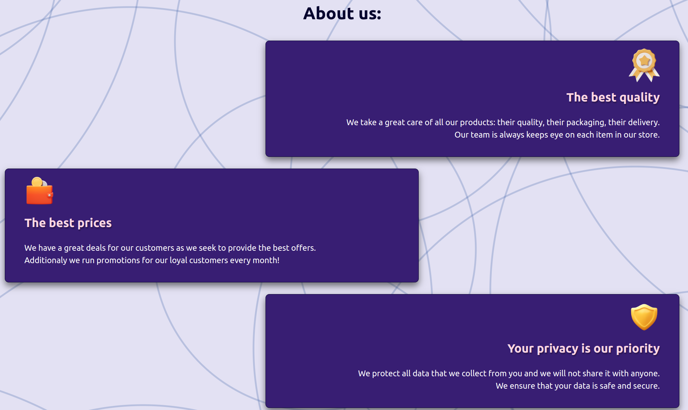

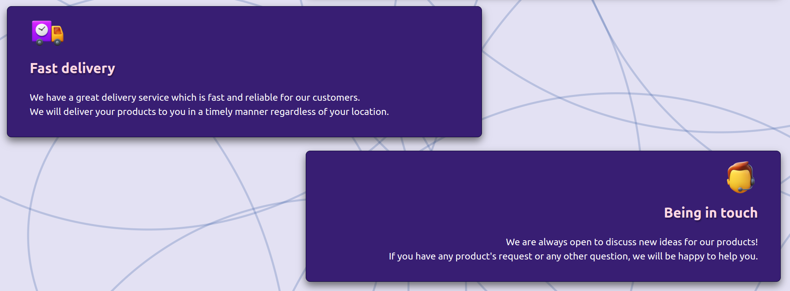

This section describes the benefits of being a customer of the store, such as "The best quality", "The best prices", "Your privacy is our priority", "Fast delivery", and "Being in touch".

- Testimonials section:


This section presents the testimonials of the store customers and aimed at giving the user an idea of the quality of the store.

*Home page is slightly different on the mobile devices*


### My profile page:


This page has the main data on the customer for the logged in user.

- It has avatar, full name, primary address (if it is set), profile navigation:


- Profile navigation has the following buttons:

  - Edit profile button, which redirects the user to the edit profile page;

  - My addresses button, which redirects the user to the my addresses page; (*If user hasn't added any addresses, the button will say: add address, and the user will be redirected to add address page*)

  - My orders button, which redirects the user to the my orders page;

  - My wishlist button, which redirects the user to the my wishlist page;

  - My reviews button, which redirects the user to the my reviews page;

### Edit Profile page:


This page has the main data on the customer for the logged in user and allows user to edit this data.

It has four forms:

  - Edit avatar form;

    

    - if user wants to upload an avatar, he can do it by clicking the "Edit" button, and the user will be able to select an image from his computer. When the user selects and image, the form will be filled with the image's data:

    

  - Edit Profile Data Form;
  
    
    
  - Change Password Form;
  
    

  - Delete Account Form;

    

    - If the user clicks the "Delete" button, the user will be asked to confirm the deletion.

    

    - If user confirms the deletion, the user will be redirected to the home page.

    - If user doesn't confirm the deletion, the delete account form will be closed.

### My addresses page:

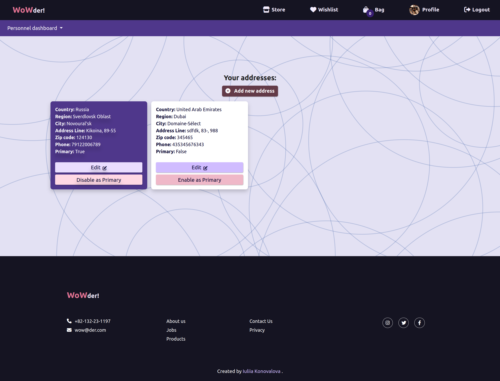

This page empowers customers to store their addresses. And easily allows them to edit and delete them as well as set the primary address.

It has a button: "Add new address", which redirects the user to the add address page.


It has table of address's cards:

Only one address can be primary.

Each card has address data and 2 buttons.

  - Edit button, which redirects the user to the edit address page;
  
  - Primary address card has also a "Disable as Primary" button, which allows the user to disable the primary address.

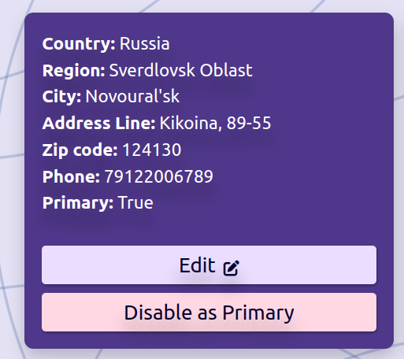

The primary address card is distinguished by the "Primary" label and purple background.

  - Not primary address card has also a "Enable as Primary" button, which allows the user to make the address primary, and disable the previous primary address.

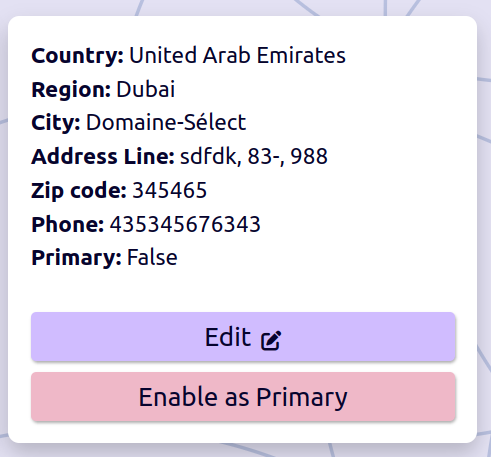


### Add address page:


This page allows the user to add a new address by selecting the country, state, city, and typing the address, zip code, and phone number. The user can also select the address as primary.


It also has 2 buttons:

  - Save address button, which redirects the user to the my addresses page and saves the address;
  
  - Cancel button, which redirects the user to the my addresses page.


### Store page:


This page has the following features:

  - Search-select bar:

    

    - Search bar:

    User can simply type the name of the product in the search bar and the system will show the products that match the search.

    

    - Select bar:

    User can select the category of the product in the select bar and the system will show the products that match the category.

    

  - Products:

    User can see the products that are in the store. The products are displayed in a grid with the following features:
    
    **Product card:**

    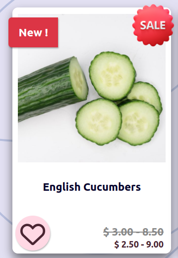

    It has the main image of the product, the name of the product, the price of the product, the button "Add to wishlist", and special labels. If the product in new, the label "New" is displayed. If the product is on sale, the label "Sale" is displayed.

    If the user didn't like the product, the button outline heart is displayed. If the user likes the product, the button filled heart is displayed. And etc.

    

    The spin icon is displayed when the user call is processing the request.

    

    Special features of the product card:

    The price of products can be different depending on the product's values. For example, if the product has a value "Size", the price of the product can be different depending on the size of the product. If the product out of stock, the price is displayed as "Out of stock".

    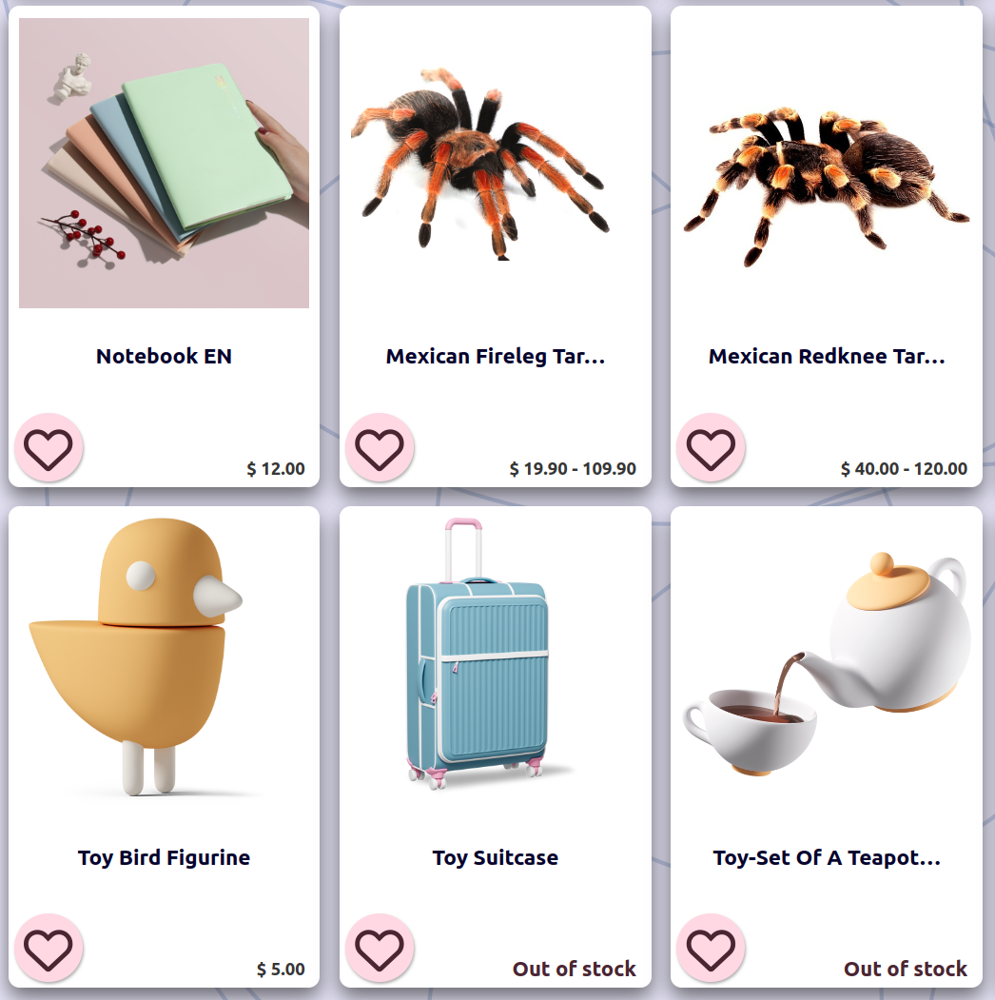

  - Pages:

    

### Product's details page:


This page has the product's card with full data.

The left side of the products card has the following features:


It has the main image of the product with carousel. When the user clicks on the left or right arrow, the carousel will change the image.

  
  
  

It also has labels:

  - if product is on sale, the label "Sale" is displayed;

  - if product is new, the label "New" is displayed;

Underneath the main image of the product is the "Add to wishlist" section. When the user clicks on the outline heart button, the product is added to the wishlist.

And the message will appear in the top right corner of the page:

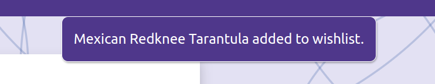

And the heart icon button will turn to be filled heart button.


*While the request is processing, the spin icon is displayed*


Under this section the user may find the reviews of the product and overall rating of the product.

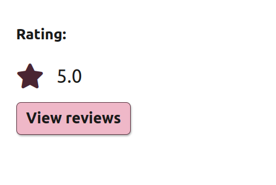

When the user clicks "View reviews", the user will be redirected to the product's reviews page.

The right side of the product card has the following features:

  

  *"Add to bag button will be disable if there are any options which are specified by the customer.**

  

  - Product's full name;
  
  - Product's description;

  - Reset button, which allows the user to reset the values of the product;

    

  - Product's options' section:
  
    

    - User can select the value of the product's option.

    *If the options are chosen, the "Add to bag" button will be enabled.*

    

    If options have colors, the user can see the example of the color right away.

    - if the product has no options, the section is not displayed;

    

    *If there are no options at all for a particular product, this button will be enable.*

    - If product is out of stock, the button "Add to bag" is disabled;

    

  - Product's price:
  
    

    The price of the product can be different depending on the product's values. In the above example, the price for the tarantula starts from $40  and increases to $120.
    
      - If the user chooses the particular value of the product, the price of the product will be specified:

      

      

    - If there is a discount, the price of the product will be displayed with the discount.
    
      
      
  - Product's quantity:

    

      - If the quantity is limited, the user will see a warning message.

      

      - If the user adds the exact quantity of the product that is available right now (7 items in this example), the plus button will be disabled.

      

      - If the user reduces the quantity of the product, the plus button will be enabled.

      

  - Add to bag button:

    The functionality of this button has been described above in the values options. It has 2 stages:

    - disabled: the button is disabled when the user has not chosen the values of the product or the product is out of stock;

    

    - enabled: the button is enabled when the user has chosen the values of the product and the product is not out of stock and there are not options for a particular product;

    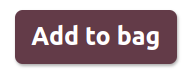

    - If button is enabled, the user can add the product to the bag and the message will appear in the top right corner of the page confirming the success of the operation:
    
      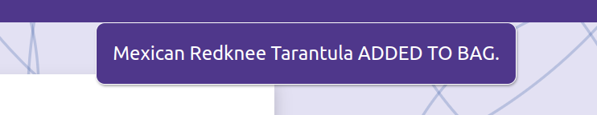

  - Request product section:

    - When the user opens the product's details page, the request product section is not displayed till the user starts choosing combinations of the product's options
    
      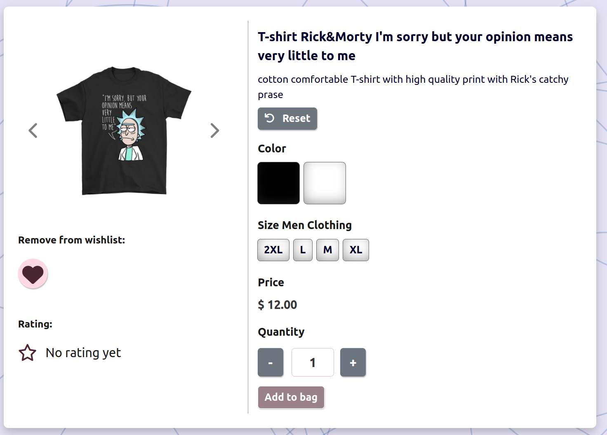

    - When the user chooses some product's options and there are some units of the products are not present in the store at this moment, he/she will see are message. This message will give the user a chance to request the particular product's options from the store and get notification email when the product is available.
    
      

    - If product is out of stock, the request product section is displayed right away.
    
      

  - Modal for requesting a product:

    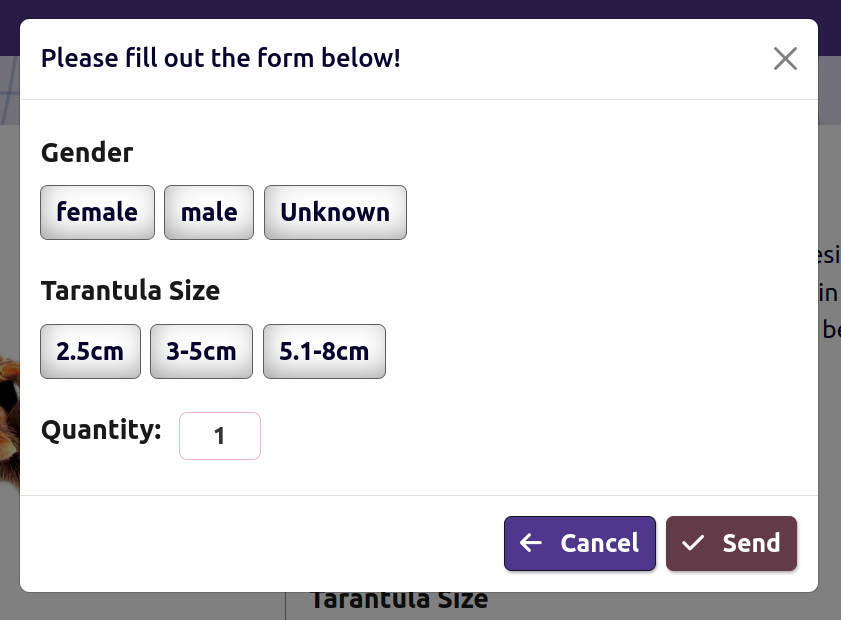

    - There are 2 buttons: "Cancel" and "Send" request. "Cancel" button will cancel the request and closes the modal. "Send" button allows user to request a stock notification email when the product is available.

    - If there are options for a particular product and the user hasn't specified with options combinations he/she wants and user clicks "Send" button, there will a visible highlighted title to remind user to select options and the request will not be sent
    
      

    - If the user has specified with options combinations he/she wants and user clicks "Send" button, the request will be sent, modal window will be closed and the user will see a message confirming the success of the operation.
    
      

    - If the user has specified with options combinations he/she wants and user clicks "Cancel" button, the request will not be sent and modal window will be closed.

    - If the user has specified with the options combinations he/she wants and user clicks "Send" button, and these options combinations are available in the store at this moment, the request will not be sent, modal window will be closed and the user will see a message:

      

  - Email notifications on stock request:

    When the user requested a product, the user will receive an email notification when the product is available.

    

    When the requested product is available, the user will receive an email notification.

    

  *For the mobile version of the site, the product's details page is displayed in a different way.*

  

### Wishlist page:


This page has following features:

  - Empty wishlist button:
  
    
    
    - if user unlikes the product, the product will be removed from the wishlist and the user will see a message confirming the success of the operation.

    

    - If the user clicks the button, a container with the confirmation will appear:

    

    - if the user clicks "No", the container will be closed and the wishlist will not be emptied.

    - If the user click "Yes" button, the wishlist will be emptied and the user will see a message confirming the success of the operation.

    

    - If there are no items in the wishlist, the user will see a message:

    

    - If there too many items in the wishlist, the user will see a functional page navigation:

    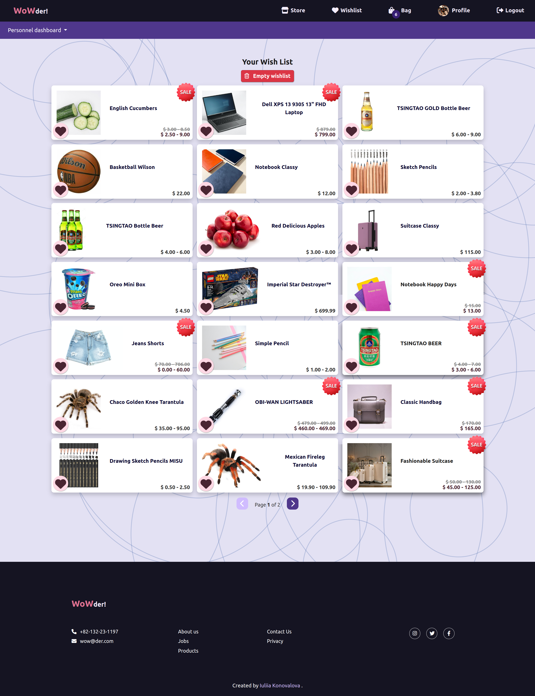

### Bag page:


This page has following features:

  - Title with the arrow down button. If user clicks this button, he/she will be redirected to checkout button immediately.
  
    
    
    - If user clicks the button, the bag page will be redirected to the checkout page.
    
  - Alert message. It can have to options:

    - If user has subscribed to the newsletter, the message will be displayed:
    
      

    - If user hasn't subscribed to the newsletter, the message will be displayed:

      

  - Bag table with all items in the bag:
  
    

    - If there are no items in the bag, the user will see a message and there would be no bag table:
    
      

    - Items of the bag:

    

      - It has an image of the product, the name of the product, the quantity, the price for the single item, quantity control, the total price for the item, and the remove button.

      - Quantity control provides the user a possibility to change the quantity of the item in the bag.

      

      - If user clicks the "+" button, the quantity of the item will be increased by 1 and the user will see the message:

      

      - If user clicks the "-" button, the quantity of the item will be decreased by 1 (If user has more than 1 items) and the user will see the message:

      

      - If user clicks the "-" button and the quantity of the item is 1, the item will be removed from the bag and the user will see the message:

      

      **Note!** When user updates the quantity of the item in the bag, the total price for the item and the total spending will be updated as well.

      - There is an remove from the bag button, which helps the user to remove the item from the bag regardless of the quantity.

      

      - When user clicks the button, all items will be removed from the bag and the user will see the message:

      

  - Bag Summary section:

    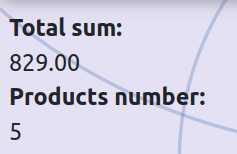

    It has Total sum of the bag and quantity of the items in the bag.

  - Under this section the user may see coupon section for loyal customers:

    

    - If the user inputs the correct coupon code, the price will be reduced by the coupon value

      

    - If the user inputs the incorrect coupon code, the user will see the message:
    
      

  - Checkout button. When the user clicks the button, the bag page will be redirected to the checkout page.
  
    

### Payment page:


This page has following features:

  - Title and prefilled form:
  
    

    - This form is editable and the user can change the data.

    - If the user hasn't set the full name in the profile, the "Customer Name" will be empty:

    
    
    - If user has subscribed to the newsletter, the form will be prefilled with the email address.

    - Alert message if the user hasn't set a primary address with empty form:

    

  - Under the from the user will see a payment card field with a "Pay button" This button will show the exact price for the order.
  
    
    
    - If the user clicks the button, the payment page will be redirected to the confirmation page.

    *If there are any errors in the form, the user will see the messages*
    *Uses is enable to double click on the button to pay the order.*

### Order Placed page:


This page has a success message and a button to go to review a customer's orders.


---
## Design

The design of the application is based on the Material Design principles. The colors are chosen to be consistent with the [Material Design principles](https://www.creative-tim.com/blog/web-design/12-absolute-principles-material-design/)
The minimalistic approach was used to create something meaningful without moving out of customer's focus. As this application is a multifunctional (provides full customer experience and business management) application and consists of many components, the decision to implement white spaces was made as it helps to create a more pleasant user experience. It also helps users, whether customers or personnel, to focus on the main content of the application.

### Color Scheme

The color scheme of the application is based on the combination of bold colors and neutral colors. The bold colors are used to create a more vibrant and attractive user experience. The neutral colors are used to create a more calm and relaxed user experience.

  

The navbar and footer are colored with the dark purple color (`#151422`) to create emphasis on the main content of the application. Navbar for admin was colored with the purplish color (`#4f378b`) to separate is from the main navbar and put an accent on the admin functionality. It also help personnel to distinguish that they enter as personnel.

The color scheme for the text is quite simple to create a more readable user experience.

  

As the application is highly complex and has lots of functionality, I have made a decision to implement accent colors to help users to navigate the application. The accent colors are used to create a more vibrant and attractive user experience.

  

### Typography
The main font used in the application is Lato. During my learning experience, I found that the Lato font is very easy to use and has a very good readability, which increases user experience. This fon is also consistent with the color scheme.

  

  

  

To emphasize the importance of the text, the font-weight was set to 900. To make the accent on the buttons, the font-weight was set to 700. For the rest of the text, the font-weight was set to 400.

### Imagery

- The main background image was generated with the user of the [BGJar](https://www.bgjar.com/) tool.

  

- Images were downloaded from the the websites listed in the **Credits section**. [Content and Images](#content-and-images)

- The main part is allocated to the use of icons from the [font awesome](https://fontawesome.com/) website. The use of icons is essential for the user experience when it comes to multifunctional websites.

### Wireframes

  [WoWder Wireframes](documentation/design/wowder_wireframes.pdf)

---

## Flowcharts

---

## Information Architecture

### Database

* During the earliest stages of the project, the database was created using SQLite.
* The database was then migrated to PostgreSQL.

### Entity-Relationship Diagram


### Data Modeling

#### Role Model
| Name          | Database Key  | Field Type    | Validation |
| ------------- | ------------- | ------------- | ---------- |
| name          | name          | CharField    | max_length=50, unique=True, blank=True, null=False, verbose_name='Role name' |
| description   | description   | TextField    | max_length=500, blank=True, null=True, verbose_name='Role description' |

#### Profile Model

When user signs up, a new profile is created. 

| Name          | Database Key  | Field Type    | Validation |
| ------------- | ------------- | ------------- | ---------- |
| user          | user          | OneToOneField | User, on_delete=models.CASCADE, related_name='profile', verbose_name='User' |
| first_name    | first_name    | CharField    | max_length=50, blank=True, null=True, verbose_name='First name' |
| last_name     | last_name     | CharField    | max_length=50, blank=True, null=True, verbose_name='Last name' |
| birthday      | birthday      | DateField    | blank=True, null=True, verbose_name='Birthday' |
| avatar        | avatar        | CloudinaryField | blank=True, null=True, verbose_name='Avatar' |
| subscription | subscription | BooleanField | default=False, verbose_name='Subscription' |
| role          | role          | ForeignKey   | Role, default=1, on_delete=models.SET_NULL, null=True, verbose_name='Role' |
| created_at    | created_at    | DateTimeField | auto_now_add=True, verbose_name='Created at' |
| updated_at    | updated_at    | DateTimeField | auto_now=True, verbose_name='Updated at' |

#### Address Model

Users are encouraged to create their own addresses and set the default address for the fastest purchase. 

| Name          | Database Key  | Field Type    | Validation |
| ------------- | ------------- | ------------- | ---------- |
| user          | user          | ForeignKey   | User, on_delete=models.CASCADE, related_name='addresses', verbose_name='User' |
| country       | country       | CharField    | max_length=50, blank=False, null=False, verbose_name='Country' |
| county_region | county_region | CharField    | max_length=50, blank=False, null=False, verbose_name='County/region' |
| city          | city          | CharField    | max_length=50, blank=False, null=False, verbose_name='City' |
| address_line  | address_line  | CharField    | max_length=150, blank=False, null=False, verbose_name='Address line' |
| zip_code      | zip_code      | CharField    | max_length=10, blank=False, null=False, verbose_name='Zip code' |
| phone_number  | phone_number  | CharField    | max_length=15, blank=False, null=False, verbose_name='Phone' |
| is_primary    | is_primary    | BooleanField | default=False, verbose_name='Is primary' |
| created_at    | created_at    | DateTimeField | auto_now_add=True, verbose_name='Created at' |
| updated_at    | updated_at    | DateTimeField | auto_now=True, verbose_name='Updated at' |

#### Wishlist Model

When the user signs up, a new wishlist is created.

| Name          | Database Key  | Field Type    | Validation |
| ------------- | ------------- | ------------- | ---------- |
| user          | user          | ForeignKey   | User, on_delete=models.CASCADE, related_name='wishlist', verbose_name='User' |
| products      | products      | ManyToManyField | Product, blank=True, related_name='wishlist', verbose_name='Products' |
| created_at    | created_at    | DateTimeField | auto_now_add=True, verbose_name='Created at' |

#### Category Model

| Name          | Database Key  | Field Type    | Validation |
| ------------- | ------------- | ------------- | ---------- |
| name          | name          | CharField    | max_length=100, unique=True, blank=False, null=False, verbose_name='Category name' |
| slug          | slug          | SlugField    | max_length=150, unique=True, blank=False, null=False, verbose_name='Category Slug' |
| is_active     | is_active     | BooleanField | default=False, verbose_name='Is active' |
| created_at    | created_at    | DateTimeField | auto_now_add=True, verbose_name='Created at' |
| updated_at    | updated_at    | DateTimeField | auto_now=True, verbose_name='Updated at' |

#### Tag Model

| Name          | Database Key  | Field Type    | Validation |
| ------------- | ------------- | ------------- | ---------- |
| name          | name          | CharField    | max_length=100, unique=True, blank=False, null=False, verbose_name='Tag name' |
| slug          | slug          | SlugField    | max_length=150, unique=True, blank=False, null=False, verbose_name='Tag Slug' |
| is_active     | is_active     | BooleanField | default=False, verbose_name='Is active' |
| created_at    | created_at    | DateTimeField | auto_now_add=True, verbose_name='Created at' |
| updated_at    | updated_at    | DateTimeField | auto_now=True, verbose_name='Updated at' |

#### Brand Model

| Name          | Database Key  | Field Type    | Validation |
| ------------- | ------------- | ------------- | ---------- |
| name          | name          | CharField    | max_length=100, unique=True, blank=False, null=False, verbose_name='Brand name' |
| slug          | slug          | SlugField    | max_length=150, unique=True, blank=False, null=False, verbose_name='Brand Slug' |
| description   | description   | TextField    | max_length=500, blank=False, null=False, verbose_name='Brand description' |
| is_active     | is_active     | BooleanField | default=False, verbose_name='Is active' |
| created_at    | created_at    | DateTimeField | auto_now_add=True, verbose_name='Created at' |
| updated_at    | updated_at    | DateTimeField | auto_now=True, verbose_name='Updated at' |


#### Product Model

| Name          | Database Key  | Field Type    | Validation |
| ------------- | ------------- | ------------- | ---------- |
| name          | name          | CharField    | max_length=100, unique=True, blank=False, null=False, verbose_name='Product name' |
| slug          | slug          | SlugField    | max_length=150, unique=True, blank=False, null=False, verbose_name='Product Slug' |
| description   | description   | TextField    | max_length=500, blank=False, null=False, verbose_name='Product description' |
| category      | category      | ForeignKey   | Category, on_delete=models.CASCADE, related_name='products', verbose_name='Category' |
| tags          | tags          | ManyToManyField | Tag, related_name='products', verbose_name='Tags' |
| brand         | brand         | ForeignKey   | Brand, on_delete=models.CASCADE, related_name='products', verbose_name='Brand' |
| is_active     | is_active     | BooleanField | default=False, verbose_name='Is active' |
| created_at    | created_at    | DateTimeField | auto_now_add=True, verbose_name='Created at' |
| updated_at    | updated_at    | DateTimeField | auto_now=True, verbose_name='Updated at' |

#### ProductImage Model

| Name          | Database Key  | Field Type    | Validation |
| ------------- | ------------- | ------------- | ---------- |
| product       | product       | ForeignKey   | Product, on_delete=models.CASCADE, related_name='images', verbose_name='Product' |
| image         | image         | CloudinaryField | null=True, blank=True, verbose_name='Image' |
| alt_text      | alt_text      | CharField    | max_length=300, null=True, blank=True, verbose_name='Alt text' |
| default_image | default_image | BooleanField | default=False, verbose_name='Default image' |
| is_active     | is_active     | BooleanField | default=False, verbose_name='Is active' |
| created_at    | created_at    | DateTimeField | auto_now_add=True, verbose_name='Created at' |
| updated_at    | updated_at    | DateTimeField | auto_now=True, verbose_name='Updated at' |

#### ProductAttribute Model

| Name          | Database Key  | Field Type    | Validation |
| ------------- | ------------- | ------------- | ---------- |
| name          | name          | CharField    | max_length=255, unique=True, blank=False, null=False, verbose_name='Attribute name' |
| description   | description   | TextField    | max_length=500, blank=True, null=True, verbose_name='Attribute description' |

#### ProductType Model

| Name          | Database Key  | Field Type    | Validation |
| ------------- | ------------- | ------------- | ---------- |
| name          | name          | CharField    | max_length=100, unique=True, blank=False, null=False, verbose_name='Product type name' |
| slug          | slug          | SlugField    | max_length=150, unique=True, blank=False, null=False, verbose_name='Product type Slug' |
| product_type_attributes | product_type_attributes | ManyToManyField | ProductAttribute, related_name="product_type_attributes", through="ProductTypeAttribute", verbose_name='Product type attributes' |
| description   | description   | TextField    | max_length=500, blank=False, null=False, verbose_name='Product type description' |

#### ProductAttributeValue Model

| Name          | Database Key  | Field Type    | Validation |
| ------------- | ------------- | ------------- | ---------- |
| product_attribute | product_attribute | ForeignKey   | ProductAttribute, on_delete=models.CASCADE, related_name='product_attribute_values', verbose_name='Product attribute' |
| attribute_value | attribute_value | CharField    | max_length=255, blank=False, null=False, verbose_name='Attribute value' |

#### ProductInventory Model

| Name          | Database Key  | Field Type    | Validation |
| ------------- | ------------- | ------------- | ---------- |
| sku           | sku           | CharField    | max_length=50, null=False, unique=True, blank=False, verbose_name='Stock Keeping Unit' |
| upc           | upc           | CharField    | max_length=12, null=False, unique=True, blank=False, verbose_name='Universal Product Code' |
| product       | product       | ForeignKey   | Product, on_delete=models.CASCADE, related_name='inventory', verbose_name='Product' |
| product_type  | product_type  | ForeignKey   | ProductType, on_delete=models.CASCADE, related_name='inventory', verbose_name='Product type' |
| attribute_values | attribute_values | ManyToManyField | ProductAttributeValue, related_name="product_attribute_values", through="ProductAttributeValues", verbose_name='Attribute values' |
| retail_price  | retail_price  | DecimalField | max_digits=9, decimal_places=2, null=False, blank=False, verbose_name='Retail price' |
| store_price   | store_price   | DecimalField | max_digits=9, decimal_places=2, null=False, blank=False, verbose_name='Store price' |
| sale_price    | sale_price    | DecimalField | max_digits=9, decimal_places=2, null=False, blank=False, verbose_name='Sale price' |
| weight        | weight        | FloatField   | null=False, blank=False, verbose_name='Product weight' |
| is_active     | is_active     | BooleanField | default=False, verbose_name='Is active' |
| created_at    | created_at    | DateTimeField | auto_now_add=True, verbose_name='Created at' |
| updated_at    | updated_at    | DateTimeField | auto_now=True, verbose_name='Updated at' |

#### Stock Model

| Name          | Database Key  | Field Type    | Validation |
| ------------- | ------------- | ------------- | ---------- |
| product_inventory | product_inventory | ForeignKey   | ProductInventory, on_delete=models.CASCADE, related_name='stock', verbose_name='Product inventory' |
| last_checked     | last_checked     | DateTimeField | null=True, blank=True, verbose_name='Last checked' |
| units_variable   | units_variable   | IntegerField | default=0, null=False, blank=False, verbose_name='Units variable' |
| units            | units            | IntegerField | default=0, null=False, blank=False, verbose_name='Units current' |
| units_sold       | units_sold       | IntegerField | default=0, null=False, blank=False, verbose_name='Units sold' |

#### ProductAttributeValues Model

| Name          | Database Key  | Field Type    | Validation |
| ------------- | ------------- | ------------- | ---------- |
| attributevalues | attributevalues | ForeignKey   | ProductAttributeValue, on_delete=models.CASCADE, related_name='productattributevalues', verbose_name='Attribute values' |
| productinventory | productinventory | ForeignKey   | ProductInventory, on_delete=models.CASCADE, related_name='productattributevalues', verbose_name='Product inventory' |


#### ProductTypeAttribute Model

| Name          | Database Key  | Field Type    | Validation |
| ------------- | ------------- | ------------- | ---------- |
| product_attribute | product_attribute | ForeignKey   | ProductAttribute, on_delete=models.CASCADE, related_name='producttypeattribute', verbose_name='Product attribute' |
| product_type | product_type | ForeignKey   | ProductType, on_delete=models.CASCADE, related_name='producttypeattribute', verbose_name='Product type' |

*The decision to implement unique_together model method was made due to the wider coverage of it rather than UniqueConstraint which has been added in Django 4.0.0.
[Link to Django Documentation](https://docs.djangoproject.com/en/4.0/ref/models/options/#django.db.models.Options.unique_together)*

#### EmailNewsNotification Model

| Name          | Database Key  | Field Type    | Validation |
| ------------- | ------------- | ------------- | ---------- |
| email_name    | email_name    | CharField    | max_length=100, null=False, unique=True, blank=False, verbose_name='Email name' |
| content       | content       | TextField    | null=False, blank=False, verbose_name='Content' |
| code          | code          | CharField    | max_length=100, null=True, blank=True, verbose_name='Code' |
| created_at    | created_at    | DateTimeField | auto_now_add=True, verbose_name='Created at' |

#### StockEmailNotification Model

| Name          | Database Key  | Field Type    | Validation |
| ------------- | ------------- | ------------- | ---------- |
| user           | user           | ForeignKey   | User, on_delete=models.CASCADE, verbose_name='Requested user' |
| requested_product | requested_product | ForeignKey   | Product, on_delete=models.CASCADE, verbose_name='Requested product' |
| requested_attributes_values | requested_attributes_values | ManyToManyField | ProductAttributeValue, related_name="requested_attributes_values", through="RequestedAttributesValues", verbose_name='Requested attributes values' |
| requested_quantity | requested_quantity | PositiveIntegerField | verbose_name='Requested quantity' |
| created_at    | created_at    | DateTimeField | auto_now_add=True, verbose_name='Created at' |
| answer_sent    | answer_sent    | BooleanField | default=False, verbose_name='Answer send' |

#### Order Model


```python
    """Model for Order."""
    PENDING = 'Pending'
    PROCESSING = 'Processing'
    SHIPPED = 'shipped'
    COMPLETED = 'Completed'
    REFUNDED = 'Refunded'

    STATUS_CHOICES = (
        (PENDING, 'Pending'),
        (PROCESSING, 'Processing'),
        (SHIPPED, 'Shipped'),
        (COMPLETED, 'Completed'),
        (REFUNDED, 'Refunded'),
    )
```

| Name          | Database Key  | Field Type    | Validation |
| ------------- | ------------- | ------------- | ---------- |
| user           | user           | ForeignKey   | User, on_delete=models.CASCADE, verbose_name='Requested user' |
| full_name      | full_name      | CharField    | max_length=50, null=False, blank=False, verbose_name='Full name' |
| email          | email          | CharField    | max_length=50, null=False, blank=False, verbose_name='Email' |
| phone          | phone          | CharField    | max_length=100, null=False, blank=False, verbose_name='Phone' |
| address1       | address1       | CharField    | max_length=250, null=False, blank=False, verbose_name='Address1' |
| address2       | address2       | CharField    | max_length=250, null=False, blank=False, verbose_name='Address2' |
| city           | city           | CharField    | max_length=100, null=False, blank=False, verbose_name='City' |
| county_region_state | county_region_state | CharField    | max_length=100, null=False, blank=False, verbose_name='County/Region/State' |
| country        | country        | CharField    | max_length=100, null=False, blank=False, verbose_name='Country' |
| zip_code       | zip_code       | CharField    | max_length=20, null=False, blank=False, verbose_name='Zip code' |
| created        | created        | DateTimeField | auto_now_add=True, verbose_name='Created' |
| updated        | updated        | DateTimeField | auto_now=True, verbose_name='Updated' |
| total_paid     | total_paid     | DecimalField | max_digits=5, decimal_places=2, null=False, blank=False, verbose_name='Total paid' |
| order_number   | order_number   | CharField    | max_length=32, null=False, editable=False, verbose_name='Order number' |
| order_key      | order_key      | CharField    | max_length=200, blank=True, null=True, verbose_name='Order key' |
| billing_status | billing_status | BooleanField | default=False, verbose_name='Billing status' |
| status         | status         | CharField    | max_length=20, choices=STATUS_CHOICES, default=PENDING, verbose_name='Status' |

*The decision to implement several options for the order identification numbers was due to the variety of the possibilities of the identification numbers in different countries.*

#### OrderItem Model

| Name          | Database Key  | Field Type    | Validation |
| ------------- | ------------- | ------------- | ---------- |
| order          | order          | ForeignKey   | Order, on_delete=models.CASCADE, related_name='order_item', verbose_name='Order' |
| product_inventory | product_inventory | ForeignKey   | ProductInventory, on_delete=models.CASCADE, related_name='order_item_inventory', verbose_name='Product inventory' |
| quantity       | quantity       | PositiveIntegerField | verbose_name='Quantity' |

#### Promotion Model

| Name          | Database Key  | Field Type    | Validation |
| ------------- | ------------- | ------------- | ---------- |
| name           | name           | CharField    | max_length=100, unique=True, blank=False, null=False, verbose_name='Name' |
| slug           | slug           | SlugField    | max_length=100, unique=True, blank=False, null=False, verbose_name='Slug' |
| description    | description    | TextField    | null=False, blank=False, verbose_name='Description' |
| promotion_code | promotion_code | CharField    | max_length=100, unique=True, blank=False, null=False, verbose_name='Promotion code' |
| promotion_reduction | promotion_reduction | DecimalField | max_digits=3, decimal_places=0, default=Decimal(0), validators=PERCENTAGE_VALIDATOR, verbose_name='Promotion reduction' |
| active         | active         | BooleanField | default=True, verbose_name='Active' |
| start_date     | start_date     | DateTimeField | null=False, blank=False, verbose_name='Start date' |
| end_date       | end_date       | DateTimeField | null=False, blank=False, verbose_name='End date' |
| products_inventory_in_promotion | products_inventory_in_promotion | ManyToManyField | blank=True, related_name='products_promotions', verbose_name='Products inventory in promotion' |
| created_at     | created_at     | DateTimeField | auto_now_add=True, verbose_name='Created at', help_text='Date and time of creation.' |
| updated_at     | updated_at     | DateTimeField | auto_now=True, verbose_name='Updated at', help_text='Date and time of last update.' |

#### Review Model


```python
    STAR_CHOICES = (
        ('1', '1'),
        ('2', '2'),
        ('3', '3'),
        ('4', '4'),
        ('5', '5'),
    )
```
| Name          | Database Key  | Field Type    | Validation |
| ------------- | ------------- | ------------- | ---------- |
| user           | user           | ForeignKey   | User, on_delete=models.CASCADE, related_name='reviews', verbose_name='User' |
| product        | product        | ForeignKey   | Product, on_delete=models.CASCADE, related_name='reviews', verbose_name='Product' |
| order          | order          | ForeignKey   | Order, on_delete=models.CASCADE, related_name='reviews', verbose_name='Order' |
| rating         | rating         | CharField    | max_length=20, choices=STAR_CHOICES, default=1, verbose_name='Rating' |
| comment        | comment        | TextField    | max_length=1000, blank=True, null=True, verbose_name='Comment' |
| created_at     | created_at     | DateTimeField | auto_now_add=True, verbose_name='Created at', help_text='Date and time of creation.' |

#### ReviewImage Model


| Name          | Database Key  | Field Type    | Validation |
| ------------- | ------------- | ------------- | ---------- |
| review         | review         | ForeignKey   | Review, on_delete=models.CASCADE, related_name='images', verbose_name='Review' |
| image          | image          | CloudinaryField | null=True, blank=True, verbose_name='Image' |

#### Future Models:

##### Supplier Model

| Name          | Database Key  | Field Type    | Validation |
| ------------- | ------------- | ------------- | ---------- |
| company_name  | company_name  | CharField    | max_length=100, unique=True, blank=False, null=False, verbose_name='Company name' |
| company_email | company_email | EmailField   | max_length=100, unique=True, blank=False, null=False, verbose_name='Company email' |
| company_phone | company_phone | CharField    | max_length=20, unique=True, blank=False, null=False, verbose_name='Company phone' |
| company_contact_name | company_contact_name | CharField    | max_length=100, unique=True, blank=False, null=False, verbose_name='Company contact name' |
| country       | country       | CharField    | max_length=100, unique=True, blank=False, null=False, verbose_name='Country' |
| city          | city          | CharField    | max_length=100, unique=True, blank=False, null=False, verbose_name='City' |
| state_region_county | state_region_county | CharField    | max_length=100, unique=True, blank=False, null=False, verbose_name='State/region/county' |
| zip_code      | zip_code      | CharField    | max_length=20, unique=True, blank=False, null=False, verbose_name='Zip code' |
| address       | address       | CharField    | max_length=100, unique=True, blank=False, null=False, verbose_name='Address' |
| notes         | notes         | TextField    | max_length=1000, blank=True, null=True, verbose_name='Notes' |
| created_at     | created_at     | DateTimeField | auto_now_add=True, verbose_name='Created at', help_text='Date and time of creation.' |
| updated_at     | updated_at     | DateTimeField | auto_now=True, verbose_name='Updated at', help_text='Date and time of last update.' |

##### StorePurchase Model

| Name          | Database Key  | Field Type    | Validation |
| ------------- | ------------- | ------------- | ---------- |
| product_inventory | product_inventory | ForeignKey   | ProductInventory, on_delete=models.CASCADE, related_name='store_purchases', verbose_name='Product inventory' |
| units | units | PositiveIntegerField | verbose_name='Units' |
| total_spending | total_spending | DecimalField | max_digits=5, decimal_places=2, null=False, blank=False, verbose_name='Total spending' |
| supplier | supplier | ForeignKey   | Supplier, on_delete=models.CASCADE, related_name='store_purchases', verbose_name='Supplier' |
| delivered | delivered | BooleanField | default=False, verbose_name='Delivered' |
| created_at     | created_at     | DateTimeField | auto_now_add=True, verbose_name='Created at', help_text='Date and time of creation.' |
| updated_at     | updated_at     | DateTimeField | auto_now=True, verbose_name='Updated at', help_text='Date and time of last update.' |

##### LiveSupportChat Model

| Name          | Database Key  | Field Type    | Validation |
| ------------- | ------------- | ------------- | ---------- |
| members       | members       | ManyToManyField | blank=True, related_name='live_support_chats', verbose_name='Members' |
| created_at     | created_at     | DateTimeField | auto_now_add=True, verbose_name='Created at', help_text='Date and time of creation.' |
| updated_at     | updated_at     | DateTimeField | auto_now=True, verbose_name='Updated at', help_text='Date and time of last update.' |

##### LiveSupportMessage Model

| Name          | Database Key  | Field Type    | Validation |
| ------------- | ------------- | ------------- | ---------- |
| chat          | chat          | ForeignKey   | LiveSupportChat, on_delete=models.CASCADE, related_name='messages', verbose_name='Chat' |
| author       | author        | ForeignKey   | User, on_delete=models.CASCADE, related_name='live_support_messages', verbose_name='Author' |
| content       | content       | TextField    | max_length=1000, blank=True, null=True, verbose_name='Content' |
| image         | image         | CloudinaryField | null=True, blank=True, verbose_name='Image' |
| created_at     | created_at     | DateTimeField | auto_now_add=True, verbose_name='Created at', help_text='Date and time of creation.' |
| updated_at     | updated_at     | DateTimeField | auto_now=True, verbose_name='Updated at', help_text='Date and time of last update.' |

---
## Testing

Please refer to the [TESTING.md](TESTING.md) file for all test-related documentation.

---

## Payment Setup

1. Register a stripe account at https://dashboard.stripe.com/register.
2. Go to developers page:


3. Select API keys.

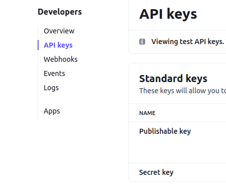

4. Copy the `public key` and `secret key` to the `env.py` file.

5. Add the following setting to `settings.py`:

```python
  STRIPE_PUBLIC_KEY = os.environ.get("STRIPE_PUBLIC_KEY")
  STRIPE_SECRET_KEY = os.environ.get("STRIPE_SECRET_KEY")
```

6. Install stripe package:

```python
  pip3 install stripe
```

7. Create order model with required fields in orders app.
8. Set up a payment app.
9. Add payment form to the payment app template.
10. Add div to hold stripe element:

```html
  <div id="stripe-element"></div>
```
11. Create View to handle payment set up:
  - Get public key: `stripe_public_key = settings.STRIPE_PUBLIC_KEY`
  - Get private key: `stripe_secret_key = settings.STRIPE_SECRET_KEY`
  - create intent: `intent = stripe.PaymentIntent.create(**kwargs)`
  - **kwargs for the payment intent should include:
    * `amount`: amount
    * `currency`: currency
    * `metadata`: metadata
  - For the metadata I have user id `userid: request.user.id`
  - Create context for the view with the following data:
      *  'my_profile': my_profile,
      *  'total_sum': total_sum,
      *  'client_secret': intent.client_secret,
      *  'stripe_public_key': stripe_public_key,

12. Add extra js block to payment template where you have to add csrf_token, stripe_public_key,
  script tag with stripe.js, and script tag with payment.js.

```html
  
    <script>
        let CSRF_TOKEN = '{{ csrf_token }}';
        let stripe_public_key = '{{ stripe_public_key }}';
    </script>
    <script src="https://js.stripe.com/v3/"></script>
    <script src="" data-rel-js></script>
  
```

13. In the payment.js create variables for stripe public key, stripe, payment element, payment form, and a variable from which you will receive 'client_secret'. To get 'client secret` I have added data-attribute to confirmation button in the payment form:

```html
  data-secret="{{ client_secret }}"
```
14. Set up stripe element:

```javascript
  let elements = stripe.elements();
  let style = {
    base: {
      color: "#000",
      lineHeight: '2.4',
      fontSize: '16px'
    }
  };
  let card = elements.create("card", {
    style: style
  });
  card.mount("#card-element");
```

*You can use various styling by checking out the following docs [stripe/elements-examples](https://github.com/stripe/elements-examples)*

15. Get all data from the payment form and collect it by using `new FormData()`

16. Create AJAX request to send collected data and set the url to for adding order. The url is `window.location.origin + '/orders/add/'`.

17. In the orders app views you need to create a view to handle order creation.

18. When the user clicks on the confirmation button, the payment intent is created. Needless to say that stripe element prevents the user from multiple clicks and handles all errors. However, you have to set alerts for the user to show the error.

19. To test the user's payment, you need to create a test payment intent with the card data provided by the stripe:

No auth: 4242424242424242

Auth: 4000002500003155

Error: 4000000000009995

20. Create a success page to redirect the user after successful payment and add js functionality to handle the redirection:

```javascript
    if (result.paymentIntent.status === 'succeeded') {
      window.location.replace(window.location.origin + "/payment/order_placed/");
    }
```

21. Set app stripe backend:
  - Go to [Stripe Docs. Stripe CLI](https://stripe.com/docs/stripe-cli)
  - Download the stripe-cli file depending on your operating system.

  

  - In my case, I downloaded the file for Linux:

  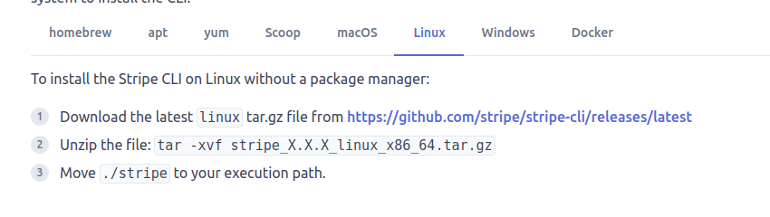

  - Go to the link provided and download the file.

  

  - Open the downloaded file and move the file `stripe` to the root directory of the project.

  - Open the terminal and type:

  `./stripe login`

  *Note! For the windows the command looks as following `stripe login`*

  - Hit enter -> You will be redirected to the Stripe dashboard where you need to allow access to your local workspace.

  - Create a payment and the intent will be created.

  *Another option:*
  
  - Download the following file:

  

  - Open downloads folder in the terminal and type:

  `sudo gdebi stripe_1.11.0_linux_amd64.deb`

  - The package will be installed -> Type `stripe` in the terminal and hit enter.

22. Create a function in the orders views to handle the payment confirmation, which will take payment data. This function will also handle email confirmation.

23. To run this function you will need to add the following function provided by stripe:

```python
from django.views.decorators.csrf import csrf_exempt

@csrf_exempt
  def stripe_webhook(request):
      payload = request.body
      event = None
      try:
          event = stripe.Event.construct_from(
              json.loads(payload), stripe.api_key
          )
      except ValueError as e:
          return HttpResponse(status=400)
      # Handle the event
      if event.type == 'payment_intent.succeeded':
          payment_confirmation(event.data.object.client_secret)
      else:
          print('Unhandled event type {}'.format(event.type))
      return HttpResponse(status=200)
```

24. Add url to the stripe_webhook function in the payment urls.py

```python
    path('webhook/', stripe_webhook),
```

25. In the terminal type:

`./stripe listen --forward-to localhost:8000/payment/webhook/`

26. Remember to set app stripe data in heroku configs:

  - Create a webhook in the stripe dashboard and set the hosted endpoint.

  

  - `STRIPE_PUBLIC_KEY`
  - `STRIPE_SECRET_KEY`
  - `STRIPE_WEBHOOK_SECRET`

---

## Deployment

- The app was deployed to [Heroku](https://wowder.herokuapp.com/)
- The repository can be found [github](https://github.com/IuliiaKonovalova/e-commerce)

### Local deployment

1. Clone the repository.

    - ```git clone https://github.com/IuliiaKonovalova/e-commerce.git```

2. Go to the ```ecommerce_project``` directory.

    - ```cd ecommerce_project```

3. Create a virtual environment.

    - ```python3 -m venv venv```

    - ```source venv/bin/activate```

4. Install all dependencies.

    - ```pip install -r requirements.txt```

5. Create a ```env.py``` file.

    - ```touch env.py```

6. Add the following lines to ```env.py```:

    - ```import os```
    - ```os.environ["SECRET_KEY"]``` = your secret key.
    - ```os.environ["DEBUG"]``` = "True" or "False" depending on whether you are in development or production.
    - ```os.environ["DEVELOPMENT"]``` = "True" or "False" depending on whether you are in development or production.
    - ```os.environ["ALLOWED_HOSTS"]``` = your domain name.
    - ```os.environ["DATABASE_URL"]``` = your database url.
    - ```os.environ["CLOUDINARY_CLOUD_NAME"]``` = your cloudinary cloud name.
    - ```os.environ["CLOUDINARY_API_KEY"]``` = your cloudinary api key.
    - ```os.environ["CLOUDINARY_API_SECRET"]``` = your cloudinary api secret.
    - ```os.environ["STRIPE_PUBLIC_KEY"]``` = your stripe public key.
    - ```os.environ["STRIPE_SECRET_KEY"]``` = your stripe secret key.
    - ```os.environ["STRIPE_WEBHOOK_SECRET"]``` = your stripe webhook secret key.

7. Create and migrate the database.

    - ```python manage.py makemigrations```
    - ```python manage.py migrate```

8. Create the superuser.

    - ```python manage.py createsuperuser```

9. Run the server.

    - ```python manage.py runserver```

10. Access the website by the link provided in terminal. Add ```/admin/``` at the end of the link to access the admin panel.


*If you are using Gitpod, you can skip steps 1-3 by clicking this [link](https://gitpod.io/#https://github.com/IuliiaKonovalova/e-commerce), and start from step 4.*
### Heroku Deployment


1. Create a Heroku account if you don't already have one.

2. Create a new app on Heroku.

    1. Go to the [Heroku dashboard](https://dashboard.heroku.com/apps).
    2. Click on the "New" button.
    3. Click on the "Create new app" button.
    4. Choose a name for your app.
    5. Choose a region.
    6. Click on the "Create app" button.

3. In your app go to the "Resources" tab.

    1. Add a Heroku Postgres database.

4. In your app go to the "Settings" tab, press "Reveal Config Vars", and add the following config vars if they are not already set:

    1. ```ALLOWED_HOSTS``` = your heroku domain name.
    2. ```CLOUDINARY_CLOUD_NAME``` = the cloud name you used when creating your cloudinary account.
    3. ```CLOUDINARY_API_KEY``` = the api key you got when created your cloudinary account.
    4. ```CLOUDINARY_API_SECRET``` = the api secret you got when created your cloudinary account.
    5. ```DATABASE_URL``` = the url of your heroku postgres database.
    6. ```REDIS_URL``` = the url of your heroku redis database.
    7. ```SECRET_KEY``` = a secret key for your app.
    8. ```EMAIL_HOST_USER``` = the email address you going to use to send emails.
    9. ```EMAIL_HOST_PASSWORD``` = the password for the email address you are using.
    10. ```DEBUG``` = True during development, False during production.
    11. ```DISABLE_COLLECTSTATIC``` = 1 during development. Remove this when deploying to production.
    12. ```STRIPE_PUBLIC_KEY``` = the public key you got when created your stripe account.
    13. ```STRIPE_SECRET_KEY``` = the secret key you got when created your stripe account.
    14. ```STRIPE_WEBHOOK_SECRET``` = the secret key you got when created your stripe webhook.

5. In your app go to the "Deploy" tab.

    1. If it's already possible, connect your Heroku account to your GitHub account and then click on the "Deploy" button.
    2. If not, you need to copy the Heroku CLI command to connect your heroku app and your local repository.

        - ```heroku git:remote -a <your-heroku-app-name>```

6. Go to your local repository.

7. Login to your Heroku account in your terminal and connect your local repository to your heroku app.

    1. ```heroku login -i``` - Enter all your Heroku credentials it will ask for.
    2. Paste the command you copied from step 5 into your terminal.

8. Create Procfile.

    This project uses Daphne server for its ability to run asynchronous applications in order to implement tech support chats in the future, so in this case if you want to implement chat functionality as well, you have to add the following to Procfile:

    - ```release: python manage.py migrate``` - this command will apply all migrations every time you re-deploy the app.
    - ```web: daphne ecommerce_project.asgi:application --port $PORT --bind 0.0.0.0 -v2``` - this command will run the app.
    - ```worker: python manage.py runworker -v2 channel_layer``` - this command will run the worker for the channel layer to run the async tasks.

9. Create ```requirements.txt```. This can be done by running the following command:

    - ```pip freeze > requirements.txt```
    or
    - ```pipreqs requirements.txt``` - if you have pipreqs installed.

10. Add and commit all changes.

11. Push your changes to Heroku.

    - ```git push heroku master```
    or
    - ```git push heroku main```

12. Check the logs of your app in heroku dashboard and make sure everything is working.

13. After the development is done, you can change the ```DEBUG``` config var to ```False``` and remove the ```DISABLE_COLLECTSTATIC``` config var from the config vars on heroku.

To get cloudinary cloud name, api key, and api secret:

1. Go to the [Cloudinary website](https://cloudinary.com/).

2. Log in to your account or sign up if you don't have an account.

3. Go to the [Cloudinary dashboard](https://cloudinary.com/console/).

4. At the top of the page you will see your cloud name, api key, and api secret.

5. To reveal api secret, hover over the api key container and click on the button that looks like an eye.

6. Copy these values and paste them into the config vars on heroku and into your `env.py` file.

To get stripe public key, secret key, and webhook secret:

**Please go to Payment Setup section in the readme file for more information.**

[Payment Setup](#payment-setup)

*If you find any difficulties with the installation, please, visit the following project's [GitHub repository](https://github.com/IuliiaKonovalova/school_app), where you can find the images of the installation process.*

---

## Credits

- [GitHub](https://github.com/) for giving the idea of the project's design.
- [Django](https://www.djangoproject.com/) for the framework.
- [Font awesome](https://fontawesome.com/): for the free access to icons.
- [Heroku](https://www.heroku.com/): for the free hosting of the website.
- [jQuery](https://jquery.com/): for providing varieties of tools to make standard HTML code look appealing.
- [jQuery UI](https://jqueryui.com/): for providing varieties of tools to make standard HTML code look appealing.
- [Postgresql](https://www.postgresql.org/): for providing a free database.
- [geonames](https://www.geonames.org/): for providing a free database on countries, regions, cities.
- [Multiple Video & Image Upload Plugin - jQuery Miv.js](https://www.jqueryscript.net/form/multi-video-image-upload.html): for providing a free plugin to upload multiple videos and images.
- [Stripe](https://stripe.com/): for providing a free payment gateway.
- [htmlcolorcodes.com](https://htmlcolorcodes.com/): for providing a free database on colors.
- [Very Academy Youtube Channel](https://www.youtube.com/c/veryacademy): for brilliant tutorials, which shed the light on the implementation of database with multi-values products, precise explanations of the stripe API, and many other things!
- [birme](https://www.birme.net/): for providing free service to center and crop images.
- [fontawesome](https://fontawesome.com/): for providing free icons.
- [googlefonts](https://fonts.google.com/): for providing free fonts.
- [BGJar](https://www.bgjar.com/): for the free access to the background images build tool.
- [Responsive Viewer](https://chrome.google.com/webstore/detail/responsive-viewer/inmopeiepgfljkpkidclfgbgbmfcennb/related?hl=en): for providing a free platform to test website responsiveness
- [GoFullPage](chrome://extensions/?id=fdpohaocaechififmbbbbbknoalclacl): for allowing to create free full web page screenshots;
- [Favicon Generator. For real.](https://realfavicongenerator.net/): for providing a free platform to generate favicons.
- [Sitemap Generator](https://www.xml-sitemaps.com/): for providing a free platform to generate sitemaps.
- [Coolors](https://coolors.co/): for providing a free platform to generate your own palette.
- [Elon Musk](https://twitter.com/elonmusk?ref_src=twsrc%5Egoogle%7Ctwcamp%5Eserp%7Ctwgr%5Eauthor): for providing a template for the twitter mock-up page;

### Content and Images

- [unsplash](https://unsplash.com/): for providing a free products' images.
- [Icons8](https://icons8.com/): for providing free access to amazing icons and illustrations to fill out the store.
- [unsplash](https://unsplash.com/): for providing a free products' images to fill out the store.
- [chrome developer tools](https://developer.chrome.com/extensions/devtools_inspector): for providing a free platform to test website.
- [adidas](https://www.adidas.com/): for providing a free products' data and images to fill out the store on clothes and shoes.
- [fashionunited](https://www.fashionunited.com/): for providing content for the newsletter;
- [dell](https://www.dell.com/): for providing a free products' data and images to fill out the store on computers and laptops.
- [nike](https://www.nike.com/): for providing a free products' data and images to fill out the store on clothes and shoes.
- [artsaber](https://www.artsabers.com/): for providing a free products' images to fill out the store on lightsabers data and images.
- [backwaterreptiles](https://www.backwaterreptiles.com/): for providing a free products' images to fill out the store on tarantulas' data and images.
- [Yum Of China](https://www.yumofchina.com/chinese-beer/): for providing a free data on the Chinese beer.
- [lego](https://www.lego.com/): for providing a free products' data and images to fill out the store with toys.
- [maggie](https://www.maggie.com/): for providing a free products' data and images to fill out the store with maggie products.
- [barilla](https://www.barilla.com/): for providing a free products' data and images to fill out the store with pasta.
- [LG electronics](https://www.lg.com/): for providing a free products' data and images to fill out the store with electronics.
---

## Acknowledgments

- [Tim Nelson](https://github.com/TravelTimN) was a great supporter of another bold idea of mine for this project. Tim guided me through the development of the project and helped me to learn a lot of new things by challenging me to do something new.
- [Aleksei Konovalov](https://github.com/lexach91), my husband and coding partner, who assisted me greatly in product values js selection control implementation and helped me to stay sane.
- [Very Academy Youtube Channel](https://www.youtube.com/c/veryacademy) provided a great insight on the implementation of database with multi-values products, precise explanations of the stripe API, and many other things! This Youtube channel has plenty of brilliant tutorials, which shed the light on the most curious and useful aspects of Django.
