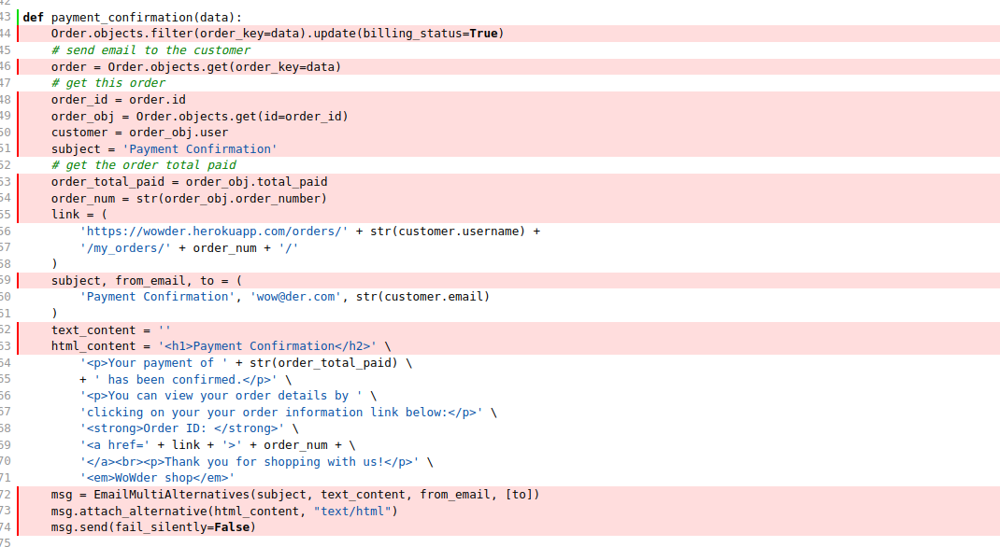
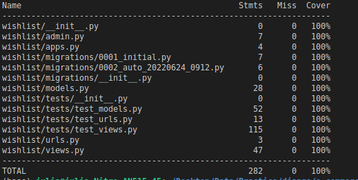

# TESTING

## Manual Testing

Testing was done throughout site development, for each feature before it was merged into the master file.

Usability was tested with the below user acceptance testing, sent to new users to ensure testing from different users, on different devices and browsers to ensure issues were caught and where possible fixed during development.


| Page    | User Actions           | Expected Results | Y/N | Comments    |
|-------------|------------------------|------------------|------|-------------|
| Sign Up     |                        |                  |      |             |
| 1           | Click on Sign Up button | Redirection to Sign Up page | Y |          |
| 2           | Click on the Login link in the form | Redirection to Login page | Y |          |
| 3           | Enter valid email 2 times | Field will only accept email address format | Y |          |
| 4           | Enter valid password 2 times | Field will only accept password format | Y |          |
| 5           | Click on Sign Up button | asks user to confirm email page Sends address a confirmation request email | Y |          |
| 6           | Confirm email | Redirects user to blank Sign In page | Y |          |
| 7           | Sign In | Redirects user to blank In page | Y |          |
| 8           | Sign In with the same email/username and password | Takes user to schedule page with pop-up confirming successful sign in. Get started button now missing in main nav, replaced by Menu | Y |          |
| 9           | Click "Logout" button  in the center of the page| Redirects user to home page | Y |          |
| 10          | Click browser back button | You are still logged out | Y |          |
| Log In      |                        |                  |      |             |
| 1           | Click on Log In button | Redirection to Log In page | Y |          |
| 2           | Click on the Sign Up link in the form | Redirection to Sign Up page | Y |          |
| 3           | Enter valid email | Field will only accept email address format | Y |          |
| 4           | Enter valid password | Field will only accept password format | Y |          |
| 5           | Click on Log In button | Redirects user to blank In page | Y |          |
| 6           | click logout button | Redirects user to home page | Y |          |
| 7           | Click browser back button | You are still logged out | Y |          |
| 8           | Click on Log In button | Redirection to Log In page | Y |          |
| 9           | Enter valid email | Field will only accept email address format | Y |          |
| 10          | Enter valid password | Field will only accept password format | Y |          |
| 11          | Click Remember Me checkbox | Remembers user | Y |          |
| 12          | Click on Log In button | Redirects user to blank In page | Y |          |
| 13          | Click logout button | Redirects user to home page | Y |          |
| 14          | Click browser back button | You are still logged out | Y |          |
| 15          | Click on Log In button | Redirection to Log In page prefilled | Y |          |
| Navigation  |                        |                  |      |             |
| 1           | Click on the logo | Redirection to home page | Y |          |
| 2           | Click Store | Redirection to Store page | Y |          |
| 3           | Click wishlist button | Redirection to wishlist page | Y |          |
| 4           | Click bag button | Redirection to bag page | Y |          |
| 5           | Click Profile button | Redirection to Profile page | Y |          |
| 6           | Click Logout button | Redirection to logout page | Y |          |
| Admin Navigation |                        |                  |      |             |
| 1           | Click Personnel dashboard | Dropdown menu opens | Y |          |
| 2           | Click on Promo | Redirection to Promo page | Y |          |
| 3           | Click on Emails | Redirection to create email page | Y |          |
| 4           | Click Categories | Redirection to Categories page | Y |          |
| 5           | Click Brands | Redirection to Brands page | Y |          |
| 6           | Click on Tags | Redirection to Tags page | Y |          |
| 7           | Click on Product Types | Redirection to Product Types page | Y |          |
| 8           | Click on Product attributes | Redirection to Product attributes page | Y |          |
| 9           | Click on Attributes values | Redirection to Attributes values page | Y |          |
| 11          | Click on Products | Redirection to Products page | Y |          |
| 12 | Click on Users | Redirection to Users page | Y |          |
| 13 | Click on Stock | Redirection to Stock page | Y |          |
| 14 | Click on Orders | Redirection to Orders page | Y |          |
| 15 | Click on Stock Requests | Redirection to Stock Requests page | Y |          |
| Store |                        |                  |      |             |
| 1 | Type in search bar | Search results are displayed | Y |          |
| 2  | Select a category | Products are displayed | Y |          |
| 3  | Click on like button | Product is added to wishlist and message will appear to notify user | Y | If user is logged out, the user will see a message to login and the click will be ignored |
| 4 | Click on the unlike button | Product is removed from wishlist and message will appear to notify user | Y | If user is logged out, the user will see a message to login and the click will be ignored |
| 5 | Click on the product cart | User will be redirected to the product details page | Y | |
| 6 | Click on page navigation | User will be redirected to the correct page | Y | |
| Product Details |                        |                  |      |             |
| 1 | Click on left or right carousel | Carousel will change | Y | If there is only 1 image, there will be no arrow to click |
| 2 | Click on heart button | Product is added to wishlist and message will appear to notify user | Y | If user is logged out, the user will see a message to login and the click will be ignored |
| 3 | Click on the unlike button | Product is removed from wishlist and message will appear to notify user | Y | If user is logged out, the user will see a message to login and the click will be ignored |
| 4 | Click on View Reviews button | User will be redirected to the product reviews page | Y | If product hasn't been reviewed, user will not see the button |
| 5 | Click on the product options (color, size, etc) | User will see price changes | Y | |
| 6 | Click reset button | All selections are reset | Y | |
| 7 | User selects all options | User will see price changes and add to bag button will be enable| Y | |
| 8 | Click on plus-minus quantity | Quantity will change | Y | If there is not enough stock, the quantity will not change, plus button will be disabled when the user reach the limited number, and a warning message will be displayed |
| 9 | Click on add to bag button | Product is added to bag and message will appear to notify user | Y | If user is logged out, the user will see a message to login and the click will be ignored |
| 10 | Click Yes on request item pop-up | User will see a modal with products options and quantity | Y | Displayed only if the product inventory not in stock at this moment |
| 11 | Click on the product options (color, size, etc) and clicks send request button | Modal will be closed, and user will see a message to notify user, the user will also receive an email with the product options and quantity | Y |  If user requested a product inventory which is not in stock, modal will be closed, notification will not be sent and user will see a message that he/she may purchase the product right now |
| Wishlist |                        |                  |      |             |
| 1 | Click on empty wishlist button | User will see a dropdown menu with the confirmation message | Y | If user is logged out, the user will see a message to login and the click will be ignored |
| 2 | Click Yes button in the empty wishlist dropdown menu | User will be redirected to the wishlist page  and the message will appear to notify user| Y | If user is logged out, the user will see a message to login and the click will be ignored |
| 3 | Click on the not empty wishlist button | User will see a dropdown menu with the confirmation message | Y | If user is logged out, the user will see a message to login and the click will be ignored |
| 4 | Click on the product card's heart button | The product will be removed from the wishlist and the message will appear to notify user | Y | If user is logged out, the user will see a message to login and the click will be ignored |
| Profile |                        |                  |      |             |
| 1 | Click on the edit button | User will be redirected to the edit profile page | Y | |
| 2 | Click on the add address button | User will be redirected to the add address page | Y | |
| 3 | Click on the manage addresses button | User will be redirected to the manage addresses page | Y |  |
| 4 | Click on the My Orders button | User will be redirected to the My Orders page | Y | |
| 5 | Click on the My Reviews button | User will be redirected to the My Reviews page | Y | |
| 6 | Click on the My Wishlist button | User will be redirected to the My Wishlist page | Y | |
| Edit Profile |                        |                  |      |             |
| Edit profile Avatar | | | | |
| 1 | Click on the edit button | User will see a pop up window to upload an avatar | Y | |
| 2 | Click on the upload button | User will see a pop up window to upload an avatar | Y | |
| 3 | Click on the cancel button | Changes will not be confirmed | Y | |
| 4 | Click on the save button | Changes will be confirmed and the avatar will be changed | Y | |
| 5 | Click on the Delete button | User will see a pop up window to confirm the deletion | Y | |
| Edit Profile Data |                        |                  |      |             |
| 1 | Type in the first name | First name is changed | Y | |
| 2 | Type in the last name | Last name is changed | Y | |
| 3 | Select birth date | Birth date is changed | Y | |
| 4 | Click subscribe checkbox | User will be subscribed to the newsletter | Y | |
| 5 | Click Save changes button | Changes will be confirmed and the user will see a message to notify them | Y | |
| Edit Password |                        |                  |      |             |
| 1 | Type in the old password | Old password is changed | Y | |
| 2 | Type in the new password | New password is changed | Y | |
| 3 | Type in the new password confirmation | New password confirmation is changed | Y | |
| 4 | Click Save changes button | Changes will be confirmed and the user will see a message to notify them | Y | |
| Delete Account |                        |                  |      |             |
| 1 | Click on the Delete button | User will see a dropdown menu with the confirmation message | Y | |
| 2 | Click Yes button in the dropdown menu | User will be redirected to the home page and the message will appear to notify user | Y | |
| 3 | Click No button in the dropdown menu | The dropdown menu will be closed | Y | |
| My addresses |                        |                  |      |             |
| 1 | Click on the add address button | User will be redirected to the add address page | Y | |
| 2 | Click on the edit button on the address card | User will be redirected to the edit address page | Y | |
| 3 | Click on Enable as Primary button | Address is set as primary | Y | If there were another primary address, it will be set as not primary |
| 4 | Click on Disable as Primary button | Address is set as not primary | Y | |
| Add Address |                        |                  |      |             |
| 1 | Select country | Country is selected | Y | |
| 2 | Select state | State is selected | Y | |
| 3 | Select city | City is selected | Y | |
| 4 | Type in the address | Address is changed | Y | |
| 5 | Type in a zip code | Zip code is changed | Y | |
| 6 | Type in the phone number | Phone number is changed | Y | |
| 7 | Check primary checkbox | Address is set as primary | Y | |
| 8 | Click Save changes button | Changes will be confirmed and the user will see a message to notify them | Y | |
| 9 | Click on the cancel button | Changes will not be confirmed and the user will be redirected to the manage addresses page | Y | |
| Edit Address |                        |                  |      |             |
| 1 | Select country | Country is selected | Y | |
| 2 | Select state | State is selected | Y | |
| 3 | Select city | City is selected | Y | |
| 4 | Type in the address | Address is changed | Y | |
| 5 | Type in a zip code | Zip code is changed | Y | |
| 6 | Type in the phone number | Phone number is changed | Y | |
| 7 | Check primary checkbox | Address is set as primary | Y | |
| 8 | Click Save changes button | Changes will be confirmed and the user will see a message to notify them | Y | |
| 9 | Click on the cancel button | Changes will not be confirmed and the user will be redirected to the manage addresses page | Y | |
| 10 | Click on Delete address button | User will see a dropdown menu with the confirmation message | Y | |
| 11 | Click Yes button in the dropdown menu | User will be redirected to the manage addresses page and the message will appear to notify user | Y | |
| 12 | Click No button in the dropdown menu | The dropdown menu will be closed | Y | |
| My Orders |                        |                  |      |             |
| 1 | Click on the order card | User will be redirected to the order page | Y | |
| My Order Details |                        |                  |      |             |
| 1 | Click on the Back to my orders button | User will be redirected to the My Orders page | Y | |
| 2 | Click on the Add review button | User will be redirected to the Add review page | Y | This button is available only if the order is completed |
| 3 | Click on the View review button | User will be redirected to the View review page | Y | This button is available only if the order is completed  and the user has already reviewed the order |
| 4 | Click on the product's name | User will be redirected to the product page | Y | |
| Add Review |                        |                  |      |             |
| 1 | Select rating | Rating is selected | Y | |
| 2 | Type in the review | Review is changed | Y | |
| 3 | Click on the add review image button | User will see a pop up window to upload an image | Y | |
| 4 | Click on the upload button | User will see a pop up window to upload an image | Y | |
| 5 | Click on the cancel button | Changes will not be confirmed | Y | |
| 6 | Click on the save button | Changes will be confirmed and the review will be added | Y | |
| View Review |                        |                  |      |             |
| 1 | Click on the Product card | User will be redirected to the product page | Y | |
| My Reviews |                        |                  |      |             |
| 1 | Click on the review card | User will be redirected to the review page | Y | |
| Bag |                        |                  |      |             |
| 1 | Click on ready to purchase button | the page will smoothly scroll to the bottom of the page | Y | |
| 2 | Click on the product's name | User will be redirected to the product page | Y | |
| 3 | Click on the minus button | Quantity is decreased and the user will see a message to notify them | Y | If there was only one product in the bag, the product will be removed and the user will see a message to notify them |
| 4 | Click on the plus button | Quantity is increased and the user will see a message to notify them | Y | If there was not enough products in the stock, the quantity will not be increased and the user will see a message to notify them |
| 5 | Click on the remove button | Product is removed from the bag and the user will see a message to notify them | Y | |
| 6 | Click on empty bag button | The user will see a modal window to confirm the empty bag | Y | |
| 7 | Click on the cancel button | Changes will not be confirmed | Y | |
| 8 | Click on the confirm button | Changes will be confirmed and the bag will be emptied and the user will see a message to notify them | Y | |
| 9 | Type in the coupon code and click on the apply button | Coupon is applied and the user will see a message to notify them | Y | If the coupon is not valid, the user will see a message to notify them |
| 10 | Click on the checkout button | User will be redirected to the checkout page | Y | |
| Checkout |                        |                  |      |             |
| 1 | Type in the Full name | Full name is changed | Y | If user has filled out the profile fully, the filled will be filled automatically |
| 2 | Type in the email | Email is changed | Y | |
| 3 | Type in the phone number | Phone number is changed | Y | If user has set the primary address, the phone number will be set automatically |
| 4 | Type in the address | Address is changed | Y | If user has set the primary address, the address will be set automatically |
| 5 | Type in the zip code | Zip code is changed | Y | If user has set the primary address, the zip code will be set automatically |
| 6 | Select country | Country is selected | Y | If user has set the primary address, the country will be set automatically |
| 7 | Select state | State is selected | Y | If user has set the primary address, the state will be set automatically |
| 8 | Select city | City is selected | Y | If user has set the primary address, the city will be set automatically |
| 9 | Type payment card data | Payment card data is changed | Y | |
| 10 | Click on the pay button | The pay button will be disabled and the user will see a message to notify them | Y | If the payment card is not valid, the user will see a message to notify them. If the payment was successful, the user will be redirected to the order placed page and user will also receive an email notification |
| Order Placed |                        |                  |      |             |
| 1 | Click on the View my orders button | User will be redirected to the My Orders page | Y | |
| Personnel Apps |                        |                  |      | Access only to personnel members |
| Personnel Promotions |                        |                  |      |             |
| 1 | Click add promotion button | User will be redirected to the add promotion page | Y | Access only to administrators |
| 2 | Click on promotion | User will see a dropdown with all items that have been added to the promotion | Y | |
| 3 | Click on the item in the dropdown | User will be redirected to the item page | Y | |
| 4 | Click on the edit button | User will be redirected to the edit promotion page | Y | Access only to the admin |
| 5 | Click on the delete button | User will be redirected to the promotions page | Y | Access only to the admin |
| Personnel Add Promotion |                        |                  |      |  Access only to administrators           |
| 1 | Type in the promotion name | Promotion name is changed | Y | |
| 2 | Type in the promotion description | Promotion description is changed | Y | |
| 3 | Type in the promotions coupon code | Promotion coupon code is changed | Y | |
| 4 | Type in the promotion discount | Promotion discount is changed | Y | |
| 5 | Select the promotion start date | Promotion start date is changed | Y | |
| 6 | Select the promotion end date | Promotion end date is changed | Y | |
| 7 | Select items to add to the promotion | Items are added to the promotion | Y | |
| 8 | Click cancel button | Changes will not be confirmed | Y | |
| 9 | Click Add promotion button | Changes will be confirmed and the admin will be redirected to the promotions page | Y | |
| Personnel Edit Promotion |                        |                  |      | Access only to administrators           |
| 1 | Select items to add to the promotion | Items are added to the promotion | Y | |
| 2 | Click cancel button | Changes will not be confirmed | Y | |
| 3 | Click Add promotion button | Changes will be confirmed and the admin will be redirected to the promotions page | Y | |
| Personnel Delete Promotion |                        |                  |      | Access only to administrators           |
| 1 | Click on the cancel button | Changes will not be confirmed and the admin will be redirected to the promotions page | Y | |
| 10 | Click on the confirm button | Changes will be confirmed and the admin will be redirected to the promotions page | Y | |
| Personnel Create Newsletter-Promo Email |                        |                  |      | |
| 1 | Type in the email name | Email name is changed | Y | |
| 2 | Type in the email content | Email content is changed | Y | |
| 3 | Select the coupon code | Coupon code is selected | Y | if code is typed, it will be a promo-email, if code is not typed, it will be a newsletter-email |
| Personnel Categories |                        |                  |      |             |
| 1 | Click on the add category button | User will be redirected to the add category page | Y | |
| 2 | Click on the edit button | User will be redirected to the edit category page | Y | |
| 3 | Click on the delete button | User will be redirected to the categories page | Y |  access only to administrators |
| Personnel Add Category |                        |                  |      | Access only to administrators           |
| 1 | Type in the category name | Category name is changed | Y | |
| 2 | Check the category status | Category status is changed | Y | |
| 3 | Click on the cancel button | Changes will not be confirmed and the admin will be redirected to the categories page | Y | |
| 4 | Click on the add category button | Changes will be confirmed and the admin will be redirected to the categories page | Y | |
| Personnel Edit Category |                        |                  |      | Access only to administrators           |
| 1 | Render the category name | Category name is changed | Y | |
| 2 | Check the category status | Category status is changed | Y | |
| 3 | Click on the cancel button | Changes will not be confirmed and the admin will be redirected to the categories page | Y | |
| 5 | Click on the save changes button | Changes will be confirmed and the admin will be redirected to the categories page | Y | |
| Personnel Delete Category |                        |                  |      | Access only to administrators           |
| 1 | Click on the cancel button | Changes will not be confirmed and the admin will be redirected to the categories page | Y | |
| 6 | Click on the confirm button | Changes will be confirmed and the admin will be redirected to the categories page | Y | |
| Personnel Brands |                        |                  |      |             |
| 1 | Click on the add brand button | User will be redirected to the add brand page | Y | |
| 2 | Click on the brand | User will be redirected to the brand page | Y | |
| 3 | type in the brand name in search field | if brand is found, it will be displayed in the search results | Y | |
| Personnel Brand |                        |                  |      |             |
| 1 | Click on the product | User will be redirected to the product page | Y | |
| 2 | Click on the edit button | User will be redirected to the edit brand page | Y | |
| 3 | Click on the delete button | User will be redirected to the brands page | Y | Access only to administrators |
| Personnel Add Brand |                        |                  |      | |
| 1 | Type in the brand name | Brand name is changed | Y | |
| 2 | Check the brand description | Brand description is changed | Y | |
| 3 | Check the brand status | Brand status is changed | Y | |
| 4 | Click on the cancel button | Changes will not be confirmed and the admin will be redirected to the brands page | Y | |
| 5 | Click on the add brand button | Changes will be confirmed and the admin will be redirected to the brands page | Y | |
| Personnel Edit Brand |                        |                  |      | |
| 1 | Type in the brand name | Brand name is changed | Y | |
| 2 | Check the brand description | Brand description is changed | Y | |
| 3 | Check the brand status | Brand status is changed | Y | |
| 4 | Click on the cancel button | Changes will not be confirmed and the admin will be redirected to the brands page | Y | |
| 6 | Click on the save changes button | Changes will be confirmed and the admin will be redirected to the brands page | Y | |
| Personnel Delete Brand |                        |                  |      | access only to administrators           |
| 1 | Click on the product | User will be redirected to the product page | Y | |
| 2 | Click on the cancel button | Changes will not be confirmed and the admin will be redirected to the brands page | Y | |
| 3 | Click on the confirm button | Changes will be confirmed and the admin will be redirected to the brands page | Y | |
| Personnel Tags |                        |                  |      |             |
| 1 | Click on the add tag button | User will be redirected to the add tag page | Y | |
| 2 | Click on the tag | User will be redirected to the tag page | Y | |
| 3 | type in the tag name in search field | if tag is found, it will be displayed in the search results | Y | |
| Personnel Tag |                        |                  |      |             |
| 1 | Click on the product | User will be redirected to the product page | Y | |
| 2 | Click on the edit button | User will be redirected to the edit tag page | Y | |
| 3 | Click on the delete button | User will be redirected to the tags page | Y | |
| Personnel Add Tag |                        |                  |      | |
| 1 | Type in the tag name | Tag name is changed | Y | |
| 2 | | Check the tag status | Tag status is changed | Y | |
| 3 | Click on the cancel button | Changes will not be confirmed and the admin will be redirected to the tags page | Y | |
| 4 | Click on the add tag button | Changes will be confirmed and the admin will be redirected to the tags page | Y | |
| Personnel Edit Tag |                        |                  |      | |
| 1 | Type in the tag name | Tag name is changed | Y | |
| 2 | Check the tag status | Tag status is changed | Y | |
| 3 | Click on the cancel button | Changes will not be confirmed and the admin will be redirected to the tags page | Y | |
| 5 | Click on the save changes button | Changes will be confirmed and the admin will be redirected to the tags page | Y | |
| Personnel Delete Tag |                        |                  |      | |
| 1 | Click on the product | User will be redirected to the product page | Y | |
| 2 | Click on the cancel button | Changes will not be confirmed and the admin will be redirected to the tags page | Y | |
| 3 | Click on the confirm button | Changes will be confirmed and the admin will be redirected to the tags page | Y | |
| Personnel Products types |                        |                  |      |             |
| 1 | Click on the add product type button | User will be redirected to the add product type page | Y | |
| 2 | Click on the Attributes button | User will see a dropdown menu with the attributes | Y | If product type does not have attributes, the user will see: no attributes |
| 3 | Type in the product type name in the search field and click on the search button | If product type is found, it will be displayed in the search results | Y | |
| 4 | Click on the edit button | User will be redirected to the edit product type page | Y | |
| 5 | Click on the delete button | User will be redirected to the product types page | Y | access only to administrators |
| Personnel Add Product type |                        |                  |      | |
| 1 | Type in the product type name | Product type name is changed | Y | |
| 2 | Select attributes | Attributes are selected | Y | |
| 3 | Type product type description | Product type description is changed | Y | |
| 4 | click cancel button | Changes will not be confirmed and the admin will be redirected to the product types page | Y | |
| 5 | click add product type button | Changes will be confirmed and the admin will be redirected to the product types page | Y | |
| Personnel Edit Product type |                        |                  |      | |
| 1 | Type in the product type name | Product type name is changed | Y | |
| 2 | Select attributes | Attributes are selected | Y | |
| 3 | Type product type description | Product type description is changed | Y | |
| 4 | click cancel button | Changes will not be confirmed and the admin will be redirected to the product types page | Y | |
| 6 | click save changes button | Changes will be confirmed and the admin will be redirected to the product types page | Y | |
| Personnel Delete Product type |                        |                  |      | access only to administrators           |
| 1 | Click on go back button | User will be redirected to the product types page | Y | Deletion is forbidden |
| Personnel Product attributes |                        |                  |      |             |
| 1 | Click on the add product attribute button | User will be redirected to the add product attribute page | Y | |
| 2 | Click on the edit button | User will be redirected to the edit product attribute page | Y | |
| 3 | Click on the delete button | User will be redirected to the product attributes page | Y | access only to administrators |
| 4 | Type in the product attribute name in the search field and click on the search button | If product attribute is found, it will be displayed in the search results | Y | |
| Personnel Add Product attribute |                        |                  |      | |
| 1 | Type in the product attribute name | Product attribute name is changed | Y | |
| 2 | Type product attribute description | Product attribute description is changed | Y | |
| 3 | click cancel button | Changes will not be confirmed and the admin will be redirected to the product attributes page | Y | |
| 4 | click add product attribute button | Changes will be confirmed and the admin will be redirected to the product attributes page | Y | |
| Personnel Edit Product attribute |                        |                  |      | |
| 1 | Type in the product attribute name | Product attribute name is changed | Y | |
| 2 | Type product attribute description | Product attribute description is changed | Y | |
| 3 | click cancel button | Changes will not be confirmed and the admin will be redirected to the product attributes page | Y | |
| 5 | click save changes button | Changes will be confirmed and the admin will be redirected to the product attributes page | Y | |
| Personnel Delete Product attribute |                        |                  |      | access only to administrators           |
| 1 | Click on go back button | User will be redirected to the product attributes page | Y | Deletion is forbidden |
| Personnel Attributes Values |                        |                  |      |             |
| 1 | Click on the add attribute value button | User will be redirected to the add attribute value page | Y | |
| 2 | Click on the edit button | User will be redirected to the edit attribute value page | Y | |
| 3 | Click on the delete button | User will be redirected to the attributes values page | Y | access only to administrators |
| 4 | Type in the attribute value name in the search field and click on the search button | If attribute value is found, it will be displayed in the search results | Y | |
| Personnel Add Attribute value |                        |                  |      | |
| 1 | Select attribute | Attribute is selected | Y | |
| 2 | Type in the attribute value name | Attribute value name is changed | Y | |
| 3 | click cancel button | Changes will not be confirmed and the admin will be redirected to the attributes values page | Y | |
| 4 | click add attribute value button | Changes will be confirmed and the admin will be redirected to the attributes values page | Y | |
| Personnel Edit Attribute value |                        |                  |      | |
| 1 | Select attribute | Attribute is selected | Y | |
| 2 | Type in the attribute value name | Attribute value name is changed | Y | |
| 3 | click cancel button | Changes will not be confirmed and the admin will be redirected to the attributes values page | Y | |
| 5 | click save changes button | Changes will be confirmed and the admin will be redirected to the attributes values page | Y | |
| Personnel Delete Attribute value |                        |                  |      | access only to administrators           |
| 1 | Click on go back button | User will be redirected to the attributes values page | Y | Deletion is forbidden |
| Personnel Product table |                        |                  |      |             |
| 1 | Click on the add product button | User will be redirected to the add product page | Y | |
| 2 | Type in the product name in the search field and click on the search button | If product is found, it will be displayed in the search results | Y | |
| 3 | Click on the product | User will be redirected to the personnel product page | Y | |
| Personnel Product details |                        |                  |      | |
| 1 | Click view in store button | User will be redirected to the product page | Y | |
| 2 | Click on the edit button | User will be redirected to the edit product page | Y | |
| 3 | Click on the delete button | User will be redirected to the personnel product page | Y | |
| 4 | Click on category assigned button | User will be redirected to the categories page | Y | |
| 5 | Click on the brand assigned button | User will be redirected to the brand details page | Y | |
| 6 | Click on the tags assigned button | User will be redirected to the tag which was clicked | Y | |
| 7 | Click on add image button | User will see a modal window with the image upload form | Y | |
| 8 | Click on upload image button | User will see window to upload image | Y | |
| 9 | Type in the image alt text | Image alt text is changed | Y | |
| 10 | Check the image is default | Image is default | Y | |
| 11 | Check the image is active | Image is active | Y | |
| 12 | Click cancel button in modal window | the modal window is closed and image isn't added | Y | |
| 13 | Click save button in modal window | the modal window is closed and image is added | Y | |
| 14 | Click on the edit image button on the image card | User will see a modal window with the image upload form | Y | The same result as with add image modal |
| 15 | Click on delete image button on the image card | User will see a confirm window | Y | If user clicks yes, image is deleted, if not - the modal window is closed |
| 16 | Click on add unit button | User will be redirected to the add unit page | Y | |
| 17 | Click on the unit card | User will be redirected to the unit page | Y | |


---

## Automated testing

### Django unit testing

At the very beginning of the project, I decided to use Django's built-in unit testing framework. Thus, all tests are created simultaneously with the code.

I am running the following testing commands in my terminal to test the code:

```
python manage.py test <name of the app>
```

To create the coverage report, I run the following command:

```
coverage run --source=<name of the app> manage.py test
```

```
coverage report
```

To see the html version of the report and find out whether some pieces of code are missing, I run the following command:

```
coverage html
```

```
python3 -m http.server
```
**Bag app:**


However, after implementing the promotion functionality, I was not been able to get access to the full contexts.py and therefore I am missing 4 cases on the coverage report.


 The description of the testing iss is in is in the section [Django unit testing Issues](#django-unit-testing-issues) **Unsolved issues:**

**Email_notification app:**


The missing coverage is due to the fact that I was not able to test fully ```EmailStockNotificationFormAJAX```. The description of the testing iss is in is in the section [Django unit testing Issues](#django-unit-testing-issues) **Unsolved issues:**

**Home app:**


**Inventory app:**


**Orders app:**




Missing case due to the use of the function to update payment status. The description of the testing iss is in is in the section [Django unit testing Issues](#django-unit-testing-issues) **Unsolved issues:**

**Payment app:**


The missing cases in the coverage is simply because I have no idea how test webhooks. The functionality is working well and described in the section [Django unit testing Issues](#django-unit-testing-issues) **Unsolved issues:** 


**Personnel app:**


**Profiles app:**


The missing coverage is due to the fact that I was not able to test the edit profile view on the password form. The description of the view is in the section [Django unit testing Issues](#django-unit-testing-issues) **Unsolved issues:**


**Promotions app:**


**Reviews app:**


**Wishlist app:**



**Total coverage:**


### Django unit testing Issues

**Solved issues:**

1. I couldn't figure out how to test save methods in Address model as I was receiving the correct result in my print statements in the terminal but at the same time I was getting an error message.


*Solution:*

rather than calling ```self.assertEqual(self.address2.is_primary, True)```, I created a separate variable for the ```address2``` and called it:

```python
  address2 = Address.objects.get(id=2)
  self.assertEqual(address2.is_primary, False)
```


2. I couldn't add particular attributes for testing and couldn't receive the data in my print statement


*Solution:*

Considering the fact that Direct assignment of many-to-many types is not allowed, I retrieved the variables from `ProductAttributeValue` table and added them by assigned set() and putting all variables in square brackets. Additionally, when I was calling `attribute_values` field's values, I used `.all()


```python
    def setUp(self):
        self.product_inventory1 = ProductInventory.objects.create(
            sku='11111',
            upc='11111',
            product=self.product1,
            product_type=self.product_type1,
            retail_price=10.00,
            store_price=11.00,
            sale_price=9.00,
            weight=float(1.0),
            is_active=True,
        )
        product_attr_value1 = ProductAttributeValue.objects.get(id=1)
        product_attr_value2 = ProductAttributeValue.objects.get(id=2)
        self.product_inventory1.attribute_values.set(
            [product_attr_value1, product_attr_value2],
        )

    def test_product_inventory_attribute_values_field(self):
        """Test the attribute values field"""
        print(self.product_inventory1.sku)
        print(self.product_inventory1.upc)
        print(self.product_inventory1.product)
        print(self.product_inventory1.product_type)
        print(self.product_inventory1.attribute_values.all())
```

3. I couldn't test unique constrain in ProductAttributeValues model as I was getting the error:


*Solution:*

create a new object  ```product_attr_value3``` and a new variable: attributevlues by calling the ```ProductAttributeValue.objects.get()``` method with id of product_attr_value3. It is needed to prevent duplicate values from set_up method.
Then, I retrieved the ```productinventory``` by calling the ```ProductInventory.objects.get()``` method with id of self.product_inventory2 (self.product_inventory2 was created in the set_up method). After all, I created a new object for ProductAttrivuteVlaues model and assigned received values to it.

```python
    product_attr_value3 = ProductAttributeValue.objects.create(
        product_attribute=self.product_attribute1,
        attribute_value='yellow',
    )
    attributevalues=ProductAttributeValue.objects.get(
        id=product_attr_value3.id
    )
    productinventory=ProductInventory.objects.get(
        id=self.product_inventory2.id
    )
    original = ProductAttributeValues.objects.create(
        attributevalues=attributevalues,
        productinventory=productinventory
    )
```
To check whether the unique constrain is working, I called the following methods:

```python
    self.assertNotEquals(original, None)
    with self.assertRaises(Exception):
        original_clone = ProductAttributeValues.objects.create(
            attributevalues=attributevalues,
            productinventory=productinventory
        )
```
4. While testing ```ProductInventoryForm```, I was getting the following error:


*Solution:*

As I figured out the error was coming from the form's fields: ```retail_price```, ```store_price```, ```sale_price```, which were added to widget's attributes.
DecimalField should be added to the widget's attributes. Thus, I deleted them and added them separately:

```python
    retail_price = forms.DecimalField()
    store_price = forms.DecimalField()
    sale_price = forms.DecimalField()
```
Additionally, while writing test cases to check whether ```ProductInventoryForm``` is valid, I was using float() for retail_price, store_price, sale_price, weight.

5. I couldn't test contexts.py file. I wasn't able to test the context of the bag view. I was trying to test the context of the bag view, but unsuccessful.

```python
def test_if_product_is_in_bag_with_quantity(self):
    """Test if product is in bag with quantity."""
    # test if product is in bag with quantity
    response = self.client.get(reverse('bag_display'))
    self.assertEqual(response.status_code, 200)
    self.assertTemplateUsed(response, 'bag/bag_display.html')
    self.assertContains(response, '1')
    # add product to the bag
    response = self.client.post(
        self.add_to_bag_url,
        {'product_inventory_id': 1, 'quantity': 10},
        HTTP_X_REQUESTED_WITH='XMLHttpRequest'
    )
    self.assertEqual(response.status_code, 200)
    # check that bag session has 1 item
    self.assertEqual(len(self.client.session['bag']), 1)
    self.assertTrue(self.client.session['bag'], True)
    print('test contexts.py')
    print(self.client.session['bag'])
    self.assertTrue(isinstance(self.client.session['bag'], dict))
    # loop through the bag and check the quantity and product_inventory_id
    for item in self.client.session['bag']:
        print(item)
        print(self.client.session['bag'][item])
        self.assertEqual(item, '1')
        self.assertEqual(self.client.session['bag'][item], 10)
```


*Solution:*

I imported ```bag_contents``` into views.py file. and used to get the total spending and total quantity of the bag. This allowed me to include contexts.py file into the testing.

  
  ```python
    contents = bag_contents(request)
    total = contents['total']
    product_count = contents['product_count']
```


**Unsolved issues:**

1. I was getting an error message when I tried multiple times to test JsonResponse response on Password change.


I have made the following steps to solve this issue:

```python
    from django.contrib.auth.hashers import make_password

            pwd = make_password('123')
        self.user33 = User.objects.create(
            username='testuser33',
            password = pwd,
            email='user3gmail.com'
        )
        self.client.force_login(self.user33)
        pwd2 = make_password('12345')
        print('User password', self.user33.password)
        print(pwd)
        print(pwd2)
        response = self.client.post(
            self.edit_user_profile_url,
            data={
                'form_type': 'password',
                'old_password': pwd,
                'new_password': pwd2,
                'confirm_password': pwd2
            },
            HTTP_X_REQUESTED_WITH='XMLHttpRequest'
        )
```
The following screenshot will confirm that the passwords in both cases were hashed and changed correctly.


As it might seem, I am not able to test the response of the JsonResponse.

2. I was getting an error message when I tested ```EmailStockNotificationFormAJAX```. This errors because testing wasn't working correctly as it wasn't confirming the existence of the ```self.product_inventory1``` and relevant ```self.attribute_values1``` and ```self.attribute_values2```.


However, the view is working correctly. It is **checking** for the existence of the ```self.product_inventory1```. It loop through all possible product_inventories of a product and checking whether a product_inventory with received ```attribute_values``` are present in the table. If so, it returns this product_inventory and checks the units available. If there is enough units in stock, it doesn't send the email and returns an alert message to the page.


3. I was getting an error when I was testing string method for stock model:

```python
    def __str__(self):
        """String representation of Stock model"""
        # check if product inventory is null
        if self.product_inventory is None and self.units > 0:
            return 'No SKU: ' + str(self.id)
        elif self.units > 0:
            return (
                self.product_inventory.sku + ' - ' + str(self.units)
            )
        else:
            return (
                self.product_inventory.sku + ' - ' + 'Out of stock'
            )
```


However, when I was testing string method in my template, I was getting the correct string for the stock with deleted product inventory.

```html
      
        {{ stock }}
      
```


4. This issue is regarding the importing context.py file. There are no errors in functionality but 3 missing cases are present


5. I was not able to test webhooks in the payment ap. However, the functionality is working well. To proof that, I attached the following screenshots:

  - I have added products in the bag:

    

  - Click on checkout, then I was redirected to the payment page:

    

  - Filled out the payment form and clicked on the submit button:

    

  - In the terminal, I was able to see that the stock is updated and the order is created

    

  - In the admin panel, I was able to see that the order is created and the billing status is set to True, which proves that the webhook is working correctly.

    

## Bugs

**Solved bugs:**
1. I was getting an error message when I tried to test the JsonResponse response on Password change.

*Solution:*

Added `request.user` argument to the `PasswordChangeForm` form.

```python
    password_form = PasswordChangeForm(request.user, request.POST)
```

2. I was logged out right after the user logged in and the tests were showing the error `The view profiles.views.EditUserProfileView didn't return an HttpResponse object. It returned None instead.`

*Solution:*

Add additional import to the profiles views: `update_session_auth_hash`
And after saving the form, call the `update_session_auth_hash` function:

```python
    from django.contrib.auth import update_session_auth_hash

    if password_form.is_valid():
    password_form.save()
    update_session_auth_hash(request, password_form.user)
    return JsonResponse({'success': True})
```
3. I was struggling to get countries, county/regions, cities using various libraries. When planning the project I was aimed to use the `django-cities-light` library but this library is very heavy, and therefore, I wouldn't be able to deploy it to Heroku for free. Thus, I decided to use the [geonames](https://www.geonames.org/). The first issue that I encountered was that the link to the geonames website was not working. It was simply solved be enabling my account to use the geonames website. The following issue was regarding the selection regions and cities.

*Solution:*

Rather than searching for the regions by country name/code, I used country id to search for the regions.

```javascript
    let countryId = $('#id_country').find(':selected').data('id');
```

After retrieving the regions, I was able to get the first word of the region name and use it to search for the cities by link:

```javascript
    let stateName = $('#id_county_region').find(':selected').text();
    let stateNameFirstWord = stateName.split(' ')[0];
```

and url for AJAX request:

```javascript
    url: 'https://secure.geonames.org/searchJSON?q=' + stateNameFirstWord + '&username=<my_account_name>&style=FULL&fclName=city, village,...&maxRows=1000',
```

4. I was trying to get cover image for the product using related_name and if statements in the template. However, I was not able to get a single image, which is whether default and active, or not default but the first in the list of active images (``````).

*Solution:*

I added a method to the Product model that allows me to get the cover image.

```python
    def get_main_image(self):
        """Get main cover image of product"""
        images = ProductImage.objects.filter(product=self)
        if images.exists():
            active_images = images.filter(is_active=True)
            if active_images.exists():
                default_image = active_images.filter(default_image=True)
                if default_image.exists():
                    return default_image.first().image_url
                else:
                    return active_images.first().image_url
            return 'static/images/default_product_image.png' 
        else:
            return 'static/images/default_product_image.png' 
```

5. I realized that my .gitiignore file was not ignoring the db.sqlite3 file, however, it was stating the .gitiignore file 
```python
    *.sqlite3
    db.sqlite3
```

*Solution:*

At the very beginning, I used the following command:

```
git update-index --assume-unchanged db.sqlite3
```

But the output was: ```fatal: Unable to mark file db.sqlite3```

So, I user the following command for reset:

```
git reset HEAD
```
After that I run assume-unchanged again:

```
git update-index --assume-unchanged db.sqlite3
```

6. I was trying to create signals to create Stock when a ProductInventory is created.
However, I failed since I was using save method in the Stock model, which checks if there are any Product Inventory units available (if there 0 units, it will set ProductInventory.is_available to False). At first, I was trying to create a save method in the ProductInventory model to recreate signals, but I was not able to as it was calling "Unique constraint" error.

*Solution:*

I implemented checking functionality in views.py to prevent any errors:

```python
    product_inventory_active_stock = Stock.objects.filter(
                product_inventory=product_inventory_active
            )
            if product_inventory_active_stock:
                # do something
```

7. During the development of the bag functionality, I have noticed that js code was sending not the correct id data.

*Solution:*

I created product_inventory_id variable outside of the functions and reassigned it to the id of the ProductInventory object, which was checked in on change event.

```javascript
  let product_inventory_id = 0
    $('.product__options').on('change', 'input', function() {
      let attribute_value = $(this).val();
      let attribute_name = $(this).get(0).name;
      let availableAttrsFromOtherGroups = [];
      for (let stockOption of values_list_array) {
        if (stockOption[attribute_name] == attribute_value && stockOption["Quantity"] > 0) {
          for(let key in stockOption) {
            if (key != "Quantity" && key != attribute_name) {
              if (key == "id") {
                product_inventory_id = stockOption[key];
              }
              availableAttrsFromOtherGroups.push(stockOption[key]);
            }
          }
        }
      }
    });
```

8. When I was trying to implement sending email on successful payment with url link functionality, I was receiving only content_html in the email without the content_text.


  *Solution:* Move the email content into email content template.


```python
from django.core.mail import EmailMultiAlternatives


def payment_confirmation(data):
    Order.objects.filter(order_key=data).update(billing_status=True)
    # send email to the customer
    order = Order.objects.get(order_key=data)
    # get this order
    order_id = order.id   
    order_obj = Order.objects.get(id=order_id)
    customer = order_obj.user
    subject = 'Payment Confirmation'
    # get the order total paid
    order_total_paid = order_obj.total_paid
    order_num = str(order_obj.order_number)
    link = (
        'https://wowder.herokuapp.com/orders/' + str(customer.username) +
        '/my_orders/' + order_num + '/'
    )
    subject, from_email, to = (
        'Payment Confirmation', 'wow@der.com', str(customer.email)
    )
    text_content = ''
    html_content = '<h1>Payment Confirmation</h2>' \
                '<p>Your payment of ' + str(order_total_paid) \
                + ' has been confirmed.</p>' \
                '<p>You can view your order details by ' \
                'clicking on your your order information link below:</p>' \
                '<strong>Order ID: </strong>' \
                '<a href=' + link + '>' + order_num + \
                '</a><br><p>Thank you for shopping with us!</p>' \
                '<em>WoWder shop</em>'
    msg = EmailMultiAlternatives(subject, text_content, from_email, [to])
    msg.attach_alternative(html_content, "text/html")
    msg.send(fail_silently=False)

```

9. After adding values for men and women sizing, I got an error of returning more than 1 object on get method. I t was due to the same values for sizing, like L size for men clothing and L size for women clothing

*Solution:* Change get method on filter and adding for loop to go through all received objects:

```python
    attribute_testing_set_list = list(attribute_testing_set)
    selected_value = ProductAttributeValue.objects.filter(
        attribute_value=value.attributevalues
    )
    for s_v in selected_value:
        for attribute in attribute_testing_set_list:
            # Check if the attribute is in the attr set list
            if str(attribute) == str(
                s_v.product_attribute
            ):
                product_inventory_active_values[
                    attribute
                ] = s_v.attribute_value
```


## Validation

### HTML Validation:
- No errors or warnings were found when passing through the official [W3C](https://validator.w3.org/) validator. This checking was done manually by copying the view page source code (Ctrl+U) and pasting it into the validator.

- [Bag app HTML validation report](documentation/validation/bag_html_validation.pdf)

- [EmailNotification app HTML validation report](documentation/validation/email_notification_html_validation.pdf)

- [Home app HTML validation report](documentation/validation/home_html_validation.pdf)

- [Inventory app HTML validation report](documentation/validation/inventory_html_validation.pdf)

- [Orders app HTML validation report](documentation/validation/orders_html_validation.pdf)

- [Payment app HTML validation report](documentation/validation/payment_html_validation.pdf)

- [Profiles app HTML validation report](documentation/validation/profiles_html_validation.pdf)

- [Promotions app HTML validation report](documentation/validation/promotions_html_validation.pdf)

- [Reviews app HTML validation report](documentation/validation/reviews_html_validation.pdf)

- [Wishlist app HTML validation report](documentation/validation/wishlist_html_validation.pdf)

- [Allauth app HTML validation report](documentation/validation/allauth_html_validation.pdf)


### CSS Validation:

- [Full CSS Validation Report](documentation/validation/css_validation.pdf)

- No errors or warnings were found when passing through the official [W3C (Jigsaw)](https://jigsaw.w3.org/css-validator/#validate_by_uri) validator except for the warnings about the use of css root variables and webkits for the box-shadow. However, css code works perfectly on various devices.


### Python Validation:

- No errors were found when the code was passed through Valentin Bryukhanov's [online validation tool](http://pep8online.com/). According to the reports, the code is [Pep 8-compliant](https://legacy.python.org/dev/peps/pep-0008/). This checking was done manually by copying python code and pasting it into the validator.

- [Bag. Validation Report](documentation/validation/pep8_validation_bag.pdf)

- [Email_notifications. Validation Report](documentation/validation/pep8_validation_email_notifications.pdf)

- [Home. Validation Report](documentation/validation/pep8_validation_home.pdf)

- [Inventory. Validation Report](documentation/validation/pep8_validation_inventory.pdf)

- [Orders. Validation Report](documentation/validation/pep8_validation_orders.pdf)

- [Payment. Validation Report](documentation/validation/pep8_validation_payment.pdf)

- [Personnel. Validation Report](documentation/validation/pep8_validation_personnel.pdf)

- [Profiles. Validation Report](documentation/validation/pep8_validation_profiles.pdf)

- [Promotions. Validation Report](documentation/validation/pep8_validation_promotions.pdf)

- [Reviews. Validation Report](documentation/validation/pep8_validation_reviews.pdf)

- [Wishlist. Validation report](documentation/validation/pep8_validation_wishlist.pdf)

---

## Compatibility

Testing was conducted on the following browsers;

- Brave;
- Chrome;
- Firefox;

[Compatibility Report](documentation/validation/compatibility.pdf)

---

### Errors:

The errors were made in the following commits:

1. 3cb0b4f275e0650749c9f5cee59072d3889e4a97

Aff wishlist app and url path - > Add instead of Aff

2. da08e5f77a1f886ba7e492d0f2c4aaf20782f5cb

Add url path for viewing product - > Add test for url path

3. a13d44771be873e84c8f60750efe12b5b4ff5d89

Add ProductInventoriesTable View - > Add product_inventory_table url path

4. 55748cb415b51a625a38d04a68b3e2db7d6caab0

Ad categories data to template - > Add categories data to template

5. ec5a9ae366c8cd077c2d3d45e9e308b912b49c5d

Add view for adding brand functionality -> Add testing to test adding brand functionality

6. 64d3e92baacd3f271da0a36bcaebcac2cf5be6e5

Add edit_order_item_url -> Add tests for edit order item functionality

7. bd39e0881a6734c017728011b0020f32ba46ce60

Add custom stylings for search buttons -> Change if condition to show all categories products

8. 9091743069373eefd32a46b1365389860fce14e6

Add functions handlers for 400 and 505 errors - > Add functions handlers for 404 and 500 errors