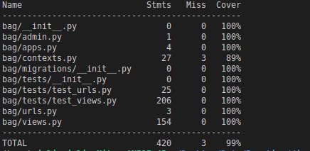
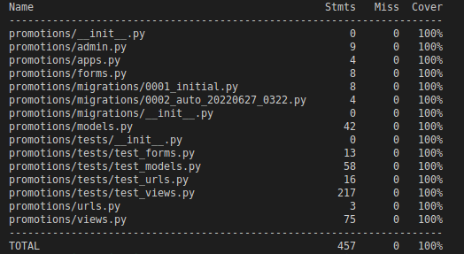

# TESTING

## Automated testing

### Django unit testing

At the very beginning of the project, I decided to use Django's built-in unit testing framework. Thus, all tests are created simultaneously with the code.

I am running the following testing commands in my terminal to test the code:

```
python manage.py test <name of the app>
```

To create the coverage report, I run the following command:

```
coverage run --source=<name of the app> manage.py test
```

```
coverage report
```

To see the html version of the report and find out whether some pieces of code are missing, I run the following command:

```
coverage html
```

```
python3 -m http.server
```

**Profiles app:**


The missing coverage is due to the fact that I was not able to test the edit profile view on the password form. The description of the view is in the section [Django unit testing Issues](#django-unit-testing-issues) **Unsolved issues:**

**Bag app:**



However, after implementing the promotion functionality, I was not been able to get access to the full contexts.py and therefore I am missing 4 cases on the coverage report.


 The description of the testing iss is in is in the section [Django unit testing Issues](#django-unit-testing-issues) **Unsolved issues:**

**Wishlist app:**


**Promotions app:**




**Email_notification app:**


The missing coverage is due to the fact that I was not able to test fully ```EmailStockNotificationFormAJAX```. The description of the testing iss is in is in the section [Django unit testing Issues](#django-unit-testing-issues) **Unsolved issues:**


### Django unit testing Issues

**Solved issues:**

1. I couldn't figure out how to test save methods in Address model as I was receiving the correct result in my print statements in the terminal but at the same time I was getting an error message.


*Solution:*

rather than calling ```self.assertEqual(self.address2.is_primary, True)```, I created a separate variable for the ```address2``` and called it:

```python
  address2 = Address.objects.get(id=2)
  self.assertEqual(address2.is_primary, False)
```


2. I couldn't add particular attributes for testing and couldn't receive the data in my print statement


*Solution:*

Considering the fact that Direct assignment of many-to-many types is not allowed, I retrieved the variables from `ProductAttributeValue` table and added them by assigned set() and putting all variables in square brackets. Additionally, when I was calling `attribute_values` field's values, I used `.all()


```python
    def setUp(self):
        self.product_inventory1 = ProductInventory.objects.create(
            sku='11111',
            upc='11111',
            product=self.product1,
            product_type=self.product_type1,
            retail_price=10.00,
            store_price=11.00,
            sale_price=9.00,
            weight=float(1.0),
            is_active=True,
        )
        product_attr_value1 = ProductAttributeValue.objects.get(id=1)
        product_attr_value2 = ProductAttributeValue.objects.get(id=2)
        self.product_inventory1.attribute_values.set(
            [product_attr_value1, product_attr_value2],
        )

    def test_product_inventory_attribute_values_field(self):
        """Test the attribute values field"""
        print(self.product_inventory1.sku)
        print(self.product_inventory1.upc)
        print(self.product_inventory1.product)
        print(self.product_inventory1.product_type)
        print(self.product_inventory1.attribute_values.all())
```

3. I couldn't test unique constrain in ProductAttributeValues model as I was getting the error:


*Solution:*

create a new object  ```product_attr_value3``` and a new variable: attributevlues by calling the ```ProductAttributeValue.objects.get()``` method with id of product_attr_value3. It is needed to prevent duplicate values from set_up method.
Then, I retrieved the ```productinventory``` by calling the ```ProductInventory.objects.get()``` method with id of self.product_inventory2 (self.product_inventory2 was created in the set_up method). After all, I created a new object for ProductAttrivuteVlaues model and assigned received values to it.

```python
    product_attr_value3 = ProductAttributeValue.objects.create(
        product_attribute=self.product_attribute1,
        attribute_value='yellow',
    )
    attributevalues=ProductAttributeValue.objects.get(
        id=product_attr_value3.id
    )
    productinventory=ProductInventory.objects.get(
        id=self.product_inventory2.id
    )
    original = ProductAttributeValues.objects.create(
        attributevalues=attributevalues,
        productinventory=productinventory
    )
```
To check whether the unique constrain is working, I called the following methods:

```python
    self.assertNotEquals(original, None)
    with self.assertRaises(Exception):
        original_clone = ProductAttributeValues.objects.create(
            attributevalues=attributevalues,
            productinventory=productinventory
        )
```
4. While testing ```ProductInventoryForm```, I was getting the following error:


*Solution:*

As I figured out the error was coming from the form's fields: ```retail_price```, ```store_price```, ```sale_price```, which were added to widget's attributes.
DecimalField should be added to the widget's attributes. Thus, I deleted them and added them separately:

```python
    retail_price = forms.DecimalField()
    store_price = forms.DecimalField()
    sale_price = forms.DecimalField()
```
Additionally, while writing test cases to check whether ```ProductInventoryForm``` is valid, I was using float() for retail_price, store_price, sale_price, weight.

5. I couldn't test contexts.py file. I wasn't able to test the context of the bag view. I was trying to test the context of the bag view, but unsuccessful.

```python
def test_if_product_is_in_bag_with_quantity(self):
    """Test if product is in bag with quantity."""
    # test if product is in bag with quantity
    response = self.client.get(reverse('bag_display'))
    self.assertEqual(response.status_code, 200)
    self.assertTemplateUsed(response, 'bag/bag_display.html')
    self.assertContains(response, '1')
    # add product to the bag
    response = self.client.post(
        self.add_to_bag_url,
        {'product_inventory_id': 1, 'quantity': 10},
        HTTP_X_REQUESTED_WITH='XMLHttpRequest'
    )
    self.assertEqual(response.status_code, 200)
    # check that bag session has 1 item
    self.assertEqual(len(self.client.session['bag']), 1)
    self.assertTrue(self.client.session['bag'], True)
    print('test contexts.py')
    print(self.client.session['bag'])
    self.assertTrue(isinstance(self.client.session['bag'], dict))
    # loop through the bag and check the quantity and product_inventory_id
    for item in self.client.session['bag']:
        print(item)
        print(self.client.session['bag'][item])
        self.assertEqual(item, '1')
        self.assertEqual(self.client.session['bag'][item], 10)
```


*Solution:*

I imported ```bag_contents``` into views.py file. and used to get the total spending and total quantity of the bag. This allowed me to include contexts.py file into the testing.

  
  ```python
    contents = bag_contents(request)
    total = contents['total']
    product_count = contents['product_count']
```


**Unsolved issues:**

1. I was getting an error message when I tried multiple times to test JsonResponse response on Password change.


I have made the following steps to solve this issue:

```python
    from django.contrib.auth.hashers import make_password

            pwd = make_password('123')
        self.user33 = User.objects.create(
            username='testuser33',
            password = pwd,
            email='user3gmail.com'
        )
        self.client.force_login(self.user33)
        pwd2 = make_password('12345')
        print('User password', self.user33.password)
        print(pwd)
        print(pwd2)
        response = self.client.post(
            self.edit_user_profile_url,
            data={
                'form_type': 'password',
                'old_password': pwd,
                'new_password': pwd2,
                'confirm_password': pwd2
            },
            HTTP_X_REQUESTED_WITH='XMLHttpRequest'
        )
```
The following screenshot will confirm that the passwords in both cases were hashed and changed correctly.


As it might seem, I am not able to test the response of the JsonResponse.

2. I was getting an error message when I tested ```EmailStockNotificationFormAJAX```. This errors because testing wasn't working correctly as it wasn't confirming the existence of the ```self.product_inventory1``` and relevant ```self.attribute_values1``` and ```self.attribute_values2```.


However, the view is working correctly. It is **checking** for the existence of the ```self.product_inventory1```. It loop through all possible product_inventories of a product and checking whether a product_inventory with received ```attribute_values``` are present in the table. If so, it returns this product_inventory and checks the units available. If there is enough units in stock, it doesn't send the email and returns an alert message to the page.


3. I was getting an error when I was testing string method for stock model:

```python
    def __str__(self):
        """String representation of Stock model"""
        # check if product inventory is null
        if self.product_inventory is None and self.units > 0:
            return 'No SKU: ' + str(self.id)
        elif self.units > 0:
            return (
                self.product_inventory.sku + ' - ' + str(self.units)
            )
        else:
            return (
                self.product_inventory.sku + ' - ' + 'Out of stock'
            )
```


However, when I was testing string method in my template, I was getting the correct string for the stock with deleted product inventory.

```html
      
        {{ stock }}
      
```


4. This issue is regarding the importing context.py file. There are no errors in functionality but 3 missing cases are present


## Bugs

**Solved bugs:**
1. I was getting an error message when I tried to test the JsonResponse response on Password change.

*Solution:*

Added `request.user` argument to the `PasswordChangeForm` form.

```python
    password_form = PasswordChangeForm(request.user, request.POST)
```

2. I was logged out right after the user logged in and the tests were showing the error `The view profiles.views.EditUserProfileView didn't return an HttpResponse object. It returned None instead.`

*Solution:*

Add additional import to the profiles views: `update_session_auth_hash`
And after saving the form, call the `update_session_auth_hash` function:

```python
    from django.contrib.auth import update_session_auth_hash

    if password_form.is_valid():
    password_form.save()
    update_session_auth_hash(request, password_form.user)
    return JsonResponse({'success': True})
```
3. I was struggling to get countries, county/regions, cities using various libraries. When planning the project I was aimed to use the `django-cities-light` library but this library is very heavy, and therefore, I wouldn't be able to deploy it to Heroku for free. Thus, I decided to use the [geonames](https://www.geonames.org/). The first issue that I encountered was that the link to the geonames website was not working. It was simply solved be enabling my account to use the geonames website. The following issue was regarding the selection regions and cities.

*Solution:*

Rather than searching for the regions by country name/code, I used country id to search for the regions.

```javascript
    let countryId = $('#id_country').find(':selected').data('id');
```

After retrieving the regions, I was able to get the first word of the region name and use it to search for the cities by link:

```javascript
    let stateName = $('#id_county_region').find(':selected').text();
    let stateNameFirstWord = stateName.split(' ')[0];
```

and url for AJAX request:

```javascript
    url: 'https://secure.geonames.org/searchJSON?q=' + stateNameFirstWord + '&username=<my_account_name>&style=FULL&fclName=city, village,...&maxRows=1000',
```

4. I was trying to get cover image for the product using related_name and if statements in the template. However, I was not able to get a single image, which is whether default and active, or not default but the first in the list of active images (``````).

*Solution:*

I added a method to the Product model that allows me to get the cover image.

```python
    def get_main_image(self):
        """Get main cover image of product"""
        images = ProductImage.objects.filter(product=self)
        if images.exists():
            active_images = images.filter(is_active=True)
            if active_images.exists():
                default_image = active_images.filter(default_image=True)
                if default_image.exists():
                    return default_image.first().image_url
                else:
                    return active_images.first().image_url
            return 'static/images/default_product_image.png' 
        else:
            return 'static/images/default_product_image.png' 
```

5. I realized that my .gitiignore file was not ignoring the db.sqlite3 file, however, it was stating the .gitiignore file 
```python
    *.sqlite3
    db.sqlite3
```

*Solution:*

At the very beginning, I used the following command:

```
git update-index --assume-unchanged db.sqlite3
```

But the output was: ```fatal: Unable to mark file db.sqlite3```

So, I user the following command for reset:

```
git reset HEAD
```
After that I run assume-unchanged again:

```
git update-index --assume-unchanged db.sqlite3
```

6. I was trying to create signals to create Stock when a ProductInventory is created.
However, I failed since I was using save method in the Stock model, which checks if there are any Product Inventory units available (if there 0 units, it will set ProductInventory.is_available to False). At first, I was trying to create a save method in the ProductInventory model to recreate signals, but I was not able to as it was calling "Unique constraint" error.

*Solution:*

I implemented checking functionality in views.py to prevent any errors:

```python
    product_inventory_active_stock = Stock.objects.filter(
                product_inventory=product_inventory_active
            )
            if product_inventory_active_stock:
                # do something
```

7. During the development of the bag functionality, I have noticed that js code was sending not the correct id data.

*Solution:*

I created product_inventory_id variable outside of the functions and reassigned it to the id of the ProductInventory object, which was checked in on change event.

```javascript
  let product_inventory_id = 0
    $('.product__options').on('change', 'input', function() {
      let attribute_value = $(this).val();
      let attribute_name = $(this).get(0).name;
      let availableAttrsFromOtherGroups = [];
      for (let stockOption of values_list_array) {
        if (stockOption[attribute_name] == attribute_value && stockOption["Quantity"] > 0) {
          for(let key in stockOption) {
            if (key != "Quantity" && key != attribute_name) {
              if (key == "id") {
                product_inventory_id = stockOption[key];
              }
              availableAttrsFromOtherGroups.push(stockOption[key]);
            }
          }
        }
      }
    });
```


#### Errors:

The errors were made in the following commits:

1. 3cb0b4f275e0650749c9f5cee59072d3889e4a97

Aff wishlist app and url path - > Add instead of Aff

2. da08e5f77a1f886ba7e492d0f2c4aaf20782f5cb

Add url path for viewing product - > Add test for url path

3. a13d44771be873e84c8f60750efe12b5b4ff5d89

Add ProductInventoriesTable View - > Add product_inventory_table url path

4. 55748cb415b51a625a38d04a68b3e2db7d6caab0

Ad categories data to template - > Add categories data to template

5. ec5a9ae366c8cd077c2d3d45e9e308b912b49c5d

Add view for adding brand functionality -> Add testing to test adding brand functionality